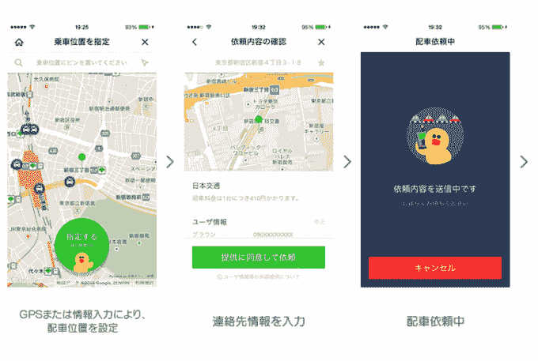

# Line 在日本推出出租车预订服务，因为聊天应用已经成为平台

> 原文：<https://web.archive.org/web/https://techcrunch.com/2015/01/08/line-taxi-japan/>

# Line 在日本推出出租车预订服务，因为聊天应用已经成为平台

信息传递不再仅仅是信息传递。去年，西方意识到了即时通讯应用的潜力——这在很大程度上要归功于脸书对 WhatsApp 的收购——2015 年，美国的应用将成为平台。很少有地方比日本更能说明这种趋势，日本的顶级聊天应用 [Line 刚刚推出了自己的出租车服务](https://web.archive.org/web/20230326023321/http://linecorp.com/en/pr/news/en/2014/904)。

Line Taxi 内置于现有的 Line 应用程序中，就像[最近推出的支付服务](https://web.archive.org/web/20230326023321/https://techcrunch.com/2014/12/16/line-pay-finally-rolling-out/)一样，它的推出使该公司与主导者优步和英国竞争对手 Hailo 展开竞争。

线路服务开始缓慢。该公司与日本最大的私人汽车公司 Nihon Kotsu 合作，最初在东京的选定地区提供 3300 多辆汽车，但它计划随着时间的推移在全国范围内增加到 23000 辆。

[来自 Tech In Asia](https://web.archive.org/web/20230326023321/https://www.techinasia.com/line-taxi-launch/) 的一份初步报告显示，与引领日本按需出租车行业的优步相比，Line 提供了更多选择和更短的等待时间，但时间会证明这一点。

整合了打车应用的消息应用听起来可能是一个奇怪的组合，但这种情况以前就发生过。中国最大的聊天应用[微信去年与出租车按需服务滴滴打车](https://web.archive.org/web/20230326023321/http://technode.com/2014/01/06/wechat-adds-taxi-booking-app-didi-dache/)捆绑在一起，并且有[传言 Facebook Messenger 将与优步](https://web.archive.org/web/20230326023321/http://recode.net/2014/07/24/facebook-and-uber-discuss-integration-of-car-service-into-messenger/)整合——然而，一个聊天应用推出自己的出租车服务*是*独特之处。

Line 在全球拥有[1.7 亿月度活跃用户](https://web.archive.org/web/20230326023321/http://linecorp.com/en/pr/news/en/2014/862)(以及超过 5 亿注册用户)，但日本是其最大的市场。它在自己的地盘上拥有超过 5000 万注册用户，它认为这种主导地位支持广泛的离线和点播服务，这些服务与消息传递体验密切相关。

Line Japan 本周推出了出租车预订，但它也有按需送餐的[计划，它有](https://web.archive.org/web/20230326023321/https://www.techinasia.com/line-dives-head-payments-taxi-hailing-ondemand-food-delivery/)[自己的地图应用](https://web.archive.org/web/20230326023321/http://official-blog.line.me/en/archives/1013365631.html)，可以支持零售商的线上到线下商务[，它也在涉足社交商务](https://web.archive.org/web/20230326023321/http://official-blog.line.me/en/archives/1006495705.html)。还有关于音乐流媒体服务的[计划——由于 Line 从微软](https://web.archive.org/web/20230326023321/https://techcrunch.com/2014/12/11/line-music-streaming-service/)收购 MixRadio，该服务将[全球化——超过 30 个应用](https://web.archive.org/web/20230326023321/https://techcrunch.com/2014/12/18/mixradio-line/)和[游戏被捆绑到其核心聊天服务](https://web.archive.org/web/20230326023321/https://techcrunch.com/2014/11/28/line-purges-its-games-platform-again-removing-15-titles-from-its-messaging-service/)。

Line 并不是唯一一家建立信息体验的公司。微信在中国也是如此。本周，母公司腾讯推出了一家在线银行——网络银行，该银行可能会成为其信息平台的一个焦点，同时还会进军零售、支付、打车等更多领域。

Line Taxi 不会是全球性的，但您可以想象，该公司会考虑在其网络足够强大的国家实施它(和类似的按需服务)。这不太可能包括美国，但今天的新闻让西方人了解到，当移动应用成为数千万人的日常必需品时，什么是可能的。