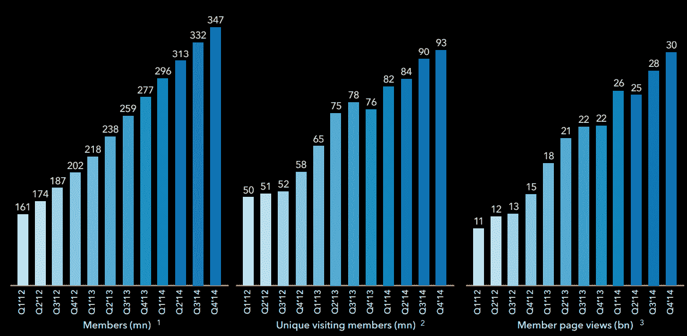

# LinkedIn 第四季度收入 6.43 亿美元，每股收益 0.61 美元 

> 原文：<https://web.archive.org/web/https://techcrunch.com/2015/02/05/linkedin-q4-2014-earnings/>

# LinkedIn 第四季度收入 6.43 亿美元，每股收益 0.61 美元

[LinkedIn](https://web.archive.org/web/20221209004654/http://linkedin.com/) 今天[公布了](https://web.archive.org/web/20221209004654/http://investors.linkedin.com/secfiling.cfm?filingID=1271024-15-3&CIK=1271024)2014 年第四财季的业绩。该公司轻松击败华尔街的预期，其收入为 643 美元，比去年同期增长 44%，非 GAAP 每股收益为 0.61 美元。华尔街[预计](https://web.archive.org/web/20221209004654/https://finance.yahoo.com/q/ae?s=LNKD+Analyst+Estimates)每股收益约为 0.53 美元，收入略低于 6.17 亿美元。

全年来看，LinkedIn 报告的收入为 221.9 万美元，与 2013 年相比增长了 45%。2014 年非美国通用会计准则净收入为 2.54 亿美元，而 2013 年为 1.92 亿美元。

LinkedIn 首席执行官杰夫·韦纳(Jeff Weiner)表示:“第四季度是 LinkedIn 又一个成功的一年，会员数量稳步增长，财务业绩强劲。”。“我们继续在许多多年战略计划上取得重大进展，包括移动、就业、内容和全球扩张。”

该公司将其收入分为三个业务部门:人才解决方案、营销解决方案和高级订阅。人才解决方案收入为 3.69 亿美元，比去年同期增长 41%。营销解决方案带来了 1.53 亿美元的收入，增长了 56%，来自高级订阅的收入总计 1.21 亿美元，增长了 38%。人才解决方案仍然是该公司的主要收入来源，占其总收入的 57%。

该公司还指出，其平台上现在有超过 300 万个活跃的职位列表，比去年增加了 10 倍。该网站现在每月有 9300 万独立访客(一年前为 7600 万)和 3.47 亿会员。

在过去的几个月里，LinkedIn [推出了](https://web.archive.org/web/20221209004654/https://beta.techcrunch.com/2014/12/11/new-linkedin-homepage/)一个简化的主页，突出了分析和服务的新闻源。它还向所有英语国家开放了自己的出版平台。不过，总体而言，这是该公司相对平静的一个季度。与上一季度不同，该公司没有宣布任何重大收购或重大里程碑。

对于下一个季度，LinkedIn 预计收入将在 618 美元至 622 美元之间。

