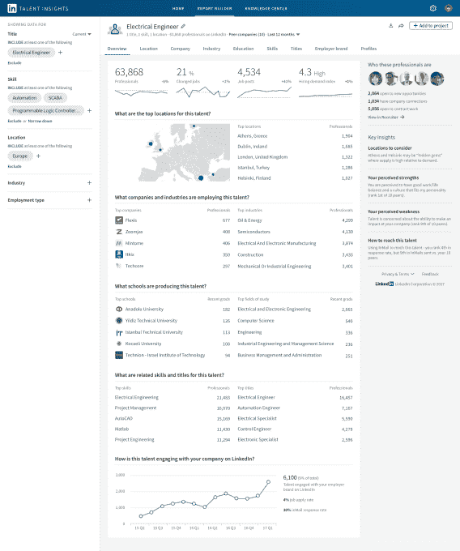
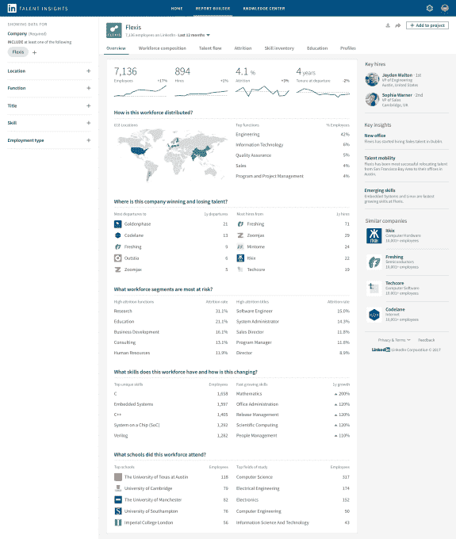

# LinkedIn 将推出新的分析工具 Talent Insights，该工具将深入研究数据 

> 原文：<https://web.archive.org/web/https://techcrunch.com/2017/10/04/linkedin-to-launch-talent-insights-a-new-analytics-tool-as-it-dives-deeper-into-data/>

LinkedIn 是微软旗下的社交网络，拥有约 5 亿会员，它已经将招聘变成了一项大生意——在任何特定时间，网站上都有约 1100 万份工作列表，招聘市场为该公司提供了最大的收入来源。

现在，它又向前迈出了一步，推出了一款新产品:LinkedIn Talent Insights，这是一款自助式大数据分析产品，让招聘人员可以根据 LinkedIn 的数据，对招聘和就业统计数据进行更深入的查询。

Talent Insights 将于今天在该公司的 [Talent Connect](https://web.archive.org/web/20230217222400/https://business.linkedin.com/events/talent-connect) 活动上宣布封闭测试版，并于 2018 年全面推出。这将是一款付费产品，LinkedIn 人才洞察产品负责人埃里克·奥斯基(Eric Owski)告诉我，尽管定价要到明年全面上市后才会公开。

人才洞察最初会有两个视图，称为“人才库”和“公司报告”。

第一个将让招聘人员搜索与他们可能希望填补的特定工作相关的不同参数——例如，LinkedIn 设想在这里可能使用的一种典型搜索是，哪些学校正在培养最成功的数据科学家或自然语言处理工程师；或者哪些行业(或公司)一直在招聘最多的计算机视觉专家。

与此同时，该公司的报告将提供类似的潜水，但进入你自己的公司和你的竞争对手的招聘模式——包括看看哪些技能增长最快，以及员工居住在哪些城市。这里的想法不是简单地获得竞争情报，而是改善你自己如何处理招聘。

LinkedIn 在过去收购了几家招聘初创公司，特别是 [Careerify](https://web.archive.org/web/20230217222400/https://techcrunch.com/2015/03/16/linkedin-buys-carreerify-to-build-out-its-recruitment-business/) 和 [Connectifier](https://web.archive.org/web/20230217222400/https://techcrunch.com/2015/10/14/linkedin-debuts-referrals-relaunches-recruiter-with-people-matching-algorithms/) ，这些公司建立了大数据解决方案，以更现代的方式来处理招聘和搜索优秀人才的过程。一些专业知识已经[开始进入 LinkedIn 产品](https://web.archive.org/web/20230217222400/https://techcrunch.com/2015/10/14/linkedin-debuts-referrals-relaunches-recruiter-with-people-matching-algorithms/),我怀疑其中一些也会进入这里。

但这似乎不能替代对特定候选人的搜索。相反，它是一个工具，将与 LinkedIn 已经提供的搜索功能(免费用户的基本搜索，高级用户的更增强搜索，以及 LinkedIn 会员计划中最高级订阅层的完整搜索)并列，并提供对你自己公司、其他公司、行业、职业和地理位置内的招聘趋势的更高层次的见解。

“我认为人才领袖将是这款产品的受众，”Owski 说，“专业人士不仅要了解日常运营，还要在战略规划中发挥作用，并使公司的人才战略与其商业战略保持一致。”

它与 LinkedIn 一直在开发的其他产品和功能一起，帮助用户与工作和招聘人员之间建立更多的联系，例如[公开候选人](https://web.archive.org/web/20230217222400/https://techcrunch.com/2016/10/06/linkedin-will-now-let-you-quietly-signal-when-youre-looking-for-a-job/)，这是一种用户向招聘人员悄悄发出信号的方式，他们愿意考虑新的工作，而不会让他们目前所在组织的人或任何其他人知道他们在做什么。

对我来说，这款新产品的意义在于，它再次表明了 LinkedIn 如何继续发展其迄今为止一直是强劲收入来源的业务。

随着 LinkedIn 面临越来越多来自其他希望进入招聘领域的公司的竞争——最近的例子是脸书，它已经建立了自己的工作列表业务(最近的例子是与 ZipRecruiter 的[合作)——LinkedIn 正在寻找方法让人们重新回到它的网站。](https://web.archive.org/web/20230217222400/https://techcrunch.com/2017/09/28/facebook-partners-with-ziprecruiter-and-more-aggregators-as-it-ramps-up-in-jobs/)

通过数据分析等工具提供招聘广告之外的更多见解是将人们与该平台联系起来的一种方式，作为一种付费工具，你甚至可以想象有一天，即使你使用 LinkedIn 进行一些招聘预算，你也可能只是将它用于分析，以帮助形成更广泛的招聘策略。

当然，这是假设人们没有在 LinkedIn 上撒谎。目前还很难知道 LinkedIn 上有多少数据是在人们自我监督之外得到验证的——因为当你提到你为 TechCrunch 工作时，你不需要提供并验证一封 TechCrunch 电子邮件——或许公司有时会在这个平台上变得更主动。LinkedIn 也尚未在该平台上推出经过验证的个人资料。

我对此也很感兴趣，因为人们早就知道 LinkedIn 是一个海量数据存储库。许多数据处理都是在闭门造车的情况下进行的，并且是为了 LinkedIn 自己的目的——有时会导致人们说 LinkedIn“令人毛骨悚然”，因为它似乎在人与人之间建立了不可思议的联系(以及联系的暗示)。

现在，它基本上向用户开放了一些分析。

从长远来看，LinkedIn 如何以及是否会尝试将这个平台扩展到招聘以外的领域，也将是一件有趣的事情。

该公司多年来一直试图将其声誉从简单的求职和社交网站发展成为一个人们丰富“职业自我”的地方——无论是通过阅读与其领域相关的新闻，还是阅读(和撰写)这些领域的人们的思想片段。这似乎是一个合乎逻辑的步骤，将人才洞察力扩展到“专业洞察力”，以继续发展更广泛的机会。

不过，就目前而言，重点将是利用 LinkedIn 自己的数据，并将重点放在招聘上。

“我们将扩大我们能为专业人才回答的问题的数量，”Owski 说。“我们已经回答了其他产品无法以这种方式回答的有关劳动力市场的关键问题。”