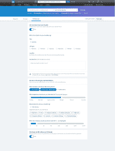
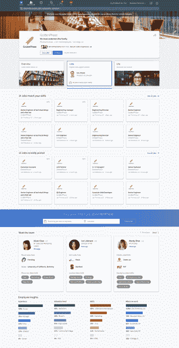

# LinkedIn 现在可以让你在找工作时谨慎地发出信号

> 原文：<https://web.archive.org/web/https://techcrunch.com/2016/10/06/linkedin-will-now-let-you-quietly-signal-when-youre-looking-for-a-job/>

任何社交网络的标志之一是它如何推动人们与他人分享他们的经历，但我们越来越多地看到社交平台采取了许多措施，让人们可以选择保持非常隐私，如果他们愿意的话。

这方面的最新举措之一来自 LinkedIn，这是一个面向工作世界的社交网络，拥有约 4.5 亿成员，目前被微软以 262 亿美元收购:今天，该公司为那些可能有兴趣悄悄寻找新工作，但仍在其他地方工作的用户开启了一项新功能。

这项新功能被称为开放候选人，它将让这些用户基本上创建一个信号，只有使用 LinkedIn 的[高级(付费)服务层](https://web.archive.org/web/20221205214332/https://business.linkedin.com/talent-solutions/recruiter)的招聘人员才能看到这个信号(价格从 8000 美元起，根据许可证的数量而有所不同)。反过来，那些寻找像那个人一样的候选人的招聘人员会得到一个信号，即某个特定的候选人正在寻求换工作，并愿意就新的职业机会与他们联系。LinkedIn 告诉我，它将首先在美国、加拿大、英国和澳大利亚推出，并将在今年推广到更多市场。

开放候选人是 LinkedIn 招聘产品更大规模改造的一部分，其中还包括更具活力的新职业页面——招聘员工的公司用来宣传自己的定制页面——以及招聘人员在后端与正在招聘的客户联系的新方式，以提供更无缝的整合。从今天起，这两项技术都将在全球范围内推广。

今天，这三款手机都将在该公司的年度[人才交流](https://web.archive.org/web/20221205214332/https://business.linkedin.com/events/talent-connect)活动上正式亮相。

开放候选人和其他两个更新是 LinkedIn 非常需要的(也许是早该有的)功能。人才解决方案——公司的招聘业务——占了公司收入的最大份额([上个季度](https://web.archive.org/web/20221205214332/https://blog.linkedin.com/2016/04/28/linkedin_s-q1-2016-earnings)带来了 8.61 亿美元销售额中的 5.58 亿美元)，但与此同时，它也面临着像 Indeed 和 Monster 这样的老牌巨头以及 Glassdoor 这样更新更灵活的方法的巨大压力，所有这些公司都在争夺同一个在线招聘市场。LinkedIn 的招聘业务如今列出了大约 600 万份工作，需要不断更新和创新才能保持竞争力。

在这三者中，开放候选人可能是今天宣布的最有趣的更新。

在社交网络方面，LinkedIn 在市场上拥有独特的地位，因为它已经接近了观察和被观察的概念。

该公司定期跟踪和更新在[上查看他们的个人资料和其他关于他们在平台上存在的统计数据的用户](https://web.archive.org/web/20221205214332/https://beta.techcrunch.com/2013/06/26/linkedin-gets-a-little-more-watchful-now-tells-you-whos-viewed-your-updates-and-where-youve-been-looking/)，本质上是将广告技术等一些机制应用到其平台上，以突出关系和建立联系。你可以选择不被跟踪，也可以选择不看这些统计数据，但即使你不想看或被看到，这些信息仍然会被跟踪。

像这样的功能是一种祝福(有些人喜欢这些东西)，也是一种诅咒(有些人觉得它令人毛骨悚然)。但对我来说，公开候选人可能是 LinkedIn 技术中最实用、最有帮助的应用之一。该公司正在采用其平台目前使用的主要方式之一——寻找工作，或找人填补工作岗位——并且它正在以一种更谨慎的方式让人们更容易做到这一点。

对一些人来说，这可能会让 LinkedIn 成为一个更友好的平台，可以用来做其他事情。我见过无数人在他们的 LinkedIn 个人资料上写道，在任何情况下，他们都不希望招聘人员联系他们。人们不得不把这个放在他们的个人资料页面上，这一事实表明 LinkedIn 对一些人来说是多么令人讨厌。如果公开候选人功能得到了应有的使用，一些垃圾内容可能会开始消退。

关于它是如何工作的，有一些有趣且非常有用的细节。LinkedIn 的职业产品负责人丹·沙佩罗(Dan Shapero)告诉我，如果你打开公开招聘，那么“寻找新工作”的信号只会发送给那些与你目前工作的地方没有任何关系的招聘人员。这意味着即使你在找工作，你也不会因此放弃你现在的工作。然后，你也可以私下与招聘人员分享你的个人资料。

和其他社交网络一样，LinkedIn 一直在寻找让人们分享更多个人信息并保持更新的方法。这也适用于这里。一旦你打开这个功能，让招聘人员私下知道你在找工作，公司会给你一个机会重新访问和更新你自己的个人资料。

虽然对 LinkedIn 上更广泛的人群影响不大，但职业页面的更新有助于为 LinkedIn 如何继续发展其招聘业务奠定基础。

新页面现在将为公司的招聘网站增加更多的对话式推荐和其他社交功能，使它们更多地试图传达公司的文化，而不仅仅是目前提供的职位。

这是一个有趣的转变，对我来说，它真正显示了像 Glassdoor 这样的网站对当今招聘市场的影响。世界上的每个人可能都不会有这种感觉(有些人会接受他们能得到的任何工作)，但很幸运的一部分人可以选择在哪里工作。

LinkedIn 的更新迎合了这一想法，帮助公司创建页面，让候选人更好地了解公司的实际情况，看看它是否是你可能喜欢的地方。用产品经理埃里克·奥斯基(Eric Owski)的话说，这“不是要卖掉公司，而是我们如何思考。”

不过，这无疑是一个积极的转变。没有心怀不满的员工的坦率评论，更新后的职业页面将带来现有员工在 LinkedIn 上发布的帖子，以及公司其他人的精选个人资料，以及职位列表。

与新的开放候选人功能一样，新的职业页面将对[付费公司](https://web.archive.org/web/20221205214332/https://business.linkedin.com/talent-solutions/company-career-pages)开放——更精简的版本仍可免费使用。