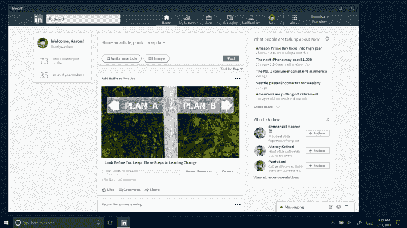

# LinkedIn 的新桌面应用程序登陆 Windows 10 

> 原文：<https://web.archive.org/web/https://techcrunch.com/2017/07/17/linkedins-new-desktop-app-arrives-on-windows-10/>

LinkedIn 今天[发布了其 Windows 10 官方桌面应用](https://web.archive.org/web/20221207235619/https://blogs.windows.com/windowsexperience/2017/07/17/announcing-linkedin-app-windows-10/#l2XH5rGkb66VgMu1.97),允许微软拥有的专业社交网络服务通过 Windows 10 开始菜单、可钉住的动态磁贴和行动中心通知等功能更深入地集成到操作系统中。该公司表示，这些提醒将包括你的 LinkedIn 收件箱中的新邮件、关于谁查看了你的个人资料的更新、你所在行业的趋势新闻以及其他亮点。

LinkedIn 的[博客文章](https://web.archive.org/web/20221207235619/https://blog.linkedin.com/2017/july/17/work-smarter-and-stay-connected-with-new-linkedin-app-windows)指出，用户可以在应用程序的通知选项卡中配置他们希望看到的提醒。

去年 12 月，微软以 262 亿美元[收购 LinkedIn](https://web.archive.org/web/20221207235619/https://beta.techcrunch.com/2016/12/08/microsoft-officially-closes-its-26-2b-acquisition-of-linkedin/)，随后提到其计划将 LinkedIn 身份引入微软的生产力应用程序，如 Office 和 Outlook 能够通过微软 Word 起草简历和申请工作；LinkedIn 与 Active Directory 的集成；Windows 操作中心的 LinkedIn 通知、[以及其他一些东西](https://web.archive.org/web/20221207235619/https://beta.techcrunch.com/2016/12/08/microsoft-officially-closes-its-26-2b-acquisition-of-linkedin/)。

随着新的 Windows 10 应用程序的推出，后一个问题正在得到解决，该应用程序实时发送更新信息——这一举措可能会让 LinkedIn 感觉像一个更活跃的网络，拥有及时的新闻和信息，而不是今天许多人在寻求跳槽时只想到查看的地方。

收购时，LinkedIn 在全球拥有超过 4 亿用户，这使其成为现存最大的职业社交网站。今年 4 月，该公司宣布其在全球 200 个国家拥有 5 亿用户，这代表着 1000 多万个活跃职位，900 多万家公司的访问权限，以及每周超过 10 万篇文章。简而言之，通过这种新的、集成的桌面体验，微软有许多与业务相关的信息需要整合。

在 Windows 10 应用发布前不久，微软宣布计划[弃用其 Windows mobile 应用](https://web.archive.org/web/20221207235619/https://www.neowin.net/news/despite-microsofts-acquisition-of-linkedin-the-windows-phone-app-is-being-killed-off)，该应用将于 2017 年 8 月 30 日关闭。该公司当时的声明称，微软的努力集中在开发新的 LinkedIn 桌面应用程序上，该应用程序将于今年夏天发布——就像今天一样。微软表示，与此同时，移动用户如果愿意，也可以通过移动网络使用该网站。

LinkedIn 的用户群是[40%的桌面用户](https://web.archive.org/web/20221207235619/https://www.msn.com/en-my/news/techandscience/linkedin-gets-a-desktop-makeover/ar-AAm1CHQ)，它也在一月份推出了[桌面体验的更新](https://web.archive.org/web/20221207235619/https://blog.linkedin.com/2017/january/19/linkedin-desktop-redesign-puts-conversations-and-content-at-the-center)。

新的 Windows 10 应用程序今天开始在 Windows 商店推出，并将在发布时提供 22 种语言。

支持的语言列表包括英语、德语、法语、西班牙语、葡萄牙语、中文(简体)、阿拉伯语、丹麦语、意大利语、荷兰语、日语、朝鲜语、挪威语、波兰语、土耳其语、瑞典语、中文(繁体)、捷克语、印度尼西亚语、泰语、马来语和罗马尼亚语。

该应用程序将于本月底在所有 LinkedIn 市场推出。