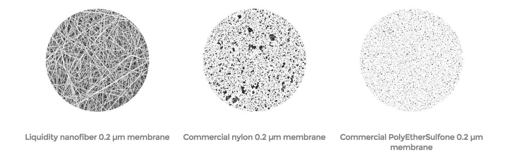

# 启动流动性，为每个人带来洁净的水 

> 原文：<https://web.archive.org/web/https://techcrunch.com/2015/05/04/liquidity-launches-to-bring-clean-water-to-everyone/>

流动性纳米技术试图改变世界。但就这一次，这种陈词滥调实际上是适用的。该公司今天在 Disrupt NY 2015 的舞台上推出了 Naked Filter，这是一款内置专有水过滤膜的消费者水瓶。

流动性看起来不像一般的创业公司。该团队建立在超过 15 年的专利大学研究基础上，是水务行业最大、最受尊敬的公司之一。

该公司的首席技术官曾是 3M 全球水务集团的负责人。技术总监来自英国，她是那里的技术主管。他们的创始人之一发明了反渗透，这一过程使海水淡化成为可能。

乍一看，这个裸露的过滤器和其他野营水瓶没什么两样。关键是表面之下发生了什么。

流动性的核心技术是由石溪大学开发并获得专利的。这是一种孔径为 0.2 微米的膜，小到足以消除构成绝大多数水质事件的微生物污染物。这包括从大肠杆菌和沙门氏菌到 SARS，甚至是诺如病毒在发达国家和新兴市场中常见的问题。

当然，水净化方法和过滤器今天是可用的，但经常迫使用户在有效性和便利性之间进行选择，这使得采用变得极其困难。在效果方面，碘和氯等化学物质会改变水的味道，紫外线需要很长的等待时间，过滤器需要用户提供泵或高压，后者对儿童来说尤其具有挑战性。

然后是家庭净化市场，其中大多数产品并没有改善水质，只是简单地改善了味道。好用，但是效果不好。

认识到这一点，流动性团队设计了他们的第一个产品，裸滤器，以符合现有消费者习惯的方式展示他们的膜。水瓶的流速几乎与不含过滤器的水瓶相同。这是可能的，因为过滤器由 80-90%的开放空间组成，几乎不需要压力或等待时间来移动水通过膜，使产品非常方便消费者。(传统的薄膜大约占开放空间的 20%。)

为了制造可以大规模生产的纳米纤维薄膜，Liquidity 不得不发明自己的制造工艺。过去 10 年，Liquidity 已经做到了这一点，完善了其专利的电纺 3D 打印技术。

该过程从液体聚合物和集电板开始。向聚合物和板施加电压，产生拉力将液体聚合物从其容器中吸向板。随着聚合物的移动，它变得越来越薄。事实上，如此之薄，以至于在某一点上，空气阻力实际上开始影响液体的流动，导致现在变薄的聚合物在落到收集板上时变得卷曲。

在行程中，聚合物溶液也转化为固体。最终的图案是一个看似随机的极细纤维阵列的 3D 垫。

这种过滤膜具有很高的柔韧性和耐用性，可以制成各种尺寸。

电纺并不是一种新的工艺。然而，流动性团队开发了一种多喷嘴系统，允许膜规模化生产。

以前，现有的材料和生产技术限制了过滤器仅捕获大于 1 微米的微生物的能力。随着他们新发明的纤维形成方法，流动性孔径下降到 0.2 微米左右。

Liquidity 的技术已经由微生物测试机构 BioVir Laboratories 进行了第三方验证，符合 EPA 安全饮用水 99.9999%细菌去除率的标准。

尽管这项技术很强大，但采用这项技术的挑战依然存在。通过创造一个非常容易使用的瓶子，Liquidity 希望首先解决西方国家的户外热情。截至今天，你可以在他们的网站上预购裸滤瓶；它将于今年夏天上市。该公司还寻求提供家庭和办公室过滤系统。

更大的市场机会在巴西和印度等国家的新兴中产阶级。这些地区的基础设施和水质很差，但购买力却在增加。许多人已经在使用某种类型的家庭净水方法，但收效甚微。

不过，最终，Liquidity 看到了自己作为技术参与者的优势，并致力于成为水务行业的“Intel Inside”。从医疗和制药到石油和天然气，各行各业都有巨大的工业应用。

[图库 ids =，1153597，1153595，1153594，1153593，1153592，1153591，1153590，1153589，1153588，1153586，1153585，1153584，1153583"]