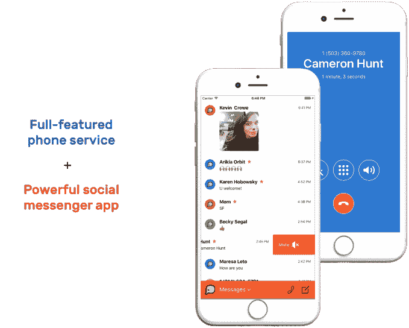
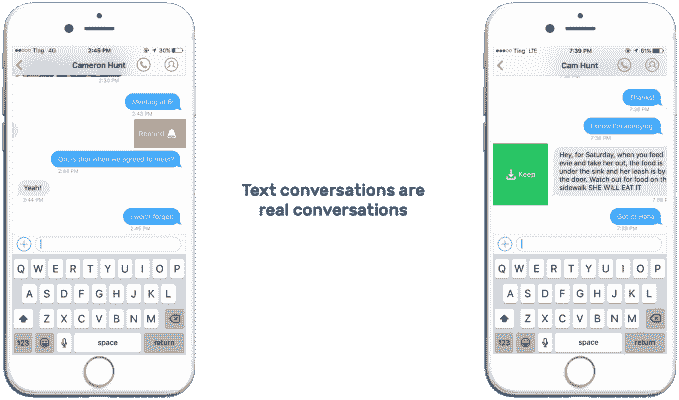

# Listen 通过自动回复、静音、提醒等功能让电话号码更加智能

> 原文：<https://web.archive.org/web/https://techcrunch.com/2016/11/18/listen-makes-phone-numbers-smarter-with-auto-responders-muting-reminders-and-more/>

一个名为 [Listen](https://web.archive.org/web/20230313195359/https://uselisten.com/) 的新移动应用程序希望通过让你更多地控制谁在发短信和打电话来让电话号码更加智能，这要归功于白名单、提醒、自动回复、静音按钮等多种功能。该公司解释说，这个想法是为通过你的电话号码收到的所有信息提供一个“收件箱”。最终结果是一个你可以更安全地公开分享的数字，类似于 Twitter 的一个句柄。

创造一条在公共场合使用的备用线路的想法并不新鲜。谷歌语音多年来一直提供类似的功能，而 Burner 等一些现有的移动应用程序也允许你创建一次性电话号码或副线，只要你是付费用户，你就可以保留这些号码。

听，本质上是想成为一个更好的谷歌之声——一个多年来没有受到太多关注的产品，因为谷歌的重点已经转移到其他通信平台，如 Hangouts，以及现在的 Allo 和 Duo 应用程序。

首席执行官劳伦·勒托解释说:“我们决定建立[Listen],因为我们离不开电话号码。“我们被它们困住了——为什么不把它们变得更好呢？她说:“我把自己在美国电话电报公司的个人号码移植过来听，感觉很棒，但话又说回来，这是我为自己打造的。

[gallery ids="1418286，1418287，1418285"]

要开始使用 Listen，您首先需要输入您当前的电话号码，作为验证您帐户的一种方式，就像其他消息应用程序一样。然后，您可以根据自己选择的区号选择一个新号码。

您可以分发此号码，并在您的私人运营商提供的号码之外使用它，或者您可以选择通过 iPhone 的设置(在“电话”下)将来电转移到您的接听号码。然而，如果你不把你的电话号码转过去听，电话会直接转到语音信箱。

该公司目前正在开发工具，实际上允许用户将他们的号码移植到监听系统，移植意味着为你的号码更换运营商，这更像是一种承诺。这也意味着你将无法使用 iMessage。

然而现在,“倾听”只是给你一个新的电话号码。

一旦[监听](https://web.archive.org/web/20230313195359/https://itunes.apple.com/us/app/listen-your-smart-phone-number/id1092222604?ls=1&mt=8)建立起来，你就可以做一些用普通电话号码做不到的事情。例如，如果您正在讨论需要完成的事情，您可以在短信对话中轻扫来设置提醒，或者您可以在线索上向另一个方向轻扫来将特定文本“存储”到联系人的个人资料中，以便将来更容易访问。

你也可以让联系人静音，这样你就不会被垃圾邮件或者其他你不想收到的消息(比如前任？)，并且您可以禁用语音邮件。您还可以配置应用程序，使您只接收来自最喜爱的联系人的通知，这样您就不会分心。另一个方便的功能是能够设置电话和短信的自动应答。

iPhone 已经可以让你用一条定制的短信主动拒绝来电，但当这项功能启用时，Listen 的自动回复会立即发送给任何人。当你要离开手机一段时间时，这可能会很有用——例如，当你坐飞机旅行或试图度过一个没有科技产品的假期时。

与 Burner 等竞争对手相比，Listen 的另一个有趣之处在于，它的目标是保持基本功能集——电话和短信——免费。

勒托说，取而代之的是，该计划是在未来对面向国际用户的服务收费。

勒托解释说，“短期居住在国外的人可以将他们的美国号码移植进来收听，从而保持它的‘安全’,并且仍然可以接收和发送来自朋友和家人的信息，而无需支付高昂的国际费用。”

“这将是一种付费服务，但仍比保持传统的运营商服务便宜得多，”她补充道。

目前还不清楚 Listen 能在多大程度上兑现这些承诺，因为这项服务是在 Twilio 上运行的。在资金耗尽之前，它必须想办法在某个时候为其免费层付费。

在创办 Listen 之前，勒托创建了幽默网站[昨晚的文本](https://web.archive.org/web/20230313195359/https://www.crunchbase.com/organization/texts-from-last-night)和一个用于励志名言的移动应用[和](https://web.archive.org/web/20230313195359/https://techcrunch.com/2011/03/27/founder-stories-leto-bnter-texts-from-last-nigh/)[笑话](https://web.archive.org/web/20230313195359/https://www.crunchbase.com/organization/banters#/entity)。CTO Cam Hunt 是 GroupMe 的第一名员工，首席工程师 Austen Ito 之前在 Bonobos 和 Kitchensurfing 工作。

这个三人小组是 Expa 实验室的一部分，已经从 Notation Capital、Social Starts 和 Rob Fishman 那里筹集了 70 万美元。

Listen 目前可以在 iOS 系统上使用，但是 Android 和网络支持正在计划中，还有其他功能，如群发短信、自我删除文本和端到端加密。

https://youtu.be/q6FLMHubOLs