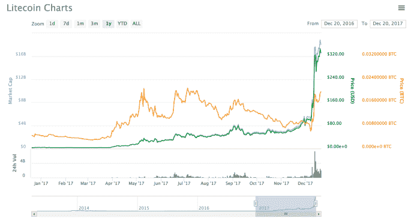

# Litecoin 创始人查理·李卖掉了他所有的 LTC 

> 原文：<https://web.archive.org/web/https://techcrunch.com/2017/12/20/litecoin-charlie-lee-conflict-of-interest/>

比特币基地前工程总监查理·李正在出售他在莱特币(Litecoin，LTC)中的几乎所有股份，莱特币是他在 2011 年创立的加密货币。

Lee 在 Reddit 上的一篇帖子中解释说，他正在出售他所有的 LTC 硬币——除了一些他作为收藏品保存的实物硬币——以避免他作为 LTC 创始人的影响力和地位带来的利益冲突。

由于他在比特币基地和 LTC 的时间，李被认为是加密领域的关键影响者，他在 Twitter 上已经积累了超过 378，000 名粉丝，他的昵称是 [@SatoshiLite](https://web.archive.org/web/20230216144019/https://twitter.com/SatoshiLite) 。虽然他说他没有直接发关于 LTC 价格的推文，但他承认他的推文在某些方面被批评为操纵价格，尽管他有最大的利益。李开复欣然承认，他的职位代表了利益冲突，因此被解职。

“每当我在推特上谈论莱特币价格，甚至只是好消息或坏消息，我都会被指责为个人利益而这样做。甚至有人觉得我做空 LTC！所以从某种意义上说，我持有 LTC 并在推特上谈论它是有利益冲突的，因为我有如此大的影响力。我总是避免在我的主要推文之前或之后购买/出售长期资本，但这是只有我知道的事情。人们总是会怀疑，我的任何行为是否是为了在莱特币和加密货币的成功之上增加我自己的个人财富，”[李写道](https://web.archive.org/web/20230216144019/https://www.reddit.com/r/litecoin/comments/7kzw6q/litecoin_price_tweets_and_conflict_of_interest/)。

我们不知道 Lee 持有和出售了多少 LTC，但现在他说他正专注于开发加密货币本身。

“这绝对是一种怪异的感觉，但也莫名其妙地令人耳目一新。别担心。我不会退出 Litecoin 的。我还是会把所有时间花在莱特币上。当 Litecoin 成功时，我仍然会以许多不同的方式获得奖励，只是不是直接通过拥有硬币。我现在认为这是我继续监督 Litecoin 增长的最佳方式，”他补充道。

注意，李开复的哥哥——Bobby——是中国最大的交易所 BTCChina 的创始人，所以这绝对是一个强大的密码家族。

与比特币、以太和其他货币一样，莱特币的价值今年也出现了爆炸性增长。

根据 Coinmarketcap.com 的数据，它是世界第五大加密货币，总市值超过 180 亿美元。在撰写本文时，它的价值为每枚 330.14 美元，比 2017 年 1 月 1 日的 4.36 美元上涨了 75 倍以上。

如下图底部图表所示，该硬币的交易量在 2017 年底也达到了前所未有的水平。根据 Coinmarketcap.com 的数据，在过去的 24 小时内，LTC 的交易额超过了 20 亿美元。

虽然莱特币已经成为一种赚钱的工具，但它最初的目标是成为比特币的黄金。它还被设计成比比特币更容易开采，交易成本更低，希望这些功能可以使它成为未来用于交易和现实世界的加密货币。

*帖子更新修正莱特币总值*

*注:乔恩拥有少量加密货币。足以获得一种理解，不足以改变一种生活。*