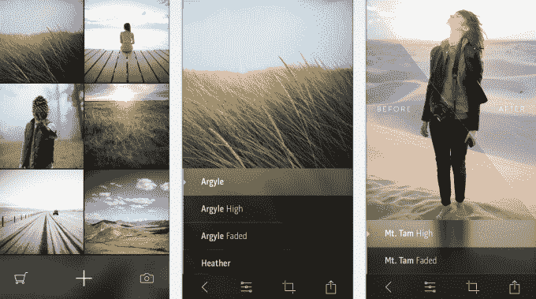
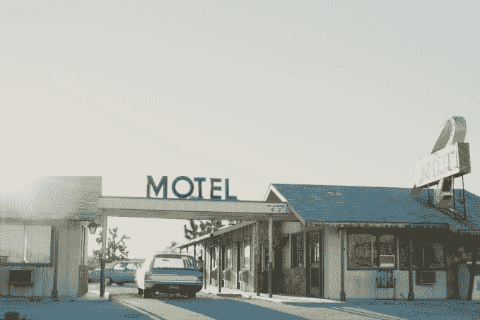

# Litely 是 iOS TechCrunch 最好的新照片过滤应用

> 原文：<https://web.archive.org/web/https://techcrunch.com/2014/05/14/litely-is-the-best-new-photo-filtering-application-for-ios/>

一款名为 [Litely](https://web.archive.org/web/20221208152159/https://itunes.apple.com/us/app/litely/id850707754?mt=8) 的 iOS 新照片编辑应用程序由负责 Instagram 多种滤镜的专业摄影师开发，在本月早些时候发布后的几天里，已经登上了 App Store 的榜首。今天，这款应用在 App Store 的排行榜上排名第三(免费应用)，在照片&视频类别中排名第一，这在一定程度上要归功于苹果自身的大力推广，它被 Litely 评为“最佳新应用”之一，也是“编辑的选择”

这些赞誉是恰如其分的，因为 Litely 是一个简单而优雅的照片过滤应用程序，它可以让你尝试一系列全新的照片预设，灵感来自电影色调。

这款应用由专业摄影师 Cole Rise 开发，他拍摄风景和旅行摄影，曾为国家地理以及苹果、谷歌和索尼等科技公司工作。但你可能从 Instagram 上知道他的工作，他帮助创建了 Amaro、Hudson、Sierra、Sutro、Mayfair、Willow 和 Rise 滤镜。

在 Litely 应用推出之前，Rise 的新电影预设只能在网上获得，例如，针对使用 Lightroom、Photoshop、Aperture 和 Adobe Camera Raw 的其他专业摄影师。

现在，它们都可以在 iOS 应用程序中使用，其中一些是免费的，而另一些则作为应用内购买提供。

在新的应用程序中，过滤包按主题分组。例如，一个地球色调包被称为“起源”，而一个温暖的色调包被称为“威尼斯”，灵感来自威尼斯海滩。另一部名为“煤渣”的电影让人想起老的黑白电影。

例如，与 Instagram 的几个过滤器或竞争应用 Aviary 中的过滤器相比，这些过滤器的好处在于效果更加微妙。这个想法是为了带出照片中的自然美，而不是用过度饱和的效果过度处理它们。(你知道，整个，*“哦，我看到你用了一个过滤器，”*你今天经常有这种体验)。例如，照片看起来更亮或更暖或更淡，但比以前可能的方式更精细。

要使用 Litely，您可以点击以应用不同的效果，甚至可以通过用两个手指点击照片来查看“之前和之后”，这是一个方便的技巧。您可以裁剪照片，以及调整曝光度、鲜明度、清晰度等。在这里，你实际上可以拖动你的手指到图像上的任何地方来进行调整，这比试图将你的手指放在小滑块上感觉更自然。

Litely 还支持全景照片编辑，这要归功于它使用了 iPhone 的陀螺仪，可以让你从一边到另一边倾斜设备，以查看更多的图像。

最棒的是，总的来说，Litely 的设计足够简单明了，即使是业余摄影师也可以使用——只需点击预设并进行一些调整。

Litely 用户下载后会收到一个包含 9 个预设的初始包，其他包每个 1.99 美元。Litely 通过应用内销售和网站销售创收。

这款应用在 iTunes 上[有售。](https://web.archive.org/web/20221208152159/https://itunes.apple.com/us/app/litely/id850707754?mt=8)