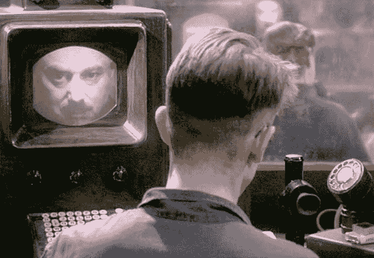

# 拿起你的相机，我们是小兄弟 

> 原文：<https://web.archive.org/web/https://techcrunch.com/2014/11/25/little-brother-is-watching-them/>

反乌托邦的未来总是想象政府用监视来压迫我们。在老大哥无所不知、无所不闻的耳目之下，自由意志受到限制，只允许“认可”的行为。爱德华·斯诺登透露这不是阴谋论，我们不必等待未来。我们已经被监视了，为了安全我们牺牲了自由。

但是乔治·奥威尔和阿尔多斯·赫胥黎没有预见到的是“小弟”的平行崛起

相机和录音设备越来越小，越来越便宜，所以有一天我们可能都会拥有它们是合乎逻辑的。令人惊讶的是社交媒体及其将这些设备联系在一起的能力。突然间，公民手中的相机成了正义的武器。只要我们把它们打开，它们就能在民众和当权者之间建立公平的竞争环境。

鸣谢:1984 处女电影/鸣谢: [Pyxurz](https://web.archive.org/web/20230202213316/http://pyxurz.blogspot.com/2013/04/nineteen-eighty-four-alt-1984-page-2-of.html) 。

有人称之为[、](https://web.archive.org/web/20230202213316/http://www.newyorker.com/tech/elements/little-brother-is-watching-you)，来源于法语“下面”和“观看”的意思。科利·多克托罗[写了一部小说](https://web.archive.org/web/20230202213316/http://craphound.com/littlebrother/)，讲述小哥哥的理想在未来如何实现。但是我们今天需要执行这些实践来控制权威。

围绕着迈克·布朗令人悲伤的死亡的困惑本可以由小弟弟来解决。

不幸的是，没有清晰的视频记录布朗和开枪打死他的警官达伦·威尔逊之间的互动。相反，大陪审团看到了其他证据，而不是向公众披露的证据，并决定不起诉他，并将案件提交审判。在美国发生了太多白人警察杀害手无寸铁的黑人的令人心碎的故事后，威尔逊不接受审判的事实引起了可以理解的愤怒。

毫无疑问，警察的工作很艰难，他们必须在瞬间决定如何保护自己。有时需要致命的武力。但有理由假设它偶尔会被不适当地使用，由愤怒或种族主义推动。然而，在截至 2011 年的七年时间里，美国执法部门报告了 2718 起“正当杀人案”，而只有 41 名警察因执勤杀人被指控谋杀或过失杀人。那只是 1.5%的时间。

在许多这类案件中，结论是根据不完整或相互矛盾的证人证词和官员的话得出的。  任何生命的丧失都是悲惨的，不管是谁的错。但是，为了让这个国家的每个人都感到安全，特别是遭受种族歧视和其他不利条件的少数民族，正义必须得到伸张。

“小兄弟”的录音可以提供伸张正义所需的事实。现在有一些应用程序，比如美国公民自由联盟的 Stop T5 搜身手表 T4，专门用于监控警察与平民的冲突。该应用程序可以录制视频并将其发送到美国公民自由联盟，或者在附近有人激活该应用程序时提醒用户，以便他们可以从另一个角度拍摄情况。

除了理清像布朗案这样的悲惨事件的来龙去脉之外，公民对权力的监督可以阻止不法行为。我们希望每个人的道德指南针能正确引导他们，但相机提供了额外的保障。当局知道他们的确切行动可能会受到审查，因此被迫照章办事。如果他们是对的，录音会证明他们是对的。

随着时间的推移，随着便携式高品质相机变得越来越便宜和便携，公民和执法部门之间更多有争议的互动将被拍摄下来。然而，摄像机永远不会在所有正确的地方和正确的时间打开。这就是为什么许多人，包括布朗的家人，正在推动警察在他们的制服上安装录音设备。

布朗家族在一份声明中说“加入我们的运动，确保在这个国家的街道上工作的每一名警察都佩戴人体照相机”。警车仪表板摄像头的记录已经用于这种效果。他们不仅可以解决关于事件顺序的争议，还可以让每个人的警务工作更加安全。

在加州里亚托的[警察佩戴人体摄像机的小规模试点项目中，针对警察的投诉下降了 88%，他们使用武力的情况减少了近 60%。当嫌疑人和目击者知道他们被拍摄时，他们会表现得更有礼貌，如果犯罪者担心他们会被摄像头捕捉到，你会认为对警察的攻击会减少。这是](https://web.archive.org/web/20230202213316/http://www.theguardian.com/world/2013/nov/04/california-police-body-cameras-cuts-violence-complaints-rialto)[福柯的全景监狱](https://web.archive.org/web/20230202213316/http://cartome.org/foucault.htm)派上用场。

尽管如此，警察可能会抵制人体摄像头，因为他们担心永久记录较小的错误会让他们被解雇。他们不得不改变工作方式，各部门可能会固执地将摄像机投入到紧张的预算中。

这就是为什么在必要的时候，我们都需要扮演小哥哥的角色。一个旁观者的手机视频可以为歧视和虐待的受害者带来正义，或者为不公平的被告开脱。

重要的是[了解你在拍摄警察或其他当局周围的权利](https://web.archive.org/web/20230202213316/https://www.aclu.org/kyr-photo)。美国公民自由联盟认为，你可以在合法存在的公共场所拍摄，只要你不干扰执法行动，你可以拍摄警察。没有搜查令，警察不得没收、查看或删除你的照片或视频。然而，有一种普遍的趋势是，警察骚扰、拘留和逮捕合法拍摄他们的公民，任何与警察的互动都有潜在的危险，所以要小心。

用相机斗相机，可能会进一步抹杀我们的隐私。多年来，我们一直在朝着这个方向稳步前进。但如果我们无论如何都要失去它，我们至少可以控制快门按钮，这样我们就可以用隐私换取真相。