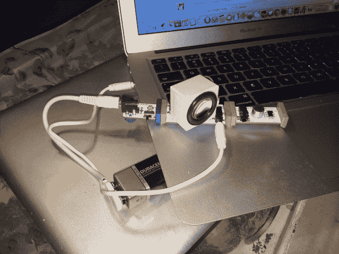

# littleBits 和美国宇航局用新的“太空工具包”TechCrunch 将太空带到地球

> 原文：<https://web.archive.org/web/https://techcrunch.com/2014/04/24/littlebits-and-nasa-bring-space-down-to-earth-with-new-space-kit/>

对书呆子来说，没有什么比太空更有吸引力了，几十年的电视、围绕火星探测器着陆的传言以及埃隆·马斯克都可以证明这一点。这可能是模块化集成电路初创公司 littleBits 与美国宇航局合作创建 [littleBits](https://web.archive.org/web/20221208065643/http://littlebits.cc/new_home) “太空套件”的原因这套工具售价 189 美元。

如果你没有实际拿到产品，littleBits 很难让你理解。但是一旦你这样做了，混搭模块会很鼓舞人心，教会你——如果你是普通的——比你权限内的任何事情都多的电气工程。第一课:你总是需要电源(蓝色)和输出(绿色)，以便创建一个最小可行的电子电路。

“如果你把 littleBits 模块想象成一个砖块——本质上是一个你可以制作任何东西的建筑块——那么你可以说乐高是无限可扩展库的最接近的比较，”创始人 Ayah Bdeir 说，他最近在 TED 上发表了演讲。“当然，我们通过在砖块中内置电子设备的能力，为砖块增加了一个全新的维度。”

这是我昨晚用工具做的基本扬声器。

虽然她不愿透露收入数字，但 Bdeir 告诉我，这家名为“21 世纪砖块”的初创公司已经在 70 多个国家的 2000 所学校售出了“数十万个单元”，其开源图书馆中可能有“数万亿个组合”。

littleBits 于 2011 年正式推出其产品，已从 [True Ventures](https://web.archive.org/web/20221208065643/http://www.trueventures.com/) 、[科斯拉风险投资](https://web.archive.org/web/20221208065643/http://www.khoslaventures.com/)、[铸造集团](https://web.archive.org/web/20221208065643/http://www.foundrygroup.com/wp/)、 [J](https://web.archive.org/web/20221208065643/http://en.wikipedia.org/wiki/Joi_Ito) [伊藤](https://web.archive.org/web/20221208065643/http://en.wikipedia.org/wiki/Joi_Ito)、[尼古拉斯·尼葛洛庞帝](https://web.archive.org/web/20221208065643/http://en.wikipedia.org/wiki/Nicholas_Negroponte)、[乔安妮·威尔逊](https://web.archive.org/web/20221208065643/http://www.crunchbase.com/person/joanne-wilson) 等公司筹集了 1560 万美元。以前的 littleBits 套件是面向音乐和灯光的。

美国宇航局在 2012 年接触了 littleBits，目的是教育更多人有关太空旅行的知识。该合作的具体目的是促进对 STEM 教育的兴趣，使没有获得工程学位的人能够轻松获得机器人、能源和无线数据传输。

每个太空工具包都带有 12 个磁性模块，包括一个数字模块，远程触发器和红外 LED 传感器。该工具包还附有一本由美国宇航局的科学家编写的电路应用手册，以及如何制作自己的波发生器、星图、卫星轨道和火星探测器模型的说明。

“我们收到了很多合作请求，但我们选择了 NASA，因为太空是至关重要的，对宇宙中的每一个人和整个社会都非常重要，”Bdeir 写道，“但只有我们中的很多人知道所有这些发现意味着什么，以及它们与我们的关系。”

该公司计划保持与美国国家航空航天局的关系(你永远不知道这何时会派上用场！并且正在围绕这些工具包组织一系列的黑客马拉松和研讨会，再次希望让更多的人热衷于科学和技术。

如果有人在我七岁的时候给我一个这样的东西，我可能已经成为我的爸爸了。

[https://web.archive.org/web/20221208065643if_/https://www.youtube.com/embed/WrywrtSnSog?feature=oembed](https://web.archive.org/web/20221208065643if_/https://www.youtube.com/embed/WrywrtSnSog?feature=oembed)

视频