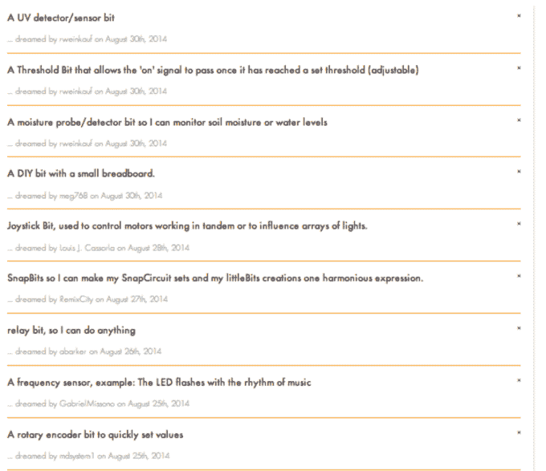

# LittleBits 宣布推出硬件应用商店 BitLab 

> 原文：<https://web.archive.org/web/https://techcrunch.com/2014/09/16/littlebits-announces-bitlab-an-app-store-for-hardware/>

# LittleBits 宣布推出硬件应用商店 BitLab

你曾经想造一架香蕉钢琴吗？或者用乐高做一个机器人蟑螂大脑？现在有了 LittleBits，你(可能)可以。该公司刚刚宣布了一个名为 BitLab 的项目，这是一个与众包技术系统相结合的竞赛，允许发明家创造新的 LittleBits 块，上传它们，并由公司制造和销售。该系统还包括一个硬件开发套件，允许任何人访问 LittleBits 的定制磁性卡扣式导线。

整个系统旨在让创作者为 LittleBits 世界构建有用的小模块。虽然该系统的早期版本是针对教育市场的，但创始人 Ayah Bdeir 现在正在设想一个像 Arduino 或 Raspberry Pi 这样的快速原型系统。事实上，随着 Arduino 模块和[云包](https://web.archive.org/web/20221007054858/http://littlebits.cc/bundles/cloud-starter-bundle)的[发布，你可以做出一些非常令人印象深刻的电子项目，而不必了解面包板和电子元件的变幻莫测。](https://web.archive.org/web/20221007054858/http://littlebits.cc/bits/arduino)

“当苹果推出应用商店时，许多应用都是游戏，许多都很无聊。我记得很多屁应用，”Bdeir 说。“但是现在 6 年过去了，已经有超过 130 万个应用为软件开发者社区贡献了近 150 亿美元。我们相信同样的事情也会发生在硬件开发者身上，他们只需要一个通用的开发平台，一个支持它的供应链，以及一个面向社区和分销的市场。”

它是如何工作的？你用 HDK 和你自己的智慧创建一个模块。它可以是复杂的——一个完整的 PCB——或者只是一个想法。然后观众投票选出他们最喜欢的模块。如果模块在每个周期的投票中获胜，LittleBits 将生产它。这允许你和你的朋友支持你可能想要使用的酷模块，并且它允许 LittleBits 扩展它的模块选择。

LittleBits 已经在与 MakeyMakey(T2)背后的人合作，制作水果钢琴模块(真的)和后院大脑(T4)为实验室构建模块，我们可以期待在未来几个月内看到模块在网上商店上市。你可以在这里查看比特实验室[但是即使你在比特实验室，也不要碰戴尔的架子鼓。](https://web.archive.org/web/20221007054858/http://littlebits.cc/bitlab)

【YouTube = https://www . YouTube . com/watch？v=K4L5BggqW14]

【YouTube = https://www . YouTube . com/watch？v=0jc188iS5Tg]