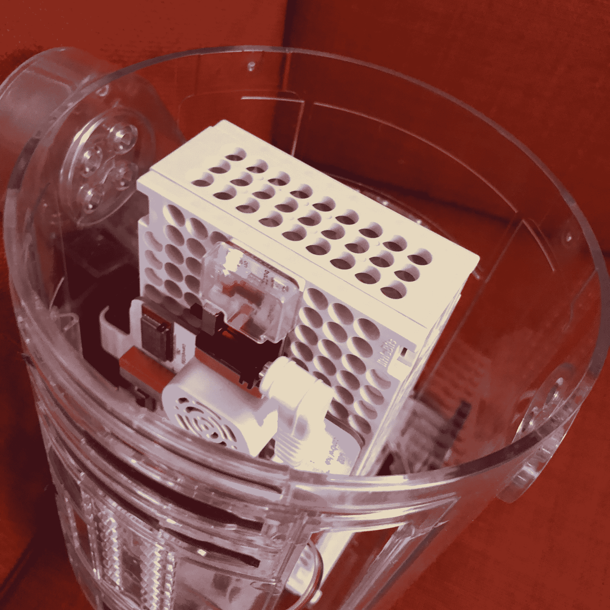
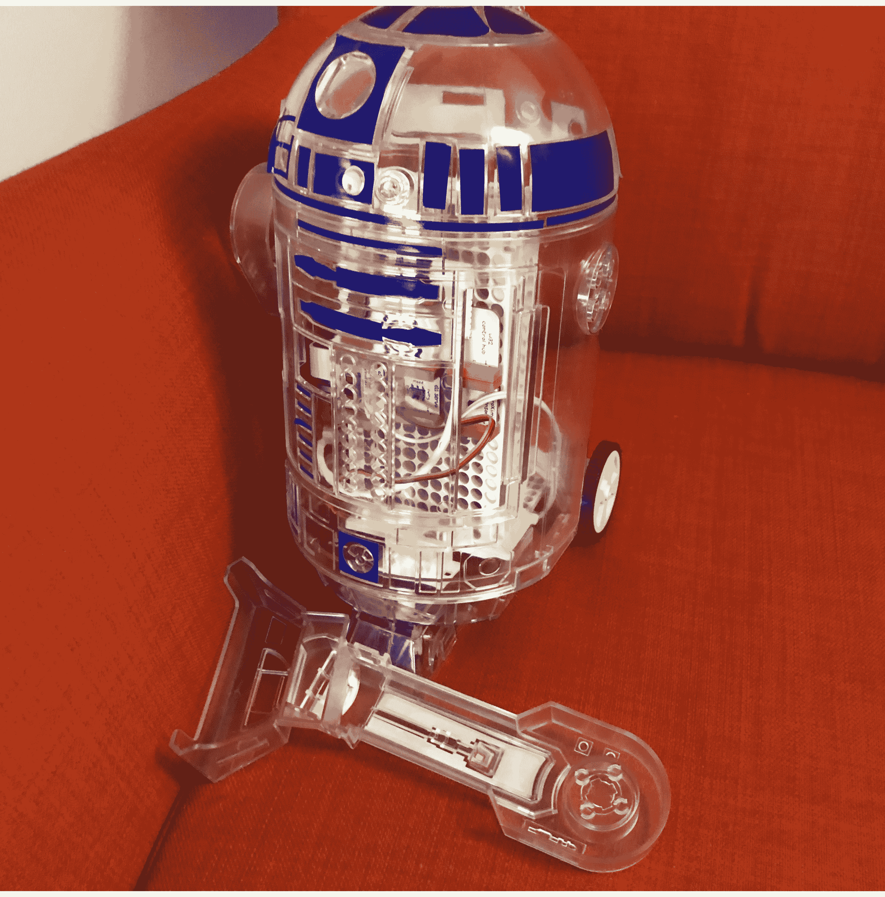
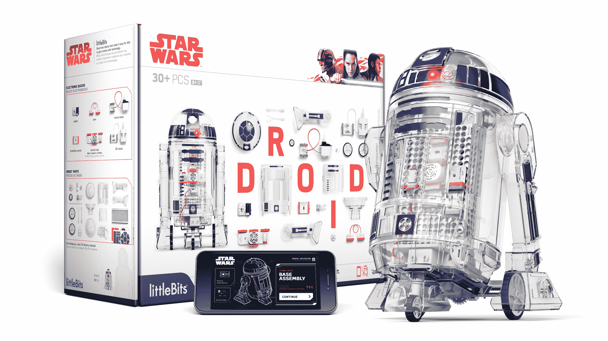

# LittleBits 的 Droid Inventor kit 是第一个能用的 STEM 玩具

> 原文：<https://web.archive.org/web/https://techcrunch.com/2018/01/26/littlebits-droid-inventor-kit-is-the-first-stem-toy-that-works/>

# LittleBits 的机器人发明家工具包是第一个可以工作的 STEM 玩具

我一直怀着极大的兴趣和极大的怀疑看着 STEAM 和/或 STEAM 玩具。虽然许多家长和老师报告说，像 [Cleverbot](https://web.archive.org/web/20230323204543/https://store.makewonder.com/collections/cleverbots-accessories?utm_source=google&utm_medium=cpc&utm_campaign=646362917&utm_term=US-47768229531-238231859478--kwd-307760119808&gclid=EAIaIQobChMI-I3V8vH12AIVh4WzCh33GA5cEAAYASAAEgJ36_D_BwE) 和无论什么[这东西是](https://web.archive.org/web/20230323204543/http://www.fisher-price.com/en_US/brands/think-and-learn/index.html)这样的编程玩具取得了巨大成功，但我发现，我认识的孩子(和家长)发现许多 STEM 玩具是无菌的、无聊的、没有乐趣的。

众所周知的复杂的小比特套件也是如此。这些工具包里有一些可以组装的电子部件，让你可以创建电路和连接芯片，以构建各种项目。你可以制作合成器、Arduino 小工具、机器人等等，但最终，我认识的任何人都没有任何灵感。现在，我很高兴地报告，LittleBits 终于用 Droid Inventor kit 实现了 STEM magic，其他制造商将会很好地模仿他们。

这套工具看似简单。它只包括几个组件，包括驱动和转向电机，以及接近传感器和连接到您的手机的无线单元。该套件带有一个塑料 R2D2 身体，包括可移动的腿和头，以及让您选择红色或蓝色 R2 单元的贴纸，甚至可以让您的孩子给自己的机器人上色的白色贴纸。

组装该项目很容易，附带的安装盒便于布置电路和连接电源，无需担心电线被夹住或短路。一旦你的机器人组装好了，你就可以按照手机应用程序上的一组指令来教你的机器人跟随你，模拟推挤和其他可爱的游戏。

为什么这个产品这么好？这是一个引人注目和有趣的套件，它与一个非常受欢迎的系列产品相关联，既可以作为学习体验，也可以作为玩具。虽然机器人目前在我孩子们的地板上已经支离破碎，但他们玩 Droid Inventor 套件的次数远远超过我见过的任何其他 STEM 套件，包括经典的 [Snap Circuits](https://web.archive.org/web/20230323204543/https://www.amazon.com/Snap-Circuits-SC-300-Electronics-Discovery/dp/B0000683A4/ref=sr_1_17?ie=UTF8&qid=1516981527&sr=8-17&keywords=electronics+kit) ，它比任何 LittleBits 套件都更完整，也更复杂。

虽然我知道轶事证据是不可靠的，但我相信 LittleBits 最终得到了正确的 STEM 公式。这款价值 99 美元的玩具/小工具/工具包易于制作，有趣，并具有潜在的教育意义。它本质上就像一个非常简单的星球大战乐高玩具，拥有更加智能的技术。

这个玩具会让你的孩子成为小天才吗？不会，但他们会对电路有一个初步的了解，并明白小元件可以做很酷的东西。再说一次，我不相信像这样的玩具会让孩子们变得更聪明，但至少他们会接触到一些概念、工具和想法，这些会让他们在科技领域找到职业。所需要做的就是在 STEM 混音中加入一个流行的异想天开的哔哔声机器人。