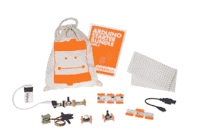
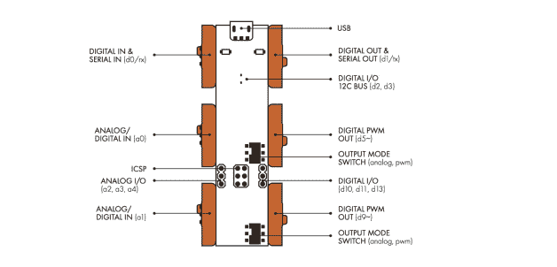

# LittleBits 与新的 Arduino 模块一起成长 

> 原文：<https://web.archive.org/web/https://techcrunch.com/2014/05/15/littlebits-grows-up-with-new-arduino-module/>

littleBits(我年轻时真的希望存在的“非玩具”玩具)的世界变大了一点:它现在可以和 Arduino 友好地玩耍了。

如果你不熟悉 littleBits，可以把它想象成一个用乐高拼装的 DIY 电子工具包。每个“比特”都是一个独立的电子元件，比如扬声器、光传感器或发光二极管。将它们组合在一起，你就可以做各种很酷的事情——不需要编程。

想在每次有人走进房间时发出蜂鸣声吗？将电源模块与运动触发器模块连接，将运动触发器与蜂鸣器模块连接，就大功告成了。想点亮一个 LED 而不是发出蜂鸣器的声音吗？将蜂鸣器模块换成指示灯。

“不需要编程”一直是 littleBits 最大的优势之一；这意味着*任何人*都可以很偶然地开始组装东西。

唉，直到现在，“不需要编程”也意味着“不允许编程”。如果你想做一些预先提供的模块没有被编程为开箱即用的事情(比如说，只在周四发出前述的蜂鸣声之类的)，那……你对此无能为力。

谷歌对“littleBits”的顶级建议之一是“littleBits Arduino”，这是有原因的。littleBits 的想法很棒，但是一旦一个特别热情的用户达到了他们套件的极限，下一步(学习使用独立的 Arduino 板，这意味着还要学习正确的电路、焊接等。)突然变得非常大。

今天早上，littleBits 将推出一款 Arduino 模块。就像其他 littleBits 模块一样，它可以直接安装到位，不需要焊接，一个很大的不同是:它是可编程的。您可以获得 Arduino 的可编程性，而无需学习无数其他必备技能。你通过板载的 microUSB 端口接入它，通过标准的 Arduino IDE 上传你的程序，所有的 littleBits 模块就排成一行了。

如果你已经有了 littleBits 套件，littleBit 的 Arduino-At-Heart 模块将花费你 36 美元。如果你没什么比特，他们现在也在卖一个以 Arduino 为中心的入门套件，带有 Arduino 模块和 8 个其他组件(电池、几个开关、伺服系统和控制转盘)，售价 89 美元。

迄今为止，littleBits 已经筹集了 1560 万美元，最近一次是在 11 月份的 1100 万美元 B 轮融资中。

对于外面的 Arduino 极客，我会让下面的话来说明一切:

