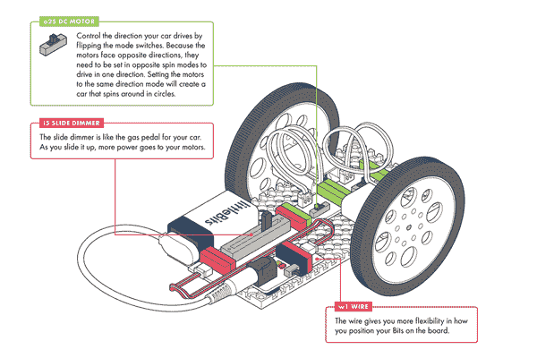
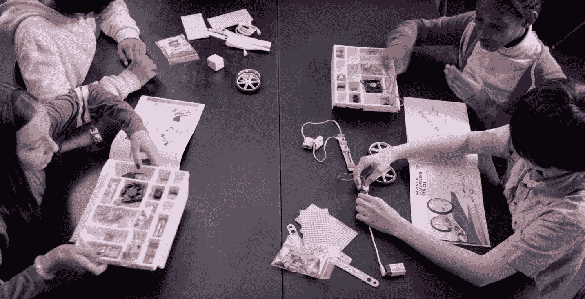

# littleBits 面向学生的新 STEAM 套件强调发明

> 原文：<https://web.archive.org/web/http://techcrunch.com/2016/03/08/littlebits-new-steam-kit-for-students-emphasizes-invention/>

在 TechCrunch，我们是《T2》的超级粉丝。该公司去年筹集了 4420 万美元，提供了许多不同的[设备](https://web.archive.org/web/20230323204543/http://littlebits.cc/shop)，教孩子们(和成年人)编程和电子知识——让他们用新技能发挥创造力。

今天，该公司推出了其[首款蒸汽套件](https://web.archive.org/web/20230323204543/http://littlebits.cc/kits/steam-student-set)。STEAM 将“艺术和设计”添加到 STEM 的科学、技术、工程和数学中，因此毫不奇怪，这个新系列的重点是发明和设计。这款电视机现在可以预订，售价 299.95 美元，将于 4 月 22 日发货。

这套新设备直接面向学校(例如，不同于 littleBits 的[小发明&小工具](https://web.archive.org/web/20230323204543/https://techcrunch.com/2015/10/08/littlebits-releases-a-wonderful-gadget-and-gizmo-kit/)套件), littleBits 还将为希望在课堂上使用它的教育工作者提供一门课程。

使用这个新工具包和它附带的 72 页的[发明指南](https://web.archive.org/web/20230323204543/https://d3ii2lldyojfer.cloudfront.net/pdf/STEAM+Student+Set/STEAM-Student-Set-Invention-Guide.pdf)，学生们将可以建造自己版本的基本[无人驾驶汽车](https://web.archive.org/web/20230323204543/http://littlebits.cc/lessons/invent-a-self-driving-vehicle)，一个跟踪他们日常习惯的小发明[和一个投掷臂](https://web.archive.org/web/20230323204543/http://littlebits.cc/lessons/invent-a-throwing-arm)，以及许多其他项目。

该套件本身包括 19 个不同的部分，包括光和温度传感器，蜂鸣器，伺服电机和 LED 灯。还有 49 个配件(想想 USB 适配器，轮子，伺服架等。).

几乎 300 美元，这可能不是在家里开始使用 littleBits 的最佳选择(99 美元的基本套件可能是更好的选择)。然而，对于学校来说，这提供了一个很好的一体化包来激发学生对技术的兴趣。

littleBits 创始人兼首席执行官 Ayah Bdeir 在今天的声明中表示:“little bits希望每个学生都拥有技术素养和解决问题的技能，以创造自己的发明，无论是帮助残疾人的设备，街机游戏还是新的家用电器。”。“我们正在与教育工作者合作，为任何人提供一种方法，无论他们的技术能力如何，都能以一种极具影响力和吸引力的方式将 STEM 和 STEAM 带入课堂。”

该公司表示，纽约市教育局将在其城市 STEM 项目的夏季为 2-5 年级使用这些新设备。

