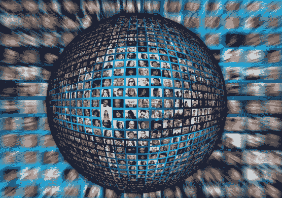
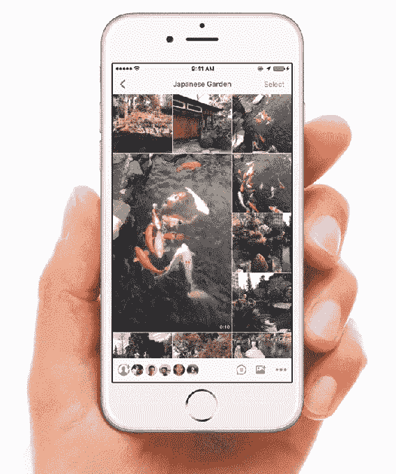

# 活在当下 

> 原文：<https://web.archive.org/web/https://techcrunch.com/2016/03/25/live-is-having-a-moment/>

塔里克·科鲁拉撰稿人

Tarikh Korula 在创办公司、运输和发展消费技术产品方面有十年的经验。他目前领导着一些不寻常的实验室，为早期和中期创业公司的增长、融资和盈利能力提供建议。科罗拉在 NYU、SVA 和帕森斯学院讲授产品开发课程，是“相互依赖项目”的董事会主席，这是一个致力于教授正念和冥想的非营利组织。

More posts by this contributor

本周满 10 岁的 Twitter 显然已经将它的整个组织原则变成了现实。在上个月的一次全体会议上，马克·扎克伯格宣布视频直播是脸书的首要任务。

显然，扎克的[将他的战斗](https://web.archive.org/web/20221207171322/https://beta.techcrunch.com/2016/03/01/get-it-while-its-hot/)引向了 Twitter 的 Periscope，这是一款移动直播应用，它本身[与 Meerkat 展开了激烈的竞争](https://web.archive.org/web/20221207171322/https://beta.techcrunch.com/2015/05/06/meerkat-founder-on-getting-the-kill-call-from-twitter/)。

亚马逊正在将其最近收购的直播游戏平台 Twitch 扩展到新的内容类别，如[食物](https://web.archive.org/web/20221207171322/https://beta.techcrunch.com/2016/03/15/twitch-to-stream-julia-childs-cooking-show-to-kick-off-launch-of-new-food-channel/)。[与亚马逊就](https://web.archive.org/web/20221207171322/https://beta.techcrunch.com/2014/08/25/amazon-will-buy-twitch-for-over-1-billion/) Twitch 争论不休的谷歌，据传正在开发[直播应用](https://web.archive.org/web/20221207171322/http://venturebeat.com/2016/03/23/google-is-building-youtube-connect-a-live-streaming-app-to-take-on-periscope/)，同时通过直播活动收集数百万观众，包括 [AlphaGo 与 Lee Sedol](https://web.archive.org/web/20221207171322/https://beta.techcrunch.com/2016/03/09/googles-deepmind-chalks-up-ai-landmark-after-beating-go-world-champion-lee-sedol/) 的比赛以及总统初选辩论。

与此同时， [Instagram Spotlights](https://web.archive.org/web/20221207171322/https://beta.techcrunch.com/2016/01/06/too-lazy-to-scroll/) 和 [Twitter Moments](https://web.archive.org/web/20221207171322/https://beta.techcrunch.com/2015/10/06/project-glacier/) 正在追赶 [SnapChat 的 Live Stories](https://web.archive.org/web/20221207171322/https://beta.techcrunch.com/2016/02/28/snapchat-debuts-stories-web-player-for-academy-awards/) ，上周，SnapChat 首次为奥斯卡发布了网络体验，并首次为一场板球比赛发布了全球 [Live Story](https://web.archive.org/web/20221207171322/http://www.icc-cricket.com/world-t20/news/2016/media-releases/93751/crickets-first-ever-global-snapchat-story-to-be-at-india-v-pakistan-at-icc-world-twenty20-india-2016) 。

直播媒体是当今发展中最具活力的移动讲故事类别，因为它速度快，身临其境，可以在你的手掌中消费。这是我们喜欢(偶尔也讨厌)互联网的一切——即时、第一人称、混乱不堪。它正在改变我们与世界故事联系的方式，因为它创造了体验和参与现实世界事件的新方式。

突发新闻推出新媒体。当 7/7 伦敦爆炸案在伦敦发生时，Flickr 的用户生成的事件照片瞬间将其转化为国际照片平台。当 Sully Sullenberger 将一架飞机安全降落在哈德逊河上时，Twitter 成了全世界观看飞机机翼上照片的方式。随着最近圣贝纳迪诺枪击案的发生，SnapChat [在许多人眼中成长](https://web.archive.org/web/20221207171322/https://twitter.com/dannysullivan/status/672256519690301440)，从性短信应用到[下一代突发新闻应用](https://web.archive.org/web/20221207171322/https://twitter.com/AdrianCraver/status/672302895656644608)。

虽然直播已经伴随我们十年了，但直播媒体还是新生事物。所以，让我们拥抱我们所说的实时媒体。尽管平台和格式多种多样，但还是有一些共同的特征。

现场媒体来自实时故事，植根于一个地方和时间，从不同的角度讲述。直播媒体是移动媒体。可以是照片、视频、评论、状态更新、签到以及以上的各种组合。直播媒体独特地让远程观众能够在故事展开时体验并参与其中。最后，由于直播媒体是多角度、多格式和不同步的，它通常是一个皇家的混乱，需要一些人工编辑来聚合成摘要流以便于消费。实时媒体是:

*   **民主。现场媒体报道每个人:目击者、世界领导人、名人和公民。因此它邀请实时参与。**
*   **瞬间移动。直播媒体为大众层面的观点创造了新的机会，创造了真正的亲密、直接和沉浸感。**
*   **生吃。**现场媒体是杂乱的、手持的、非线性的。它经常需要管理和编辑。

**为什么是现在？**

由于各种因素的爆炸性结合，现场媒体正在成为主流。全球有超过 20 亿部支持摄像头的智能手机和平板电脑被激活。[这张广为分享的照片](https://web.archive.org/web/20221207171322/https://www.instagram.com/p/W2FCksR9-e/)从内心捕捉到了移动设备在我们这个世界的广泛覆盖。再加上 2013 年拍摄的照片，现在无处不在且强大的 4G 网络，有可能将媒体无缝地流式传输到新兴和主导的社交平台上，这些平台本身就拥有数十亿眼球的全球受众。

采用 Live media 的最后一个因素是新一代的千禧一代——越来越多的是我们所有人——他们依靠手机作为信息收集、消费和参与的第一个家。这一代移动设备取代了与电视和桌面浏览器捆绑在一起的前几代设备。他们的世界是移动到移动的，实时媒体、第一人称视角、积极参与和事后回放都在他们手中。

我们将如何管理所有这些实时媒体？我们中的大多数人都太忙了，无法对每个警报做出响应。消费者将如何搜索、发现和消费直播后的暴雪？人们自然会想方设法对直播后的媒体进行书签、重播、搜索、分类和展示。(请注意，我在这场比赛中有一匹马，因为我是 [Katch](https://web.archive.org/web/20221207171322/https://katch.me/) 的首席执行官，这是一个致力于搜索、发现和发布赛后实时回放的视频平台)。

**活鱼**

说到后现场回放，“现场”一直有点像一个构造。几十年来，内置于编辑和电视中的直播广播延迟一直在播放预先录制的“直播”节目，如 【周六】 晚间直播。虽然看起来技术已经发展到了“活”实际上意味着“活着”的程度，但活着仍然是一个模糊的概念。SnapChat 的直播故事通常由几小时前分享的媒体组成。Twitter 的实时订阅现在有争议地包含了“当你不在的时候……”时移推文。通过 SnapChat、Meerkat 和 Periscope 等平台的短暂性，这种差异在很大程度上被时间敏感性所掩盖。但随着这些平台的成熟，聚集现场参与者和接触更多现场后观众之间的矛盾将会越来越大。

**口袋里的电视**

消费者喜欢视频。SnapChat Live 故事最初是照片拼贴，但现在主要是视频。预计视频将在直播媒体以及我们在手机上创建和消费的内容中扮演越来越重要的角色。随着手机摄像头的改进，网络容量的扩大，用于创作和编辑的应用程序的改进，以及更多的人放弃使用电脑，寻找新的内容来源，我们手机上的更多视频是不可避免的。由于视频广告的价格优于其他在线广告，因此也将会有一个平台对它的渴望。也许这就是为什么像脸书和推特这样的社交网络竞相整合视频的原因。

“视频直播是我最兴奋的事情之一，”扎克伯格最近在柏林说。“我认为视频是一个大趋势，几乎和手机一样大，”他在另一次采访中说。

在某种程度上，直播媒体的供应商应该专注于改进和丰富他们围绕视频的所有产品。

**即将推出**

如果直播媒体像扎克伯格和这个领域的其他玩家一样大，它将改变我们沟通、讲述故事和获取新闻的方式。目前，这还为时尚早，还有很多东西需要充实。

在线市场会发展到让消费者申请保险吗？想象一下，通过网络社区，能够集中资源，共同记录突发事件和利基事件。

随着直播媒体应用的激增，新的服务会试图在致力于利基社区的垂直市场中脱颖而出吗？注意，我们已经开始看到类似于 [Nom](https://web.archive.org/web/20221207171322/https://nom.com/) 、 [Krue](https://web.archive.org/web/20221207171322/https://www.krue.tv/) 和 [Waggle](https://web.archive.org/web/20221207171322/http://waggle.tv/) 这样的服务。

目前，SnapChat Stories、Twitter Moments 和 Instagram 聚光灯都有一层人类策展和编辑。算法将能够帮助排序、排名和创建亮点吗？可以利用社区来参与策展吗？还是说编辑声音和报告文学会变得更重要？

生活中没有什么是免费的。服务将需要找出围绕直播媒体的商业模式。期待看到赞助、前置广告、叠加广告、分析、虚拟商品和赞助的货币化实验。

以上这些将如何改变我们与故事的联系方式，还有待观察。但有一点是肯定的:这场革命将会直播。