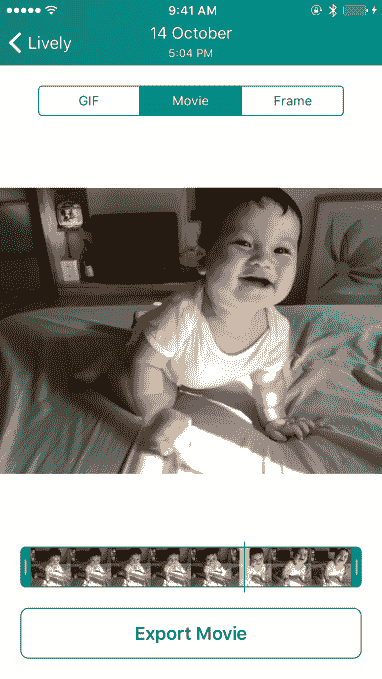

# Lively 让您可以修剪 iPhone 的实时照片，从视频中挑选您的最佳镜头 

> 原文：<https://web.archive.org/web/https://techcrunch.com/2015/12/18/lively-lets-you-trim-your-iphones-live-photos-pick-your-best-shot-from-the-video/>

自从 iPhone 6s 和 6s Plus 推出支持名为 Live Photos 的新的动画照片类型以来，已经推出了许多应用程序来帮助 iPhone 用户处理这些移动图像，包括将它们转换为 gif，[通过删除 Live Photos](https://web.archive.org/web/20221208174108/https://beta.techcrunch.com/2015/10/27/lean-cleans-up-live-photos/) 等来节省存储空间。现在，这个领域的先行者之一， [Lively](https://web.archive.org/web/20221208174108/http://lively.tinywhale.net/) ，已经推出了几个显著的功能，扩展了你可以用实时照片做的事情。该应用程序现在允许你修剪你的剪辑，甚至从视频中抓取最好的静止帧。

如果你之前没注意到，[应用首次亮相是在今年秋天，](https://web.archive.org/web/20221208174108/https://beta.techcrunch.com/2015/10/19/free-the-gif/)在新 iPhones 发布后不久，为用户提供了一种将实时照片转换成 gif 的方法。其他应用程序也提供类似的功能，比如像 Live GIF 。

这些应用目前很有用，因为苹果还不支持将你的实时照片发布到脸书和 Twitter 等社交媒体网站，或 Facebook Messenger 等即时通讯应用中。然而，这种情况正在开始改变，因为 Tumblr 本月增加了对实时照片的支持。不过就目前而言，如果你想更广泛地分享你的实时照片，你必须首先将它们转换成 gif 格式——这就是 Lively 所做的。

在最新版本中，Lively 对这一过程进行了改进，它允许您在将实时照片导出为 GIF 之前对其视频部分进行修剪。这意味着你可以删除 iPhone 拍摄你举起或放下手机的部分，这在 iOS 9.1 发布之前一直是一个特别令人烦恼的事情，iOS 9.1 开始感应手机是否被举起或放下，因此它不会记录这些时刻。尽管如此，仍有旧图像需要修剪，有时您只想剪辑视频。

虽然应用程序开发人员 Tiny Whale 的 Jason Dinh 表示，修剪是 Lively 2.0 中最值得注意的新功能，但我个人认为，从实时照片的视频部分选取帧的能力实际上是新增加的功能中最好的。当你试图捕捉一个扭动的孩子或宠物或其他动作镜头时，这尤其有用——通常，最好的照片不是 iOS 捕捉的静态图像，而是可以从视频部分提取的图像。

[gallery ids="1253814，1253813，1253812，1253810，1253809，1253808，1253807"]

有几个应用程序可以让你从视频中提取剧照，如 [Vhoto](https://web.archive.org/web/20221208174108/https://itunes.apple.com/app/id816602120?&referrer=click%3D1c8897cf-eb08-4387-8650-649b61a2ba85) (现在关闭了)和 [Stillshot](https://web.archive.org/web/20221208174108/https://itunes.apple.com/US/app/id520436425?mt=8) (废弃)，但它们不支持现场照片。这使得该功能成为一个受欢迎的新增功能。

最近发布的其他改进包括除了相机胶卷之外，还可以从其他相册中提取实时照片；GIF 生成和回放优化，支持更好的分享，包括直接发布到 Twitter 和 Tumblr 本地化；和可访问性支持。

这款应用还支持像 Instagram 的 Boomerang 应用一样制作简短的循环 gif，开发者还提到。不同的是，Boomerang 要求你使用其应用程序来记录你的拍摄，但 Lively 允许你在事后进行编辑。

更新版本的最后一个调整是，Lively 不再要求你在三次导出后购买该应用程序——今后，你可以无限期免费使用它，只有在你想删除照片上出现的水印时才需要付费。

Jason 告诉 TechCrunch，以前应用内购买率在 10%左右，这真的很好。“但这意味着 90%的用户在 3 次导出后根本无法使用该应用程序。他说:“我们希望这些用户继续使用这款应用，也许从长远来看这是可行的。”。

Lively 是 iTunes 上的免费下载。