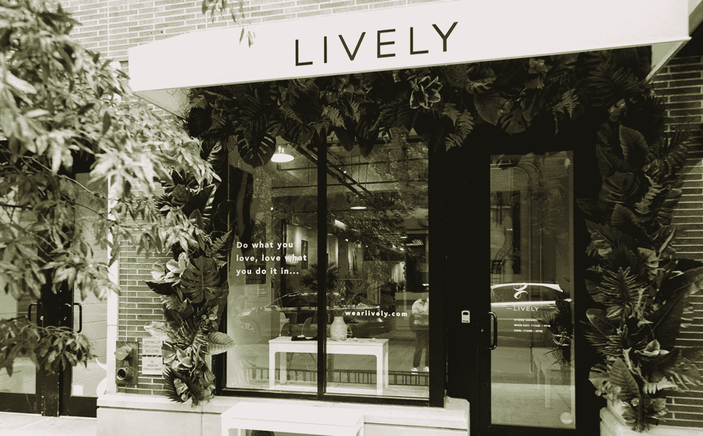

# Lively 筹集了 650 万美元，将其舒适且包容的内衣带到实体店

> 原文：<https://web.archive.org/web/https://techcrunch.com/2018/09/11/lively-raises-6-5m-to-bring-its-comfortable-and-inclusive-lingerie-to-brick-and-mortar-stores/>

罗伊·雷蒙德开了一家名为“维多利亚的秘密”的小店，现在是世界上最受欢迎的内衣商店之一，因为他不好意思在百货商店给妻子买内衣。

该品牌创立的前提是，男性需要一个安全的空间为女性购买内衣，而女性需要更多种类的性感、天使般的胸罩和其他内衣供男性穿着。

但现在是 2018 年了。如今，女性会为自己购买内衣。他们希望舒适、实用且美观。

直接面向消费者的内衣初创公司 [Lively、](https://web.archive.org/web/20230306180741/https://www.wearlively.com/)的创始人兼首席执行官米歇尔·科代罗·格兰特(Michelle Cordeiro Grant)曾是维多利亚的秘密(Victoria's Secret)的高级商人。“激励女性成为坎蒂丝·斯瓦内普尔对世界上大多数女性来说是不可行的。我想创造一款适合女性、由女性打造的产品。”

她意识到市场上存在不会用钢圈扎伤你的胸罩的空白，于是建造了 Lively。迄今为止，该公司已经筹集了 1500 万美元的风险投资资金，包括 GGV 资本、NF Ventures 和前 Nautica 首席执行官哈维·桑德斯(Harvey Sanders)今天宣布的 650 万美元的首轮投资。

“以前，女人的抽屉里有两排产品。一排是他们想被看到的……另一排是更简单、更舒适的——但是没有人想被看到。”

Cordeiro Grant 说，虽然她在#MeToo 运动之前就开始了 Lively 的工作，但它极大地推动了业务的发展。在过去的一年里，这个规模庞大的初创公司增长了 300%。这家直接面向消费者、销售 35 美元胸罩和内衣的公司已经扩展到提供泳装、运动服和家居服。接下来是实体零售。

她说:“女性已经准备好接受像我们这样的谈话了。”。

这家初创公司正在利用资金开设实体店，[这是其他电子商务企业的一种趋势](https://web.archive.org/web/20230306180741/https://techcrunch.com/2018/09/05/uppercase-raises-3-5m-to-help-e-tailers-open-brick-and-mortar-stores/)。今年 7 月，即将开业的几家门店中的第一家在纽约市的 SoHo 社区开业，占地 2700 平方英尺。芝加哥、洛杉矶和达拉斯的商店也在考虑之中，与 Nordstrom 的合作也在考虑之中，该公司将从下周开始在 11 家商店积极销售限量版内衣。

Lively 与其他几个直接面向消费者的内衣和运动服品牌竞争，包括 ThirdLove、AdoreMe、TomboyX 和 Outdoor Voices。