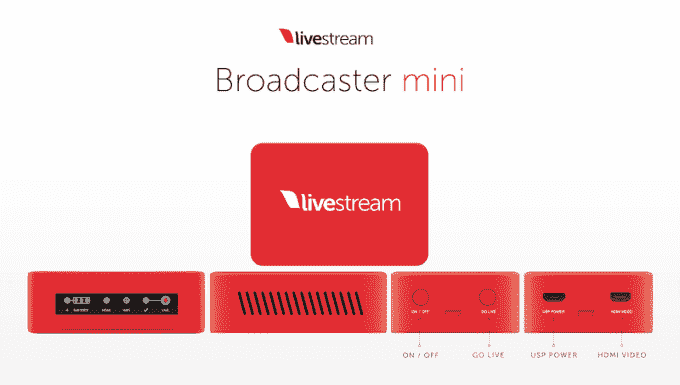

# Livestream 通过更小、更便宜的广播公司 Mini  改进其硬件阵容

> 原文：<https://web.archive.org/web/https://techcrunch.com/2015/03/01/livestream-broadcaster-mini/>

# Livestream 通过更小、更便宜的广播 Mini 改进其硬件阵容

随着一款名为[广播迷你](https://web.archive.org/web/20230308013915/http://new.livestream.com/broadcaster-mini)的新产品的推出，Livestream 正计划让(你猜对了)直播视频变得更容易、更实惠。

迷你是广播公司双管齐下的更新的一部分，[大约三年前推出](https://web.archive.org/web/20230308013915/https://techcrunch.com/2012/04/12/livestreams-new-livestream-broadcaster-will-let-you-live-stream-from-almost-any-camera/)并允许客户从任何相机直播。联合创始人兼首席执行官 Max Haot 告诉我，广播公司是一个很好的切入点，让你只需购买一台“prosumer”相机，就可以开始流媒体播放。

即将推出的 Broadcaster Pro 将取代现有的设备，而 Broadcaster Mini 更小、更便宜——大约是原始设备的三分之一(如果你想准确的话，它是 73 毫米×51 毫米×25.5 毫米)，价格仅为 295 美元，而原始广播公司的价格为 495 美元。同时，它仍然可以传输 1080p 视频。

Haot 上周为我演示了 Mini，通过 HDMI 线将其连接到相机，然后使用该公司的免费 iOS 应用程序(也可以在 Android 上使用)作为遥控器来找到互联网连接，并建立我们的采访流。当然，在你进行面试的时候观看面试可能不是真正的用例(首先，这有点让人分心)，但是看到现实世界的讨论和网上的讨论之间几乎为零的延迟确实令人印象深刻。

豪特还告诉我，目前约有 40%的 Livestream 活跃客户群在使用这款播放器。他说，该公司并不认为硬件是一个大的赚钱机器——它真正的业务在于提供额外的功能，如分析和嵌入。

虽然直播视频可能不再是闪亮的新事物(至少不是[，除非它涉及视频游戏](https://web.archive.org/web/20230308013915/https://techcrunch.com/2014/08/25/amazon-will-buy-twitch-for-over-1-billion/))，但 Livestream 表示，它每月仍向 4000 万观众播放 30 万场活动。

豪特说，该公司通过“为正确的工作提供正确的工具”来实现这一目标因此，即使你没有单独的摄像头，你也可以使用该公司的应用程序从你的电脑或移动设备上进行直播，或者你可以使用 Broadcaster Pro 或 Mini 做一些更专业的事情，或者你可以通过自定义设置更进一步“上游”。

“我们有一个非常强大的产品路线图，”他补充说。“如果你相信人们希望现场观看每一场比赛，那么流媒体领域发生的一切都还没有开始。”