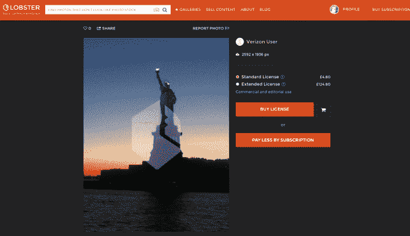

# 龙虾将威瑞森云添加到其人工智能照片许可军火库 

> 原文：<https://web.archive.org/web/https://techcrunch.com/2016/10/17/lobster-adds-verizon-cloud-to-its-ai-powered-photo-licensing-arsenal/>

龙虾是一家成立于 2014 年的初创战地公司，它与威瑞森云合作，为其人工智能媒体许可平台注入了新的活力。

广告商、出版物、代理商和媒体现在将有办法许可来自社交媒体和威瑞森云的图片。每卖出一张图片，75%的利润归贡献者所有，从专业摄影师到普通 Instagrammer 都有。

对于普通用户(你！)，这意味着如果你注册了[龙虾](https://web.archive.org/web/20221204075339/https://lobster.media/marketplace)，并从你的威瑞森云上传图片到该服务，你就可以继续许可并出售它们以获取利润。Lobster 的人工智能引擎通过分析这些图像、建立神经网络和启用详细的搜索方法来发挥作用，从而实现对您工作的发现。

值得注意的是，图像许可费应该是负担得起的，所以龙虾并不是主要的收入来源，而是一种似乎可行的赚钱方式，同时也保护了你在社交媒体上发布的东西的版权完整性。

在实践中，品牌和广告商通过电子邮件或社交媒体评论，联系常规社交媒体用户，以获得广告或其他创意材料内容的许可。从那里，用户可以登录到一个仪表板，允许他们管理他们的许可图像，接受报价并依次购买图像。

到目前为止，该公司已经整合了许多知名的管理大型媒体商店的公司:谷歌照片、Flickr、YouTube、脸书、Instagram、VK 以及最近的 Dropbox。

通过访问威瑞森云上由数百万用户产生的数十亿张图像，龙虾人工智能的搜索和自动标记能力将会提高，直到龙虾为其目录添加了另一个社交媒体来源。