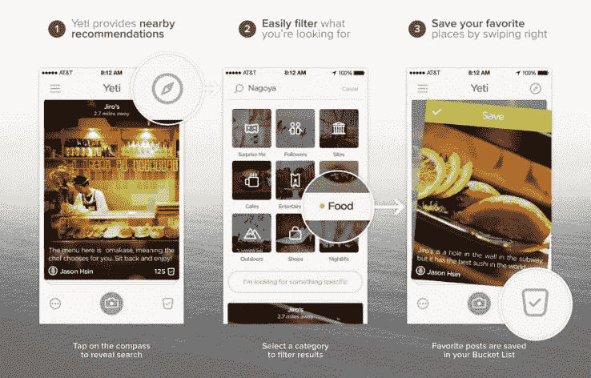

# 本地探索应用 Yeti 被私人投资者收购，经历领导层变动 

> 原文：<https://web.archive.org/web/https://techcrunch.com/2015/07/16/local-discovery-app-yeti-acquired-by-private-investors-undergoes-leadership-changes/>

据 Yeti 公司称，该公司刚刚被一群私人投资者收购。Yeti 的首席执行官和联合创始人亚历克斯·卡佩塞拉特罗(Alex Capecelatro)将把注意力转移到一家新公司，但将继续作为战略顾问与公司合作。安迪·马扎雷拉是一位在科技和金融领域拥有 30 年经验的连续创业者，他将接任 Yeti 的首席执行官。

私人投资者，包括 Hyphos(Yeti 的母公司)的最大投资者之一，三月资本合伙人的董事总经理吉姆·阿姆斯特朗，正在寻求继续应用程序的最初使命。

“[Yeti]需要大量资本才能上一个台阶。一些规模较大的硅谷科技公司曾就收购事宜与我们接触，我们决定探索这个选项。”在那个阶段，卡佩塞拉特罗表示，很明显，他帮助打造的产品如果被一家主要公司收购，将会被拆除，他还开始与夸克的创始人蒂姆吉尔(Tim Gill)聊天，讨论创办一家人工智能企业，听起来这似乎导致他对被收购变得沉默寡言。

“把 Yeti 卖给一家知名的科技公司对我的简历来说是件好事，但这不是我想在接下来的四年多时间里过的生活，”Capecelatro 说。“有一段时间(吉尔)打算收购 Yeti，我们打算围绕人工智能引擎打造它，但当投资集团就出售事宜与我们接洽时，所有的事情都走到了一起。”

卡佩塞拉特罗在 2011 年创建了 Yeti 的母公司 Hyphos，并开始在游泳池开发[，这是一款帮助用户找到朋友一起活动的人物发现应用程序。当 Capecelatro 和团队的其他成员看到用户以不同于他们预期的方式参与应用程序时，游泳池最终会变成雪人。](https://web.archive.org/web/20221007192251/https://beta.techcrunch.com/2012/07/14/social-network-at-the-pool-releases-techcrunch-pool-in-advance-of-mondays-launch/)

“随着产品的发展，人们越来越多地使用该应用程序来查找当地信息，而不是与人联系，”卡佩塞拉特罗说。“例如，我们的成员不是找个人一起攀岩，而是讨论当地最好的攀岩馆和抱石点。”

这款应用已经吸引了超过 120 个国家的用户，他们使用这款应用来发现当地很酷的地方。

Yeti 成功的关键是它的推荐引擎，当用户点击他们感兴趣的地方时，它可以适应用户的兴趣。卡佩塞拉特罗表示，他将离开 Yeti，与吉尔一起创建一个语音控制的家庭自动化界面， [Josh.ai](https://web.archive.org/web/20221007192251/https://www.josh.ai/) 。

虽然 Capecelatro 将辞去公司首席执行官的职务，开始他的新事业，但他说，他仍然非常兴奋地看到新的所有者和领导层将 Yeti 带向何方。

“我喜欢 Yeti 将继续下去，我们的用户不会被遗忘，新的资本和人才将被注入。虽然该产品刚刚推出一年多，但它是过去 5 年来一直在努力的一部分。是时候引入新的视角，让事情更上一层楼了。”