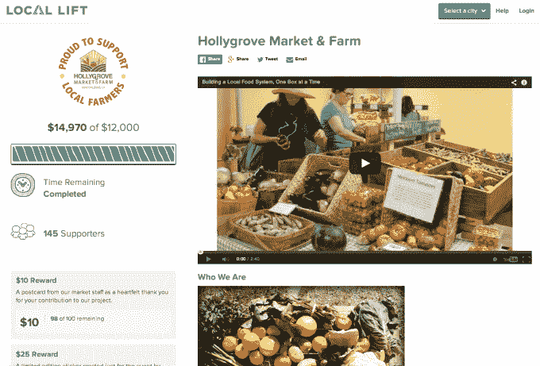

# Local Lift 是本地企业的 Kickstarter 

> 原文：<https://web.archive.org/web/https://techcrunch.com/2014/08/13/local-lift-is-a-kickstarter-for-local-businesses/>

Kickstarter、Indiegogo 和其他众筹平台在产品制造商和创意类型中大受欢迎，但一家名为 [Local Lift](https://web.archive.org/web/20221209070015/https://www.locallift.com/) 的新公司也希望将众筹的力量带给当地的小型商业社区。

有了 [Local Lift](https://web.archive.org/web/20221209070015/http://www.crunchbase.com/organization/local-lift) 平台，企业主可以通过开展为期 30 天的小额融资活动，直接从他们的客户群和整个社区筹集资金，根据早期试验，通常平均约为 7000-8000 美元。

创业的想法来自一个具有金融和商业背景的团队，包括前哈佛商学院毕业生 Broderick McClinton，他之前在贝莱德工作，并在新奥尔良从事经济发展问题的工作；和 Eric Sonnier，之前在德勤和移动广告初创公司 MdotM 工作。与此同时，首席技术官马特克里斯滕(Matt Christen)的背景涉及高频交易平台的开发工作。

“在我们所有的职业生涯中，我们都有与当地企业主打交道的经验，”麦克林顿解释道，“我们知道那里有巨大的资金需求。我们说的不是 5 万美元、10 万美元、20 万美元的贷款，而是 1 万到 1.5 万美元的贷款。他说:“经济衰退后，银行就是不给他们贷款。

“最终的结果是，这 500 多万家主要街道企业不再增长。他们没有创造就业机会；他们没有在他们的社区创造经济影响。这是一个大问题，”麦克林顿补充道。

有了 Local Lift，这些企业能够为一个项目发起一场运动，这将使他们的客户或整个社区受益，作为获得流动资金贷款的一种替代方式，麦克林顿说，对于许多企业主来说，这种方式仍然过于昂贵。

这些活动持续一个月，企业能够获得他们筹集的所有资金——减去 Local Lift 的 7%提成——即使他们的筹资目标没有实现。

马萨诸塞州剑桥的封闭试播后。该公司于 5 月下旬在选定的市场全面开放了其平台，这些市场目前包括奥斯汀、新奥尔良和旧金山湾区——选择这些城市是因为创始人在那里的第一手知识和经验，以及那些拥有强大的本地商业生态系统的城市。

迄今为止，Local Lift 已经开展了 27 场活动，为小企业主筹集了 171，000 美元，另有 20 场活动正在进行中。麦克林顿说，企业一般会筹集 7000 美元左右的资金，尽管 Local Lift 的筹集资金低至 3000 美元，高至 25000 美元。

对于那些已经与客户建立了关系的企业来说，该平台最有意义，他们可以接触到那些已经了解、喜欢并经常光顾该企业的人，无论是健身工作室、零售店、餐厅、杂货店还是其他类型的实体企业。

例如，有了当地电梯筹集的资金，一个普拉提工作室能够扩展到一个更大的位置；一家寿司店安装了新的通风系统，增加了座位，并提供送货服务；一个健身房得以翻新；一家当地市场升级了其 POS 系统，并增加了自行车架和冷却器。

Local Lift 不仅通过提供平台本身来帮助这些企业，还提供营销工具来帮助他们接触客户，包括共享媒体宣传工具和模板、电子邮件等。

在某种程度上，这家初创公司将与更通用的众筹平台竞争，如 [Tilt](https://web.archive.org/web/20221209070015/http://www.crunchbase.com/organization/crowdtilt) (之前的 Crowdtilt)，以及一些较新的借贷平台，如[fund Circle](https://web.archive.org/web/20221209070015/https://beta.techcrunch.com/2014/07/16/funding-circle-gets-funded-with-65m-more-for-its-small-business-lending-marketplace/)、 [Kabbage](https://web.archive.org/web/20221209070015/https://beta.techcrunch.com/2014/05/05/kabbage-50m/) 、 [Lending Club](https://web.archive.org/web/20221209070015/https://beta.techcrunch.com/2014/03/19/google-backed-lending-club-brings-peer-to-peer-lending-to-business-loans/) 、 [Fundera](https://web.archive.org/web/20221209070015/https://beta.techcrunch.com/2014/02/05/groupme-founder-gets-3-4m-to-make-small-business-loans-more-accessible-with-fundera/) 、 [CAN Capital](https://web.archive.org/web/20221209070015/https://beta.techcrunch.com/2014/01/08/can-capital-raises-33m-from-meritech-and-accel-to-loan-small-businesses-working-capital/) 、 [Lendio](https://web.archive.org/web/20221209070015/http://www.lendio.com/) 和 [OnDeck](https://web.archive.org/web/20221209070015/https://beta.techcrunch.com/2014/03/06/ondeck-raises-77m-from-tiger-global-to-loan-smbs-working-capital/) ，仅举几个例子。

Local Lift 目前是一个由三名全职员工组成的团队，现在正在参与 Y Combinator 项目，除了早先从宿舍基金和 Draft Ventures 筹集的资金外，它还获得了少量种子资金。