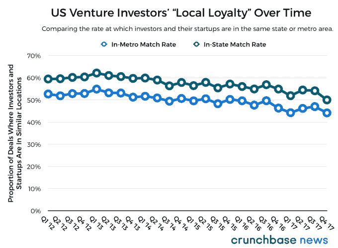
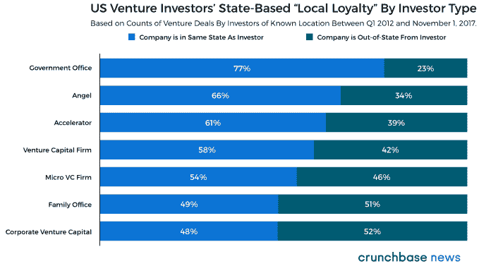
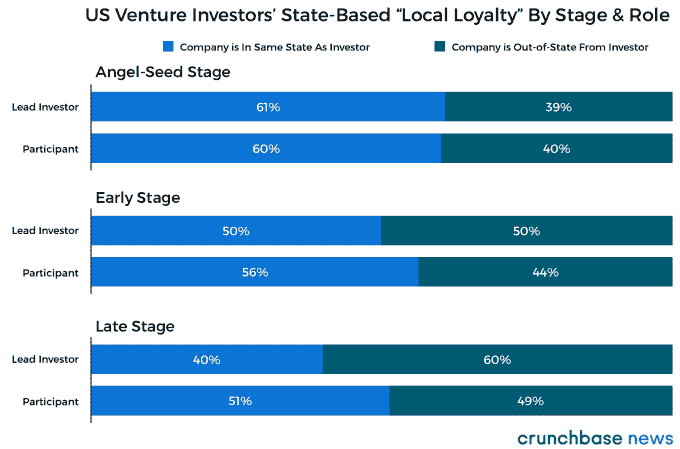
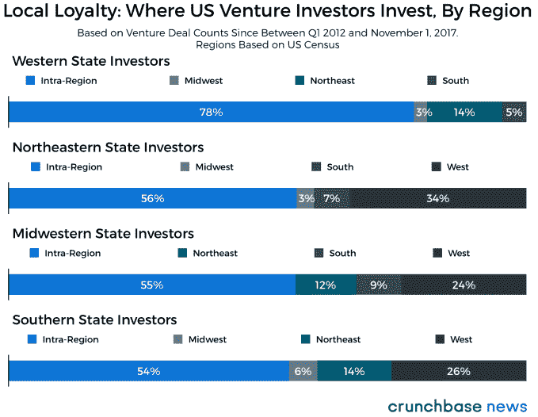

# 风险投资家在哪里投资，为什么 

> 原文：<https://web.archive.org/web/https://techcrunch.com/2017/11/09/local-loyalty-where-venture-capitalists-invest-and-why/>

杰森·罗利是《金融时报》的风险投资和科技记者

[Crunchbase News](https://web.archive.org/web/20221006144843/https://about.crunchbase.com/news/)

.

More posts by this contributor

寻求融资的企业家经常被告知，投资者喜欢把东西放在家里。这是真的吗？这个问题影响着人们选择公司的地点。毕竟，如果投资者只愿意在他们自己的后院投资，你最好在尽可能接近资本的地方创办下一家公司。当然，除非传统智慧是错误的，投资者比我们想象的更加灵活。

支持在当地投资的理由很简单:当每个人都在一个很短的车程或公共交通行程内时，面对面的会议更容易进行。即使在视频聊天几乎无处不在的时代，面对面的交流还是有好处的。还是那句话，有道理。

“那又怎样，”你可能会问自己。在可能的情况下，投资者更愿意在离家近的地方投资，这难道不明显吗？当然，但正如大多数显而易见的事情的典型情况一样，当人们稍微仔细观察时，细微差别和变化比比皆是。

所以让我们深入一点，好吗？使用来自 Crunchbase 的数据，我们建立并分析了近 36，700 笔风险投资交易的数据集，这些交易由近 21，000 名投资者在 2012 年 Q1 和 2017 年 11 月 1 日之间与近 22，000 家不同的美国初创公司达成。本文的目的是利用这些发现来支持，并在必要时打破投资者对当地最忠诚的信念和偏见。

## 大多数投资是地方性的，但随着时间的推移，这种情况会略有减少

让我们从基础开始。在 Q1 2012 开始以来的近六年中，我们分析的所有财务关系中，平均约有 57%是来自同一个州的公司和投资者之间的关系。总体而言，这些关系中大约有 50%是来自同一个大都市地区的投资者和创业公司之间的关系。

然而，值得一提的是，这是所有交易、所有投资者和公司发展所有阶段的平均值。有很多偏离这些手段来保持事情的趣味性。

> 就像小雪和暴风雪有区别一样，投资者也有不同的类别。

虽然有点抽象，但有趣的是，随着时间的推移，初创企业投资者似乎更愿意在自己熟悉的州和大都市区之外进行投资。下图显示了投资者及其投资组合公司共享一个大本营的次数缓慢但稳步下降。

既然我们已经重申了显而易见的事实——这次是用数据！—让我们更进一步。不同类型的投资者更倾向于还是更不倾向于寻找离家近的交易？

当然，每个投资者都会告诉你，就像雪花一样，它们是独一无二的，不仅仅是在他们的投资方法、他们的视角或者他们最喜欢的话题——他们增加的价值方面。但就像小雪和暴风雪之间有区别一样，投资者也有不同的类别。

## 某些投资者比其他人更稳定

方便的是，Crunchbase 的大部分投资者数据都按类型进行了标记，下面我们展示了几种最常见的风险投资者的州内与州外投资活动的全国平均值。

这里也一样，没有太多惊喜。政府机构和类似的政府支持的创业计划倾向于投资于他们表面上服务的选民，大多数个人天使投资者也倾向于在他们自己的州内投资。考虑到许多加速器计划都有明确的地理重点，例如，从旧金山和纽约到堪萨斯城相对较小的中心城市的各种 Techstars 前哨，难怪大多数交易加速器来源都来自它们所在的州。

由于风险基金管理着各种规模的资产，许多人将他们的地理位置作为一个区分点，尤其是如果他们位于硅谷以外，因此投资同一州的公司会有轻微的偏向。

然而，再往上看一点，我们可以看到，总的来说，机会主义开始超过对特定地区的任何特定亲和力。家族投资办公室——通常代表单个(超)高净值家庭投资的私人财富管理公司——以及更值得注意的是，企业风险投资基金似乎是我们在这里调查的投资者类型中最不受地点限制的。

更多早期投资者倾向于在离家更近的地方投资，这一点再次在数据中得到体现。在这里，使用 Crunchbase News 在其季度报告中使用的相同分类规则(可以在本文末尾的“融资术语表”下找到)，我们将风险投资回合分为不同的阶段。此外，在有数据的情况下，我们划分了一轮融资的主要投资者和那些仅仅参与融资的投资者。在这里，我们展示了这些投资者从他们的家乡投资公司的倾向。

总的来说，似乎更接近投资组合公司对天使和种子基金尤为重要，它们通常是公司外部资金的第一个正式来源。但随着公司的成熟，这变得不那么重要了。

有趣的是，种子和天使阶段的公司更有可能接受同一大都市地区的领投人，但随着融资周期的进行，他们更倾向于寻找自己大都市地区以外的领投人。因此，在第一轮融资中，当一位备受尊敬的本地投资者领投时，一家公司在市场上的合法性会得到提升。但在首轮及以后的融资中，让非本地投资者领投可能会有好处，尤其是如果一家公司位于主要科技中心之外。后一点可以在一定程度上解释为什么主要投资者在随后的几轮投资中经常来自其他州。

## 位置，位置，位置！

那么，如果不同类型的投资者更有可能将资金放在离家更近的地方，并且不同阶段的投资者表现出类似的可变性，那么投资者的位置会影响他们投资离家更近的地方的可能性吗？这可能是我们在这里处理的最有争议的问题，答案可能会令人惊讶，因为它们既矛盾又支持某些地区的刻板印象。

下面，我们展示一张图表，按照美国人口普查局的定义，按地区[划分美国风险投资。我们显示了区域内(即双方来自同一区域)和投资者最有可能投资的外部区域的投资者-公司关系的比例。通过这样做，我们能够显示出来自某个特定地区的投资者的内向程度，以及当他们想让自己的资金有点流动性时，他们最有可能投资的地方。](https://web.archive.org/web/20221006144843/https://www.census.gov/geo/reference/webatlas/regions.html)

对于这样一个历史上开拓性的地区，西方的风险投资者在达成交易时相当封闭。这在很大程度上是因为旧金山湾区的投资者生活在该地区——实际上是全国——风险投资活动占绝对主导地位的单一市场。

在湾区，在我们的数据集中捕获的近 36，000 个公司与投资者的关系中，几乎正好三分之二(66.2%，对于那些迫切想知道的人来说)是在湾区公司和湾区投资者之间。对于那些想要冒险回到东部进行交易的勇敢的先驱投资者来说，他们基本上忽略了位于南部和中西部的公司，只有极少数例外。

这就把我们带到了东北部。所有这些关于“沿海精英”的刻板印象，至少就风险投资而言，都被这里的数据所证实。尽管东海岸的投资者比西海岸的投资者更有可能在本地区以外投资，但这只是因为他们在本地区以外的投资中有相当大一部分是在太平洋海岸。

中国中部和南部的投资者似乎拥有地理上最多样化的投资组合，至少在涉及该地区以外的投资时是如此。

仅举一个例子，芝加哥是美国南部和中西部最大的风险投资市场，但芝加哥的投资者在他们自己的大都市区投资时，远远低于全国平均水平。就整个国家而言，50%的投资者-公司关系都在同一个大都市区内。然而，特别是在芝加哥投资者的案例中，超过 37%的关系发生在投资者和位于大芝加哥都会区的公司之间。至少从这个角度来看，芝加哥投资者与世隔绝的名声似乎有点名不副实。

也许除了芝加哥，美国的南部和中西部(同样，根据人口普查局的定义)普遍缺乏创业投资机会。来自该地区的普通投资者会在稍远一点的地方寻找潜在投资，这是有道理的。正如我们在上面的图表中看到的，这通常意味着向东或向西。

## 在未来很长一段时间内，大多数投资将停留在本地

根据一般经验，可以肯定地说，风险投资往往是地方性的事情。但正如我们在这里看到的，没有真正的硬性规则，只有模式和概率。如果你是旧金山湾区的创始人，并且正在筹集种子资金，那么主要投资者很有可能也在旧金山湾区。如果你是波士顿的天使投资人，你可能会投资波士顿或附近的初创企业。当然，也有很多例外，所以数据在这里不是命运。

不过，观察这一切如何随着时间的推移而变化将会很有趣。正如我们在开始时提到的，现在远距离通信比以往任何时候都更加丰富。董事会会议不会通过突发事件进行，但看到投资者更频繁地离家冒险也就不足为奇了。尽管如此，对于密切关注本国市场的投资者来说，还是有话要说。从远处做的再多的研究或采访都无法取代从亲身经历中学到的“基本事实”——至少现在还不能。

#### 资助术语词汇

*   种子/天使包括被归类为种子或天使的融资，包括加速器融资和低于 500 万美元的股权众筹。
*   早期风险投资包括 A 轮或 B 轮融资，低于 1500 万美元的无指定系列的风险投资，以及高于 500 万美元的股权众筹。
*   晚期风险投资包括被归类为 C+系列的融资和超过 1500 万美元的风险投资。
*   技术增长包括有风险投资者参与的私募股权投资。