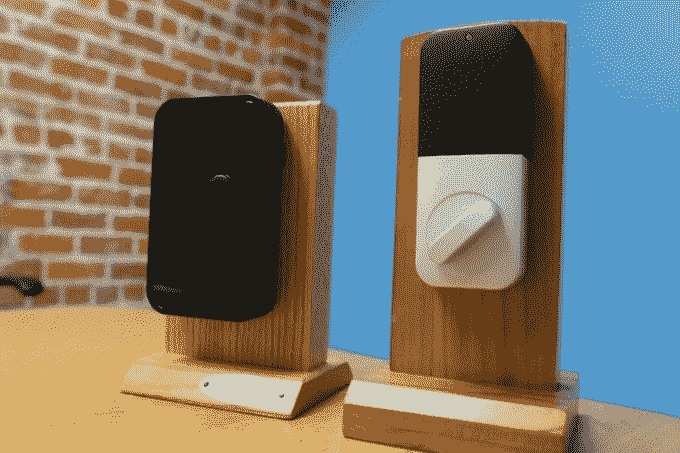

# Lockitron 宣布推出售价 99 美元的插销，这是一款您可以用手机解锁的插销。

> 原文：<https://web.archive.org/web/https://techcrunch.com/2015/01/27/lockitron-announces-the-99-bolt-a-deadbolt-you-can-unlock-with-your-phone/>

# Lockitron 宣布推出 99 美元的锁舌，这是一款您可以用手机解锁的锁舌

[Y Combinator](https://web.archive.org/web/20221210064216/https://www.ycombinator.com/) 矾 [Lockitron](https://web.archive.org/web/20221210064216/https://lockitron.com/) 今天推出了 Bolt，一款 99 美元的后续产品，以其陷入困境的众筹无钥匙进入小工具。

Lockitron 的联合创始人Cameron Robertson表示，该公司从上一个版本经历的困难中学到了很多。该团队没有使用大约 40 个分立元件(其中许多必须定制)，而是从现成的零件中采购高质量的零件，降低了故障率和成本(最初的价格为 179 美元)以及锁的占地面积。

该团队还决定回到他们最初的设计，彻底更换锁舌(同时仍然让你用旧钥匙作为备用)，而不是试图制造一个可以安装在大多数锁舌上的通用小工具。事实证明，有各种各样的锁，虽然他们的解决方案实际上对许多人来说是一个“插入”解决方案，但其他人发现公司承诺的 20 分钟安装时间实际上是一个小时。

罗伯逊和他的团队确信，他们可以用稍微复杂一点的设置做出一些东西，并且仍然以 Nest 为例做得很好。罗伯逊上周告诉我，“基本上，只要我们能把设置分解成 20 个小的、可行的步骤，它是否需要拆除旧的插销并不重要。”

Bolt 可以通过蓝牙 LE 连接到你的智能手机，让你在走向你的房子或公寓时，通过手机上的应用程序打开你的门。该应用程序还为那些购买了 lock itron 49 美元 Wi-Fi 适配器的高级用户提供了许多功能，你可以将它连接到你的 PC 或路由器上，以便通过蓝牙向 Bolt 发送数据。这样你就可以从任何地方接触到它，这样你就可以在你还在工作的时候为来到你家的客人开门。

你也可以使用电子邮件或短信来打开特定的锁，这样你的朋友和家人就可以随时进入而不需要钥匙。有定期过来的保姆或清洁工吗？你很快就可以允许个人在一天中的特定时段进行操作。