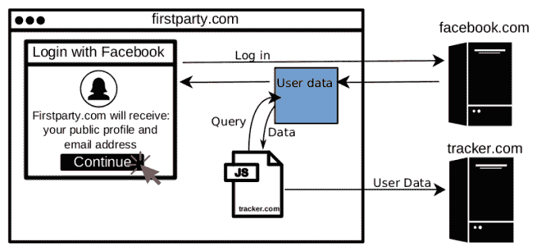

# 使用被 JavaScript 追踪器劫持的脸书数据登录

> 原文：<https://web.archive.org/web/https://techcrunch.com/2018/04/18/login-with-facebook-data-hijacked-by-javascript-trackers/>

脸书向 TechCrunch 证实，它正在调查一份安全研究报告，该报告显示脸书用户的数据可以被嵌入在使用脸书登录的网站上的第三方 JavaScript 跟踪器获取。该漏洞让这些追踪器收集用户的数据，包括姓名、电子邮件地址、年龄范围、性别、地区和个人资料照片，具体取决于用户最初向网站提供的内容。目前还不清楚这些追踪器如何处理这些数据，但它们的一些母公司出售基于收集的用户数据的出版商货币化服务。

在包括云数据库提供商 MongoDB 在内的前 100 万个网站中的 434 个网站上发现了滥用脚本。这是由普林斯顿信息技术政策中心主办的“自由修补 T2”的史蒂文·恩格尔哈特和他的同事们所说的“T1”。

与此同时，音乐会网站 BandsInTown 被发现将脸书用户的登录数据传送到安装其放大广告产品的网站的嵌入式脚本中。一个看不见的 BandsInTown iframe 将加载到这些网站上，拉入用户数据，然后嵌入的脚本可以访问这些数据。这使得任何使用 BandsInTown 的恶意网站了解到访问者的身份。BandsInTown 现在已经修复了这个漏洞。

TechCrunch 仍在等待脸书的正式声明，称“我们会调查此事，然后给你答复。”

[更新 2018 年 4 月 19 日上午 10 点 15 分:脸书发言人现在告诉我们“收集脸书用户数据直接违反了我们的政策。在我们调查这一问题的同时，我们已经立即采取行动，暂停将特定应用程序的唯一用户 id 链接到个人脸书个人资料页面的能力，并正在努力为脸书登录个人资料图片请求建立额外的身份验证和速率限制。”]

TechCrunch 今天早上将这个问题提交给 MongoDB 后，MongoDB 进行了调查，并提供了以下声明:“我们不知道第三方技术正在使用收集部分脸书用户数据的跟踪脚本。我们已经确定了脚本的来源，并将其关闭。”

bands town 告诉我，“bands town 不会向第三方披露未经授权的数据，在收到一封来自研究人员的电子邮件后，我们迅速采取了适当的措施来完全解决这个问题。”[更正:研究人员列出的两个网站已经通过欺诈预防服务 Forter 证实，它们没有托管任何剥削性追踪器，或者它们的追踪器没有访问脸书数据的权限。它们已经从研究论文中删除，随后也从这篇文章中删除。两家追踪公司已经确认他们不收集脸书的数据，我们也已经删除了他们。]

这些数据安全漏洞是在脸书脆弱的时候被发现的。该公司正试图从剑桥分析公司丑闻中恢复过来，首席执行官马克·扎克伯格刚刚[在国会](https://web.archive.org/web/20230320232553/https://techcrunch.com/2018/04/10/zzzuckerberg/)前作证，今天它[公布了隐私更新](https://web.archive.org/web/20230320232553/https://techcrunch.com/2018/04/17/facebook-gdpr-changes/)以遵守欧洲的 GDPR 法律。但是脸书最近为保护用户数据而设计的 API 变化并没有阻止这些攻击。这种情况让人们更加了解脸书用户在互联网上被跟踪的鲜为人知的方式，而不仅仅是在其网站上。

Englehardt 写道:“当用户授权一个网站访问他们的社交媒体资料时，他们不仅[信任那个网站](https://web.archive.org/web/20230320232553/https://mashable.com/2018/03/17/facebook-how-to-turn-off-app-data-sharing/#mKFfGq.ACgqc)，也信任嵌入在那个网站上的第三方。”这张图表显示了一些追踪者从用户那里获得的信息。自由修补公司最近警告 OnAudience 另一个安全问题，导致其停止收集用户信息。

脸书本可以通过足够的 API 审计来识别这些跟踪器并阻止这些利用。它目前正在加强 API 审计，因为它正在追捕其他可能不当分享、出售或使用数据的开发者，比如亚历山大·科岗博士的应用程序的用户数据是如何落入剑桥分析公司手中的。脸书还可以改变其系统，以防止开发者获取特定应用的用户 ID，并利用它来发现该人的永久总体脸书用户 ID。

像这样的披露可能会引发更大的数据反弹。多年来，公众对他们的数据在未经同意的情况下在网络上被利用的方式变得自满。虽然脸书处于困境，但谷歌等其他科技巨头依赖用户数据并运营开发者平台，这可能很难监管。新闻出版商急于从广告中赚到足够的钱来生存，经常陷入粗略的广告网络和追踪器。

扎克伯格很容易成为目标，因为这位脸书创始人仍然是首席执行官，这使得批评者和监管者可以将社交网络的失败归咎于他。但是任何玩弄用户数据的公司都应该感到紧张。