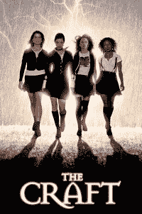

# 罗技的最新键盘 Craft 增加了一个名为 Crown TechCrunch 的智能旋钮

> 原文：<https://web.archive.org/web/https://techcrunch.com/2017/08/31/logitechs-latest-keyboard-the-craft-adds-a-smart-knob-called-the-crown/>

# 罗技的最新键盘 Craft 增加了一个名为皇冠的智能旋钮

智能旋钮的历史很短，也不是很辉煌，但这并不意味着它们不酷。至少，这似乎是罗技公司的想法，该公司刚刚在其最新的无线键盘上增加了一个智能旋钮(或者你可以称之为拨号盘)。他们称之为皇冠——它上面的键盘就是工艺。嗯，*他们*不会那样利用它，但是*我*会。

只有 90 年代的孩子会记得这个

基本上，皇冠可以让你根据应用程序控制各种设置或界面元素:Photoshop 中的缩放，Lightroom 中的曝光补偿，Excel 中的列，等等。我们在这里和那里看到过类似的东西，罗技的是一个值得尊敬的样本:低调的设计，与开箱即用的主要应用程序兼容。

现在，老实说，与微软的 [Surface Dial](https://web.archive.org/web/20221025222256/https://beta.techcrunch.com/2016/10/26/surface-dial-hands-on/) 进行比较并不真正合理。这个是上下文相关的，取决于你把它放在哪里以及你在哪个应用程序中。这意味着当你一手握笔，一手拨号时，Surface Studio 将变成一种电子人创作引擎。

皇冠更像是有人写了一个脚本，将键盘上的音量旋钮映射为当你打开某些应用程序时的人机界面设备输入。不完全是开创性的，但如果你要买一个无线键盘，为什么不买一个有甜美旋钮的呢？

Craft and the Crown 听起来像是一家对我来说太贵的酒吧，当它在 10 月份上市时，价格将是 199 美元。