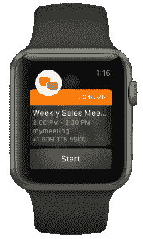

# LogMeIn 以 600 万美元收购 Zamurai，加入移动白板。me 

> 原文：<https://web.archive.org/web/https://techcrunch.com/2015/06/04/logmein-buys-zamurai-to-add-mobile-whiteboardng-to-join-me/>

LogMeIn 又进行了一次收购，以增强其在线协作和会议应用 join.me 的功能:它收购了位于旧金山的初创公司 Zamurai，后者为 iPad 开发了一款广受欢迎的白板应用。

收购的条款没有披露，但我们了解并得到消息来源的证实，这是一笔价值 600 万美元的小额收购——事实上，正如 [BetaBoston](https://web.archive.org/web/20230130232318/http://www.betaboston.com/news/2014/10/28/logmein-acquired-a-mystery-startup-in-san-francisco-to-improve-its-collaboration-product/) 去年 10 月指出的，在其[最近的一份季度报告](https://web.archive.org/web/20230130232318/http://yahoo.brand.edgar-online.com/displayfilinginfo.aspx?FilingID=10260899-818-252750&type=sect&TabIndex=2&dcn=0001193125-14-380908&nav=1&src=Yahoo)中提到了一家神秘的初创公司。

LogMeIn 表示，这笔交易实际上已于 2014 年末完成。这款应用已经在生产力应用类别中获得了几项殊荣，似乎[仍在应用商店](https://web.archive.org/web/20230130232318/https://itunes.apple.com/us/app/zamurai-mobile-whiteboard/id682016714?ls=1&mt=8)中活跃，但这种情况可能不会持续太久:LogMeIn 表示，在未来，这项技术(现在已经被[集成到 iPhone、iPad 和 Apple Watch 的 join.me 应用的新版本中)将只通过 join.me 提供。](https://web.archive.org/web/20230130232318/http://joinm.ee/6003hGdX)

*更新* : LogMeIn 的通信副总裁 Craig VerColen 证实，Zamurai 名称将会消失，目前的 Zamurai 用户将获得一条迁移路径，产品将完全并入 join.me。

除了白板之外，Zamurai 还在研究实时视觉协作的其他技术，随着团队都加入 LogMeIn，它可能会进一步增强 join.me。

这并不令人惊讶:云服务的日益普及，网络连接的改善和更好的设备都意味着 join.me 的竞争格局正在扩大。在最近的发展中，在线交流/合作平台 [Slack 去年收购了 Screenhero](https://web.archive.org/web/20230130232318/https://techcrunch.com/2015/01/28/slack-buys-screenhero-to-add-screen-sharing-and-voice-chat-to-its-work-messaging-platform/) ，这是另一种屏幕共享和语音聊天服务(如 join.me ),让人们从遥远的地方聚集到一起，处理一个或另一个用户本地的文档。

“移动创新是 [join.me](https://web.archive.org/web/20230130232318/http://join.me/) 的一个重点。我们相信，真正的移动优先方法意味着接受移动的独特优势来促进合作，而不是试图在移动设备上复制桌面或亲自体验，”LogMeIn 的总裁兼首席运营官 Bill Wagner 在一份声明中说， [join.me](https://web.archive.org/web/20230130232318/http://join.me/) 的制造商。“通过收购 Zamurai team，我们获得了一个团队和产品，可以帮助我们快速加快 [join.me](https://web.archive.org/web/20230130232318/http://join.me/) 的移动优先创新——该创新旨在解决当今固有的移动工作人员的新现实。"

这是 LogMeIn 的第五次[收购](https://web.archive.org/web/20230130232318/https://www.crunchbase.com/organization/logmein)，在此之前的最近一次是收购 [Meldium](https://web.archive.org/web/20230130232318/https://techcrunch.com/2014/09/04/logmein-buys-yc-backed-meldium-for-15m-to-add-single-sign-on-services/) 以提高其服务单点登录管理的安全性。

Zamurai 由赛门铁克和洛克希德·马丁公司的校友于 2013 年创立。目前还不清楚谁在为该公司提供资金支持，尽管该公司的顾问包括维基媒体的首席执行官莱拉·特雷蒂亚科夫、帕洛阿尔托网络公司的 CEO 雷内·邦瓦尼和柯达公司的前 CMO 杰弗里·哈伊兹莱特。

前 Zamurai 首席执行官和联合创始人迈克尔·帕克现在成为 join.me 的营销副总裁。“join.me 和 Zamurai 都意识到人们的工作方式已经发生了变化。我们实时会面和协作，更多的时候，我们在网上互动。我们都热衷于为客户提供简单的体验，”他说。“事实是，Zamurai 实际上是 T2 join . me T3 的客户。我们每天都用它，所以很明显我们在一起是多么互补。”