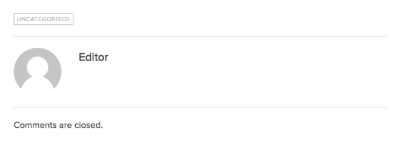

# 伦敦送货司机众筹抗议新定价模式 

> 原文：<https://web.archive.org/web/https://techcrunch.com/2016/08/15/london-deliveroo-drivers-crowdfund-protests-over-new-pricing-model/>

按需餐厅送餐初创公司 Deliveroo 本周在伦敦面临更多抗议，原因是它正在英国首都试行一种新的薪酬结构，试图将司机的固定费用改为每次送货 3.75 英镑，而不是旧薪酬结构下每小时 7 英镑加每次送货 1 英镑。

一群愤怒的 Deliveroo 司机现在正在通过 Crowdpac 平台众筹“罢工基金”[，以帮助那些抗议新薪酬结构的人，因为作为在技术平台上工作的“独立承包商”，他们放弃了在抗议期间赚钱的能力。](https://web.archive.org/web/20230131172449/https://www.crowdpac.co.uk/campaigns/47/the-deliveroostrike)

除了经济手段之外，害怕被轻易取代是零工经济中未加入工会、自主的自由职业者难以组织起来与控制平台的雇主进行集体谈判的另一个原因。

出于这个原因，IWGB 表示，今天的抗议将针对伦敦北部的一家公司招聘办公室，以确保抗议能够传到潜在的新员工的耳朵里。

抗议者显然已经将一些相关的组织和谈判后勤工作交给了[独立工人联盟(IWGB)快递公司&物流分公司](https://web.archive.org/web/20230131172449/https://iwgbclb.wordpress.com/2016/08/14/deliveroo-strike-update-3/)，该公司声称在与 Deliveroo 的谈判中充当了他们的代表。

抗议者呼吁 Deliveroo 顾客自己做饭，而不是为送餐付费，而是向该基金捐款。

在撰写本文时，crowdfunder 已经从大约 600 名捐助者那里筹集了近 8000 英镑来资助这项行动。

上周，抗议者举行了一系列示威活动，反对新的薪酬结构，认为这可能导致在较低时期(即，如果他们每小时只能完成一次交付)，薪酬低至每小时 0 至 3.75 英镑。

他们认为，公司应该为员工等待提货的时间支付报酬，而不仅仅是为了完成送货。他们还声称，新的结构鼓励司机冒险，以加快交付速度，赚取足够的钱来实现收支平衡。

(作为零工经济平台运营商的规则，送货员——公司称他们为“骑手”——也没有病假工资或假期工资等就业福利。)

Deliveroo 抗议者呼吁该公司支付 9.40 英镑/小时的伦敦生活工资，外加成本(例如，他们用来送货的助力车的燃料)，外加任何小费，每次送货加 1 英镑。

Deliveroo 的英国 MD Dan Warne 在接受 TechCrunch 采访时回应了这一具体需求，他说:“Deliveroo 骑手平均每小时的收入超过这一数字，我们相信在新模式下，他们将继续获得更多收入。”

“我们构建这一新结构，相信司机每小时的平均收入将远远高于最低工资，”他补充道。

在其博客上关于新支付模式的[说明中，该公司表示价格结构旨在增加乘客的灵活性。它在一篇博客文章中写道:“我们设计了这项试验，以使乘客能够通过按需登录和注销随时工作。”该博客文章不对评论开放，尽管也声称“我们致力于开放的对话，因此我们可以继续改善我们的支付模式和交付体验”…](https://web.archive.org/web/20230131172449/https://deliveroo.co.uk/blog/uncategorised/note-rider-payment-model-trialling-london/)

【T2

“在我们试点的地方，我们看到在最繁忙的时候，骑手的平均每小时费用比以前的支付模式增加了 2 倍，”Deliveroo 补充说。“许多司机告诉我们，通过这种模式，他们将在更短的时间内收到更多费用，这对他们来说更好。”

华纳声称，Deliveroo 的英国乘客中约有 80%有其他工作——因此“自下而上”地要求更大的灵活性。

“通过转移到这种新模式，它允许个人在他们想工作的时候工作，”他说。“我们有一名巴西司机……他大部分时间是一名 DJ，晚上则为 Deliveroo 工作。在旧的模式下，他在一周中可以工作的晚上有所限制——因为他必须在一周中给定的几天、给定的时间工作给定的班次。

“采用这种新模式后，他可以随时接通电源工作。如果他想在晚上九点插上电源工作半个小时，他可以这样做。”

虽然 Deliveroo 最初没有这样做，但现在它在试用模式下提供一些支付担保——Warne 指出，它是在听取了乘客对新模式的反馈后做出这一改变的——例如在繁忙时期提供两到三次交付的确定性。(尽管在一天中的其他时间，付款完全依赖于完成的交付。)

在提供给 TechCrunch 的一份声明中，该公司补充道:

> 每个人都熟悉每小时多少英镑的支付模式，这对许多人来说非常有效。但对一些人来说，他们可以通过按工作量获得报酬来赚更多的钱——因为他们真的是快速工作者。我们发现这可能对我们的一些骑手有效，所以上周我们决定提供一个新的支付选项，并在一些骑手中试用并获得他们的反馈。
> 
> 这就是我们现在的情况:试验区的乘客仍然可以选择我们标准的每小时 7 英镑+每次送货 1 英镑的模式，但现在他们也可以选择每次送货 3.75 英镑的模式——这显然对那些每小时送货 3 次或更多的人更好(在这两种情况下，他们可以保留小费，我们支付燃料费)。我们也可以建议任何骑手，如果我们认为他们可以从改变中受益。然后他们可以尝试一下，如果可行的话就继续，如果不行的话就回到每小时多少英镑的方法，或者他们的环境发生了变化。这一切都是为了给他们灵活性，这是他们告诉我们对他们来说最重要的。

英国政府周日介入了这场辩论，商业、能源和工业战略部的一名发言人指出，Deliveroo 必须向司机支付每小时 7.2 英镑的全国最低工资(通过[The Guardian](https://web.archive.org/web/20230131172449/https://www.theguardian.com/society/2016/aug/14/deliveroo-told-it-must-pay-workers-minimum-wage))——除非法院或英国税务海关总署将平台上的工人定义为“自营职业者”。就业法庭也可以参与确定工人的就业状况——有时推翻早期的 HMRC 分类。因此，确定就业状况可能是一个复杂的过程。

华纳证实，Deliveroo 将其骑手定义为“独立承包商”，并表示这是基于“给予员工一定程度的灵活性”。

“就我们而言，我们在传统模式下提供了很大的灵活性，在转向新模式时更具灵活性，”他说，并补充道:“我们做出这些改变的原因是我们的司机一直在要求。”

他煞费苦心地强调，新定价模式目前仅处于试验阶段，试验期定为 90 天——之后，他表示，Deliveroo 将评估进展情况，并决定下一步行动。他补充说，目前还没有任何决定。

Deliveroo 的大约 280 名乘客目前受到该试验的影响，这是该公司在首都工作的 3000 名承包商的一个子集。而受影响的五个分娩区位于伦敦的北部和东北部——包括西部汉普斯特德和贝尔斯公园等富裕地区。

Warne 说，目前还没有计划将试验扩大到伦敦的其他区域。

如果受影响地区的 Deliveroo 乘客愿意继续旧的定价结构，他们可以选择退出新的定价模式——尽管在该公司与“过去一周大约 250 名乘客”交谈以获得反馈后，Warne 证实了退出的决定。

“我们决定给他们选择，”他指出。

然而，那些行使这种选择的人不能继续在同一地区工作，而必须搬到一个新的地区——国际工作场所协会的一位发言人指出，这意味着学习一个全新的领域；她认为，由于必要的学习曲线，这个过程不可避免地意味着减薪。

Warne 反驳了这些批评，指出送货区的规模很小(每次送货伦敦 Deliveroo 骑手最多只能行驶 2.2 公里)，并认为导航和地图技术意味着现在几乎不需要学习曲线。

“伦敦的时区非常非常小。所以我们说的是从卡姆登这样的地方搬到邻近的地方。当他们在北方时，我们并没有要求他们搬到另一个城镇或另一个城市，甚至是南方。对他们来说，这是一个非常直接的行动，以保持现有的模式，”他说。

“这些知识与我们提供给他们的在该地区导航的技术越来越不相关……他们会在手机上安装一个应用程序，可以导航到餐厅，然后从餐厅到顾客，让他们有机会保持与现有地区相同的速度和相同的送货次数。”

“我们不能在同一区域内同时进行试验。每次投放模式的灵活性本质上确实要求伦敦的一个功能区完整地拥有该模式，”他补充道。

对新支付模式的其他批评是，它鼓励匆忙——增加了乘客的安全风险，也就是说，考虑到他们将专注于交付更多货物以赚取更多的钱。

在这一点上，华纳声称安全是 Deliveroo 的“第一要务”，并指出该公司正在与道路安全慈善机构合作，并对注册通过该平台送货的新司机进行测试。

“他们赚更多钱的机会将来自于 Deliveroo 开发更强的算法和更好的技术的能力，以便他们可以在更短的时间内做更多的事情。对我们来说，这是一个巨大的机会，”他说。“例如，地图的工作方式是给他们最安全的路线，而不是最快的路线。我必须把这件事放在生意的首位。司机对我们来说非常重要。

“对于这些司机来说，区域大小和送货距离从来不会超过 2.2 公里，因此它确保了短程路线，在这些路线上，订单的大部分时间实际上是由餐厅的等待时间等因素组成的。或者订单到达司机应用程序的接受时间。因为距离很短，所以从餐馆到顾客之间，司机是否匆忙并没有太大的区别。”

当然，谁也不能保证 Deliveroo 不会在未来完全取消其旧的薪酬结构——如果它在对试验的审查中决定这样做更好的话。没有就业权利，在这些技术平台上提供服务的零工经济工人面临持续的不稳定，组织和抗议变革的手段有限。

然而，华纳强烈否认 IWGB 的指控，即一些抗议的车手被该公司解雇是完全错误的。

他还否认了 IWGB 的一份报告，该公司向骑手提供报酬，以停止抗议或提供其他参加抗议的骑手的信息。

但他承认，该公司对向乘客传达支付试验的方式感到遗憾。

“我们对事情的发展都感到非常不安，我们也因为没有和车手们充分沟通而自责。这对我来说非常非常清楚，”他告诉 TechCrunch。

> 这是一种新的模式，在这种模式下，安全网，即获得时薪的安全毯被移除，因此你必须真正清晰地沟通。

“这是一种新的模式，在这种模式下，安全网，即获得时薪的安全毯被移除，因此你必须真正清楚地沟通——通过我们掌握的关于司机做什么的数据，以及他们在高峰期一小时能做多少订单，有时甚至是六七个订单——我们没有向他们足够清楚地表达这一点，这就是为什么我认为他们很多人都感到不安。”

“我很高兴承认，坦率地说，我很高兴为我认为我们沟通不畅而道歉，”他补充道。

关于 7+1 模式的未来，沃恩说:“只有当我们感到舒适，司机们一致相信这对他们是正确的，它才会停止。”

当被问及为什么 Deliveroo 的骑手合同包括在 Deliveroo 轮班期间穿着品牌服装的要求时——这一措施听起来类似于强制穿制服——沃恩说这是一种安全考虑，因为服装是“反光的”。

本月早些时候，这家成立于 2013 年的初创公司[完成了 2.75 亿美元的 E 轮融资](https://web.archive.org/web/20230131172449/https://techcrunch.com/2016/08/05/food-startup-deliveroo-raises-275m-as-uber-eats-into-its-european-market/)——我们报道称，这一轮新融资对 Deliveroo 的估值接近 10 亿美元。

*TechCrunch 的史蒂夫·奥黑尔对本文有贡献*