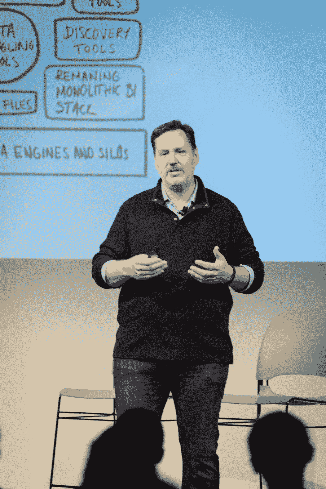

# Looker 以 8150 万美元的 D 轮投资吸引了 CapitalG、高盛和 Geodesic

> 原文：<https://web.archive.org/web/https://techcrunch.com/2017/03/30/looker-catches-the-fancy-of-capitalg-goldman-and-geodesic-with-81-5m-series-d/>

# Looker 以 8150 万美元的 D 轮融资吸引了 CapitalG、高盛和 Geodesic

商业智能平台 [Looker](https://web.archive.org/web/20230322160428/https://looker.com/) 今天宣布了一笔价值 8150 万美元的 D 轮融资，由 Alphabet 的增长投资部门 [CapitalG](https://web.archive.org/web/20230322160428/https://capitalg.com/) 牵头。[高盛](https://web.archive.org/web/20230322160428/http://www.goldmansachs.com/)和[测地资本](https://web.archive.org/web/20230322160428/http://geodesiccap.com/en/)帮助完成了这轮融资，加入了现有投资者 [KPCB](https://web.archive.org/web/20230322160428/http://www.kpcb.com/) 、[Meritech Capital Partners](https://web.archive.org/web/20230322160428/http://www.meritechcapital.com/)、 [Redpoint](https://web.archive.org/web/20230322160428/http://www.redpoint.com/) 和 [Sapphire Ventures](https://web.archive.org/web/20230322160428/http://sapphireventures.com/) 。

Looker 不想在细分市场与可视化和数据准备初创公司竞争，而是希望拥有商业智能的垂直市场。该公司通过提供干净可靠的数据源来支持企业机器学习的采用。

在与 IBM Cognos 和 Tableau 的激烈竞争中，Looker 在竞争激烈的企业商业智能领域扩大了市场份额。Looker 的首席执行官 Frank Bien 告诉 TechCrunch，该公司的客户数量在去年翻了一番，从 400 人增加到 800 人。

弗兰克·比恩，Looker 的首席执行官

尽管初创公司无法向我们提供原始收入和增长数据的透明度，但比恩将今天的这轮融资描述为“先发制人”。谷歌(Google)可以支持 Looker 数据基础设施的增长，而高盛(Goldman Sachs)则提供咨询津贴。

比恩说:“谷歌有能力帮助并带来有益于大规模公司的专业知识。”

谷歌和 Looker 的关系并不新鲜。在本月早些时候的 Cloud Next 大会上，这家科技公司授予 Looker 全球解决方案创新合作伙伴奖。Looker 还通过与该公司的数据仓库解决方案亚马逊红移(Amazon Redshift)的合作，与谷歌云的竞争对手亚马逊网络服务(Amazon Web Services)保持着良好的关系。

在企业方面，高盛经历了活跃的 2017 年——根据 Crunchbase 的数据，其最近 10 笔 IPO 前股权交易中有 7 笔涉及该领域的初创公司。高盛持有 AppDynamics 的金融股份。这家初创公司欺骗了科技行业，在面临即将到来的 IPO 时，选择接受最后一刻的收购。你想怎么做就怎么做。

除了合伙企业和资本表，Bien 坚持认为他正在发展一个独立的企业。这家初创公司成立于 2012 年，对于首次公开募股来说可能有点年轻，但这似乎是它前进的方向。

“我们的目标是建立一个强大的独立企业，”比恩补充说。第一天，我们从平台游戏开始。"

本轮融资使该公司的总融资额达到 1.775 亿美元。该公司很大一部分资本都用于增加员工人数。Looker 在整个 2016 年增加了 100 名员工。它现在支持近 400 名员工服务于北美和欧洲。Bien 乐观地认为，Geodesic 可以帮助这家初创公司在中国催化新的增长。

该公司似乎对 Q1 融资情有独钟，此前在 2015 年和 2016 年分别在 Q1 完成了 3000 万美元和 4800 万美元的融资。尽管增长速度很快，但它并没有超过 Slack 繁忙的 2014 年，当时它筹集了 4270 万美元的 C 轮融资和 1.2 亿美元的 d 轮融资。