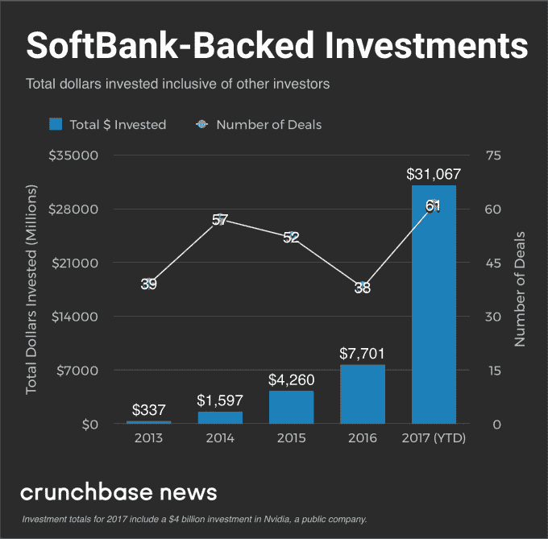
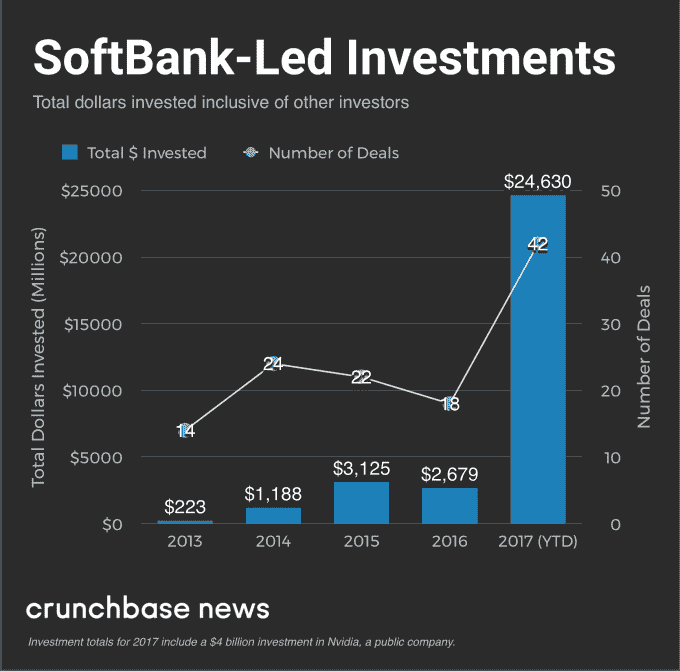
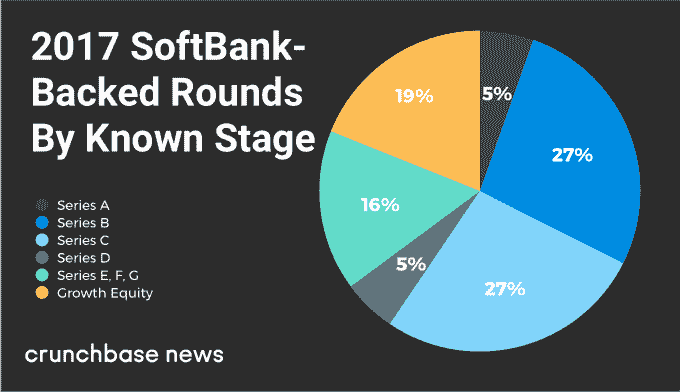

# 回望软银的大年 

> 原文：<https://web.archive.org/web/https://techcrunch.com/2017/12/23/looking-back-at-softbanks-big-year/>

乔安娜·格拉斯纳撰稿人

More posts by this contributor

尽管风险资本家争相资助大规模可扩展的业务，但他们往往认为自己的行业规模有限。常识是，在成功创业公司的供给有限的情况下，极大地膨胀可用于投资的资本数量会导致资产泡沫。

今年，[软银](https://web.archive.org/web/20221025223257/https://www.crunchbase.com/organization/softbank)的愿景基金——其行为就像一个超大规模的风险基金,拥有许多后期交易——已经对这一假设进行了前所未有的考验。自 1 月份以来，这家总部位于日本的移动和互联网巨头的投资部门已经为各类私人风险投资公司和成长期公司进行了价值超过 200 亿美元的融资。为了客观地看待这个数字，整个美国风险资本市场大约需要一个整季度的时间。

为了找出受软银慷慨影响最大的创业空间，Crunchbase 研究了该公司 1000 亿美元愿景基金和附属投资工具的活动。下面，我们来看看总投资、阶段重点和地理分布。然后我们尝试一下这一切意味着什么。

## 软银 2017 年的总额创下纪录

首先，投资总额。是的，他们是巨大的。

根据 Crunchbase 的数据，在 2017 年期间，软银投资了 44 轮融资，总价值为 307 亿美元。大部分资金来自软银牵头的融资，通常可以肯定软银及其愿景基金提供了全部或大部分资金。

在下图中，我们看到了软银资助的公司在过去五年里的总数和投资总额。由于该公司刚刚在 2017 年关闭了 1000 亿美元的愿景基金，此前几年的投资来自其他专用基金。

在下一张图中，我们来看看软银是主要投资者的几轮融资。该公司再次测试风险投资可以扩大规模的概念——从 2016 年到 2017 年，其投资总额增加了大约 10 倍。

## 多阶段，喜欢成长

如果你打算将数百亿美元投入风险投资和成长期投资，很大一部分资金流向估值已经达到数十亿美元的公司似乎是合乎逻辑的。这在很大程度上就是软银所做的。

最大的愿景基金投资已经进入了相当晚的阶段，拥有广泛的基础设施和市场覆盖面，包括合作巨头 WeWork、[滴滴出行和 Grab](https://web.archive.org/web/20221025223257/http://news.crunchbase.com/news/can-didi-network-uber-win-global-ridesharing-market/) 等打车公司(优步可能很快就会关闭)以及工作场所协作应用 Slack。

然而，软银也在通过早期和中期投资进行改革，通常领投的融资规模是目标创业公司前几轮融资的数倍。例如，它最近的一笔交易是对保险初创公司 [Lemonade](https://web.archive.org/web/20221025223257/http://news.crunchbase.com/news/lemonade-raises-120m-series-c-softbanks-third-investment-property-startup/) 的 1.2 亿美元 C 轮投资，是该公司一年前 B 轮投资规模的三倍多。

在下图中，我们按阶段对软银的私人公司投资进行了细分，不包括未指定阶段的交易。

## 地理

最后看地理。在这一点上，软银显然非常关注美国，在它投资的所有国家中，美国的创业公司数量最多。它的一些最大的私人公司投资也位于美国，包括 WeWork、 [Fanatics](https://web.archive.org/web/20221025223257/https://www.crunchbase.com/organization/fanatics) 和 [SoFi](https://web.archive.org/web/20221025223257/https://www.crunchbase.com/organization/social-finance) 。

然而软银的业务遍及各大洲。它还支持今年中国的滴滴出行、新加坡的 Grab、印度的 [Ola](https://web.archive.org/web/20221025223257/https://www.crunchbase.com/organization/ani-technologies) 和英国的[impossible](https://web.archive.org/web/20221025223257/https://www.crunchbase.com/organization/improbable)，以及亚洲和欧洲[的一长串其他公司。](https://web.archive.org/web/20221025223257/http://news.crunchbase.com/news/global-startup-exits-grow-europe-sees-profile-rise/)

从这种地理格局中得出的主要结论是，软银和首席执行官孙正义仍然坚信硅谷和其他美国科技中心的创新力量。然而，他们也热衷于从全球范围内寻找区域类别领导者和创新者，这些人被视为有潜力将大量资本注入用于盈利用途。

## 看起来很有趣

总体而言，软银的成长型投资活动是愿景基金资金的主要去向。但就测试初创企业生态系统能够处理多少资本的假设而言，公司的早期投资可能更有趣，也更有教育意义。

在最近的许多早期交易中，软银向一些公司注入了大量资金，否则这些公司可能会筹集到更多乏味的后续融资。

以硅谷一家建造室内农场的初创公司 [Plenty](https://web.archive.org/web/20221025223257/https://www.crunchbase.com/organization/see-jane-farm) 为例，它在 7 月份从软银获得了[2 亿美元的 B 轮融资](https://web.archive.org/web/20221025223257/https://www.crunchbase.com/funding_round/see-jane-farm-series-b--b8c25f54)。此前，Plenty 已经筹集了 2600 万美元的种子资金和首轮资本。这是一个好的开始，但对于一个大型的、多城市的气候控制的城市农场的建设来说还不够，这种农场承诺向最寒冷的地方稳定供应新鲜的、自产的生菜。如今，成立三年的 Plenty 拥有 2 亿美元的可支配资金，可以采取类似于更成熟公司的扩张战略。

对软银来说，这将是一个明智的选择吗？谁知道此时。诚然，[过早结垢](https://web.archive.org/web/20221025223257/https://www.forbes.com/sites/nathanfurr/2011/09/02/1-cause-of-startup-death-premature-scaling/#483826c91fc9)已被确定为启动失败的主要原因。然而，与此同时，一些最成功的科技创始人都是从极其大胆的计划起步的，包括 Plenty 的早期支持者之一杰夫·贝索斯。