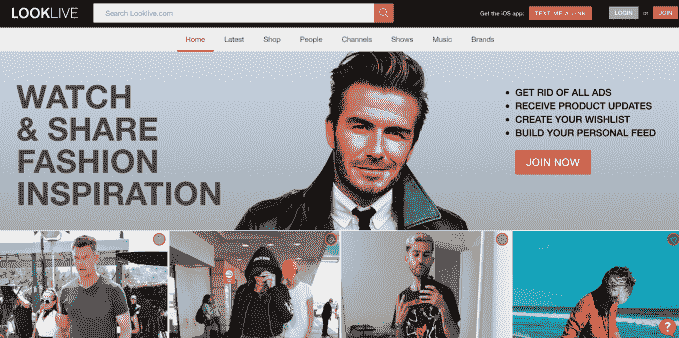
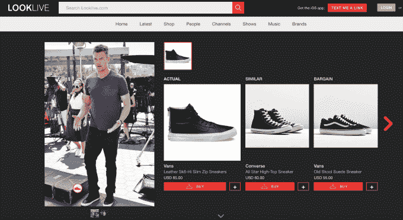

# Looklive 通过模仿名人的风格帮助男性购物

> 原文：<https://web.archive.org/web/https://techcrunch.com/2016/08/19/looklive-helps-men-shop-by-mimicking-celebs-styles/>

如今，许多时尚应用程序都是针对女性的，但 Looklive 的一个新应用程序希望在不需要成为时尚专家的情况下，也能让男性看起来很棒。取而代之的是，该公司——现在也作为 iOS 应用软件上市——允许男性购买他们最喜欢的名人和其他时尚影响者的造型。他们可以买到那些名人穿的衣服或类似的东西，但更实惠。

如果这个概念听起来很熟悉，那是因为[最近修改的应用程序 Craves](https://web.archive.org/web/20230204224146/https://techcrunch.com/2016/08/11/craves-new-fashion-app-tells-you-what-the-celebs-are-wearing-and-finds-you-similar-items/) 也在做同样的事情，但是对女性和男性都一样。它还使用视觉搜索技术来查找像您拍摄和上传的照片中的项目。

然而，Looklive 及其内容频道只关注男性时尚和名人风格来推动购买。

为了找到有问题的时尚项目，Looklive 会在网上搜索名人照片，然后汇总出最适合应用的照片，这也是由人工编辑决定的。然后，它使用数据挖掘和图像分析将名人的照片与名人青睐的有限品牌的照片进行比较，以此作为匹配 SKU 的起点。

当然，对我们大多数收入较低的人来说，名人时尚往往遥不可及，这也是为什么 Looklive 还得到一个编辑团队的帮助，他们帮助选择其特色时尚产品的平价版本。

如今，Looklive 有 6 万多种产品和 1 万张名人时尚形象图片。该服务每月约有 100 万用户，收入每月增长 25%。该公司每月在 GMV 的销售额也超过了 12 万美元。

这家初创公司通过关联收入以及与特定品牌的直运交易产生收入，这些交易会在有限的时间内留出部分库存，然后直接运送给 Looklive 客户。这些交易的利润率更高。未来，Looklive 可能会直接与名人合作开发能够获得全部零售加价的产品。

Looklive 也有一个有趣的背景故事。该公司实际上是不同业务的团队、技术和内容的结合，Looklive、策展人和 UpscaleHype。

[gallery ids="1372122，1372121，1372120，1372119"]

是策展者增长到了 100 万用户，但后来收购了 Looklive，与他们合并，整合了他们的技术。它还取了“Looklive”的名字来取代副馆长。Looklive 收购了高端在线生活杂志《UpscaleHype.com 》,为其新的名人驱动的男士时尚应用创建内容频道。

Looklive(原名 Curateurs.com)由塞德里克·罗杰斯、格雷格·塞尔科和保罗·贾奇博士创立。罗杰斯是 10 年的苹果老兵，曾在 App Store 工作；Selkoe 创立了男士电子商务公司 Karmaloop，该公司连续六年年销售额超过 1 亿美元；Judge 是包括 CipherTrust、Pindrop 和 Luma 在内的几家科技公司的联合创始人和高管。

虽然 Karmaloop 在时尚界有着重大的文化影响，但它最终申请了破产。塞尔克承认，这段经历教会了他许多经营企业的经验。

虽然 Karmaloop 因其管理风格和招聘选择而受到批评，但 Selkoe 表示，他在 Karmaloop 做得很好——病毒式营销，了解利基市场的脉搏和他们想穿什么——这是他将关注 Looklive 的地方。

“我不是这家公司的首席执行官……在我不擅长的领域，这次我不做了。”Selkoe 说。“如果说我从 Karmaloop 学到了什么，那就是确保我们有一个真正全面的团队和共同的责任。”

“从商业模式的角度来看，我们知道我们不需要库存。[在 Karmaloop]，我们变得如此之大，为了让我们获得每个季节所需的服装，我们当时不得不花费 1500 万到 2000 万美元，这总是处于风险之中。他补充道:“我们(在 Looklive)不会这么做。

该公司现在还与青年媒体品牌 Complex Media Group 合作，该品牌最近被威瑞森(披露:TechCrunch 母公司)和赫斯特公司以 3 亿美元的价格收购。该网站以年轻男性的时尚之声而闻名，也是一个关注流行文化趋势和娱乐的生活方式网站。

通过合作，Looklive 应用程序将拥有一个“复杂”的频道，可以在这里购买其媒体库中的图像。这将在不久的将来在应用程序中上线。

Looklive 目前正在参与 Y Combinator，该公司与 Looklive 的联合创始人 Judge Ventures 一起向这项业务投资了 14 万美元。这一轮是不到 100 万美元的种子阶段投资，但这家初创公司将在 YC 的演示日之后再次融资。

Looklive 应用程序[是 iTunes 上的免费下载](https://web.archive.org/web/20230204224146/https://itunes.apple.com/app/apple-store/id978632650?mt=8)。Android 版本还有几周就要发布了。