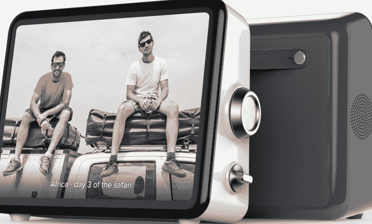

# Loop 将复古风格的娱乐带给祖辈 

> 原文：<https://web.archive.org/web/https://techcrunch.com/2016/10/25/loop-kitchen-entertainment/>

# Loop 为祖辈带来复古风格的娱乐

角落里的大屏幕显示内容，你可能早中晚都在使用智能手机。夹在中间的是 [Loop](https://web.archive.org/web/20221025223545/http://www.joinloop.com/) ，这是一款复古的设备，针对的是还没有完全接受随时随地拿着你的设备的一代人。当您忙得不可开交时，Loop 可以让您更轻松地交流、播放媒体和查找资料。

凭借四小时的电池续航时间，Loop 可以在房子里四处走动

该设备是一个专注于通信的屏幕，设计为便携式，可以在家里使用。它有几个聪明的技巧，包括比你通常在平板电脑上看到的更强大的扬声器，语音和手势控制，以方便免提控制和从 GoPro 和 YouTube 轻松流媒体。侧面易于清洁的控制盘便于在内容中向前和向后跳转，因此仍然易于浏览内容。聪明的东西。

该公司试图解决的问题是试图让人们更多地相互交流，而不是埋头于智能手机。认识到厨房仍然是家庭的中心，Loop 的灵感来自厨房电视，但将热室电视的实用性与平板电脑的灵活性相结合。

哦！漂亮！

Loop 秉承连接的理念，配备了一款应用程序，可以直接从智能手机向设备共享照片和视频。在实践中，Loop 有点像一个超个人的社交网络，旨在让你的父母和祖父母保持在循环中，引入更多的基于推送的内容分发范式。除了将您的图像和视频传送到 Loop，该设备还内置了易于使用的视频会议。

“给沙滩上的孙子们拍张照片，然后把照片直接推送到奶奶的厨房柜台上，”这似乎是该产品的核心用例——在当今这个世界上，大多数祖父母在技术上仍处于危险之中，这非常有意义。

该设备背面有一条带子，便于从一个房间移动到另一个房间。它的设计目的是在大多数时间插上电源后使用，但它有一个内置电池，所以你可以将它放在另一个房间长达 4 个小时，而不必重新连接到墙上。

凭借 9.7 英寸的屏幕，1024×768 像素的分辨率，它无法与 iPad 的视网膜显示屏相提并论，这似乎是一种耻辱(在你习惯了超清晰的文本和图像之后，回到非视网膜显示屏是非常不和谐的)，但在 Loop 的辩护中，它的目标受众可能并不在乎，他们更重视易用性而不是锐利的视觉效果。

Loop 是旧金山的硬件加速器的校友。该产品现在可以购买，标价为 199 美元，如果你购买超过一个单位，还可以打折。