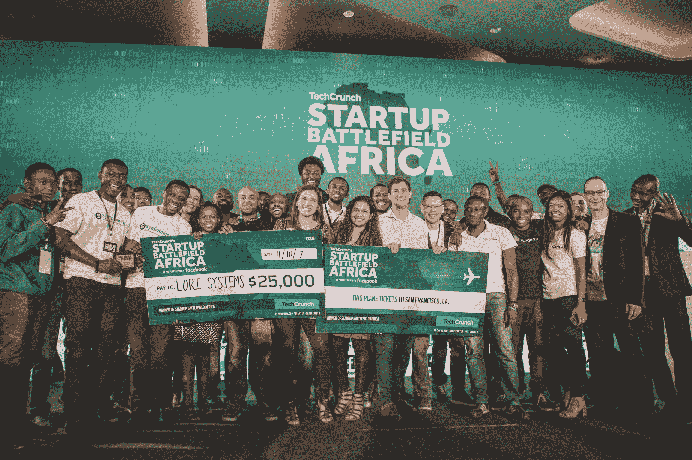

# Lori Systems 赢得初创企业非洲战场最佳展示奖

> 原文：<https://web.archive.org/web/https://techcrunch.com/2017/10/11/lori-systems-wins-best-of-show-at-startup-battlefield-africa/>

最开始的时候，有 15 家初创公司来自非洲各地。在肯尼亚内罗毕进行了一场令人难以置信的激烈竞争后，以下是 TechCrunch 有史以来第一个创业公司“非洲战场”的获胜者。

参与创业战场的创业公司都是经过精挑细选，参加我们竞争激烈的创业大赛的。他们都在担任评委的多组风投和技术领袖面前展示，有机会赢得 25，000 美元的奖金和一次免费的双人旧金山之旅，参加 TechCrunch 的旗舰活动——Disrupt SF 2018。

[我们的评委](https://web.archive.org/web/20230325094847/https://techcrunch.com/2017/09/19/announcing-the-techcrunch-battlefield-of-sub-saharan-africa-agenda/)还选出了三个类别的获胜者:生产力和效用、社会公益以及游戏和娱乐。

现在，来见见非洲战场的赢家。

## 最佳表演和类别奖得主:Lori Systems

[Lori Systems](https://web.archive.org/web/20230325094847/https://www.lorisystems.com/) 是一家位于内罗比的本地初创公司。它一直在建设一个物流平台，以改善整个非洲的货物运输。最重要的是，Lori Systems 可以优化卡车利用率，这样您就不会浪费时间和金钱。

该公司还处理发票，付款和跟踪。这是一个一体化的平台，利用技术来优雅地解决已经存在了一段时间的物流问题。Lori Systems 被评为最佳产品，并赢得了生产力和效用类别。

## 社会公益类获奖者:AgroCenta

AgroCenta 正在帮助 8，000 多名农民改善农业价值链。特别是，农村地区的小农户在进入大市场方面面临许多挑战。由于有了在线市场，这家初创公司正在帮助他们省去中间商，优化向大型市场的卡车运输。

当农民接到订单时，他们可以通过 AgroCenta 处理所有的物流。更重要的是，许多农民现在可以获得可观的收入，从而提高生活水平。

## 游戏和娱乐类获奖者:SynCommerce

[sync commerce](https://web.archive.org/web/20230325094847/https://syncommerceapp.com/)赢得游戏和娱乐类奖项，其中也包括时尚类。该公司一直致力于为电子商务提供完美的服务。如果你正在经营一个小型电子商务企业，你知道在多个电子商务网站上列出你的产品是很痛苦的。

SynCommerce 可以让你在 Shopify、易贝、Etsy 上列出你所有的产品，很快 BigCommerce 和亚马逊也会这样做。该服务甚至可以查看你的库存，并在你缺货时隐藏你所有平台上的产品。现有客户已经注意到，改用 SynCommerce 后，销售额大幅增加。

