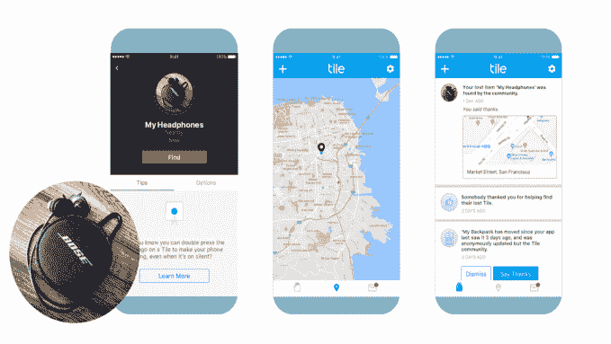

# 失物招领磁贴可与 Bose 耳机配合使用

> 原文：<https://web.archive.org/web/https://techcrunch.com/2018/01/08/lost-item-finder-tile-will-work-with-bose-headphones-and-other-new-partners/>

失物招领瓷砖今天宣布，它很快就能找到你的 Bose 耳机。从 2018 年春末开始，Bose 将成为 Tile 最大的新合作伙伴之一，因为它将开始销售其内嵌 Tile 技术的 Bose SoundSport Wireless 和 QuietControl 30 耳机。

现有设备将通过固件更新获得新功能——事实上，这是 Tile 的软件首次被下载到用户家中的设备上。

安装后，Tile 的应用程序可以像定位任何其他 Tile 设备一样定位 Bose 耳机。你可以使用应用程序“响铃”耳机来找到它们，响铃的时间越长，音量就会越大。

当然，Tile today 仍然以其钥匙链风格的方形加密狗而闻名，这种加密狗可以附着在你想要跟踪的物品上，比如你的钥匙、钱包、包、自行车、皮夹等等。但该公司更大的目标一直是创建一个全球用户社区，这些用户成为分布式网络的骨干力量，可以随时接入该网络，帮助定位丢失的物品。

据 NPD 称，到目前为止，Tile 已经售出 1300 万台设备，在“失物招领”市场占有 90%的份额。它的社区现在遍布全球 230 个国家和地区，每天被用来查找超过 200 万个项目。Tile 还报告 2016 年的收入为 1 亿美元。

Bose 的加入伴随着几个新合作伙伴的宣布，他们已经确认了将 Tile 集成到他们产品中的计划。其他新增加的包括新秀丽，这将使行李不会丢失；Propeller Health，它将把 Tile 的技术添加到其用于哮喘和慢性阻塞性肺病患者的联网吸入器中；Boosted，将瓷砖添加到其 Boosted 板；加上婴儿可穿戴创客 Starling 还有 Herschel，生产钱包、钥匙链夹和护照夹。

这些公司加入了现有的合作伙伴，如 Away Travel、SuitSupply、Blunt 雨伞、G-RO、This is Ground、Fossil、Kenneth Cole、Ricardo Beverly Hills、Axiom、Nomad、Keysmart 和 Keyline/Bianca。

由于与 Comcast、Ruckus Networks 和圣何塞国际机场的交易，Tile 还增加了一系列接入点合作伙伴，以扩大其网络。机场交易于 2017 年 11 月上线，Tile 表示，当天发现率已经增长了 20%，达到 95%。

“看到瓷砖社区呈指数增长令人兴奋，不仅有更多的消费者，还有领先的品牌甚至位置，”瓷砖首席执行官兼联合创始人迈克·法利在一份声明中说。“机场只是一个开始。我们正在关注所有高流量地区，在这些地区，对我们来说重要的东西通常会丢失——酒店和商场，以及住宅和社区。有了这些重要的合作伙伴，我们真正用智能定位覆盖了整个世界。”

今天宣布的新合作伙伴关系将于 2018 年春季启动，Bose 的集成和新秀丽的全球试点。