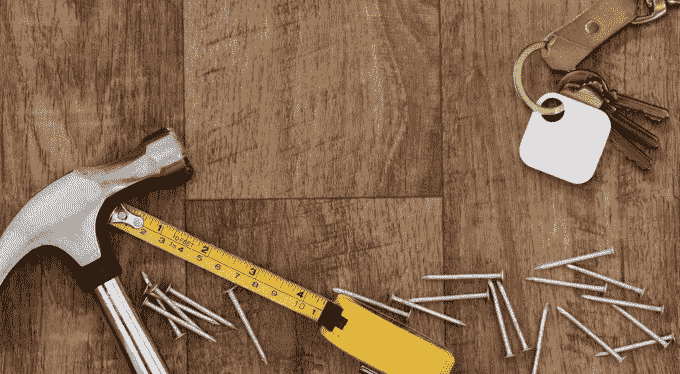
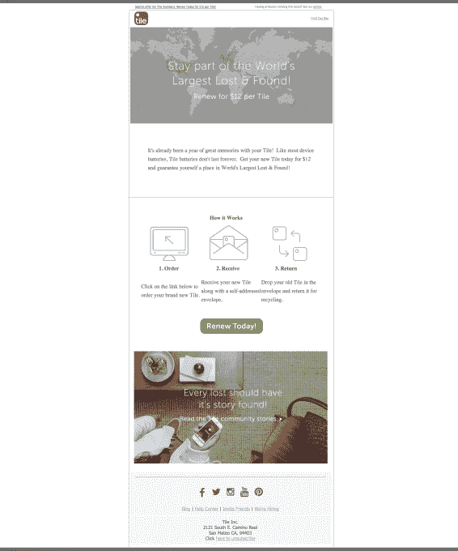
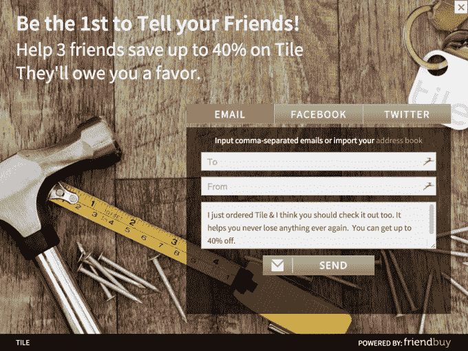

# 遗失物品追踪器磁贴推出更新服务，为早期用户提供折扣更换 

> 原文：<https://web.archive.org/web/https://techcrunch.com/2015/07/22/lost-item-tracker-tile-rolls-out-a-renewal-service/>

[Tile](https://web.archive.org/web/20221005045028/https://www.thetileapp.com/) ，一个方形的小型失物追踪器，[最近从科斯拉风险投资公司额外筹集了 300 万美元](https://web.archive.org/web/20221005045028/https://beta.techcrunch.com/2015/06/09/lost-item-tracker-tile-locates-3-million-more-in-series-a-funding-from-khosla-ventures/)，作为其早些时候[1300 万美元 A 轮投资的延伸，](https://web.archive.org/web/20221005045028/https://beta.techcrunch.com/2014/10/01/lost-item-tracker-tile-raises-13-million-to-fund-international-expansion-android-release/)此前曾表示，其商业模式最终将包括一项更换服务，允许客户在旧瓷砖电池耗尽之前购买新瓷砖。

现在，精选磁贴客户正面临这一选择。本周，该公司开始向一些早期支持者发送电子邮件，承诺在“瓷砖更新”上进行特别交易。

瓷砖追踪器是当今市场上许多失物招领器中的一种。它利用蓝牙连接和配套的智能手机应用程序来帮助用户找到他们贴有磁贴的任何物品——无论是一串钥匙、一个钱包或一个包、一辆自行车还是其他任何东西。然而，让 Tile 的实现有趣的是，它不仅仅是一个实用程序。Tile 正在发展一个由 Tile 设备所有者组成的社区，这些所有者联合起来，可以作为一个网络一起工作，以便找到人们丢失的物品，即使原始所有者不在蓝牙范围内。

该公司上个月表示，在 214 个国家和地区，每天有 250，000 个独特的发现，迄今为止已经发运了 200 万台设备。

但与它的一些竞争对手不同，瓷砖不会永远持续下去——只能持续一年。根据设计，瓷砖跟踪器不包括用户可更换的电池——这是因为，当电池耗尽时，许多消费者不会费心购买新电池并将其更换。他们会把瓷砖扔进抽屉，然后忘掉它。此外，通过消除终端用户接触电池的需要，Tile 可以在硬件设计上更加自由。

为了维持与客户的关系，Tile 联合创始人兼首席执行官 Mike Farley [早些时候在](https://web.archive.org/web/20221005045028/https://beta.techcrunch.com/2014/06/12/tile-the-lost-item-tracker-with-millions-in-crowdfunding-was-worth-the-wait/)表示，该公司将推出一项设备更换计划。今年 6 月，他表示将在几个月后发布相关公告。

但是，一些磁贴客户已经收到了电子邮件，向他们提供以每张磁贴 12 美元的价格续订的选项。电子邮件是定时的，因此只有那些最早拥有磁贴设备的人目前才能获得升级选项。

在 TechCrunch 收到的一封电子邮件中，瓷砖所有者有机会以 12 美元的价格续订一个瓷砖，以 48 美元的价格获得 4 个装的瓷砖，以 96 美元的价格获得 8 个装的瓷砖，或者以 144 美元的价格获得 12 个装的瓷砖。这些商品的价格分别低于 25 美元、70 美元、130 美元或 180 美元。(这些较高的价格是直接从网站购买瓷砖的成本。)

促销价格不可能一成不变，未来的续订价格可能会更高或更低，这取决于计划的成功与否。正如法利所说，“未来一切皆有可能……我们显然正在消费电子领域做一些新的事情。有点不一样。”

该公司尚未正式宣布其更新计划，因为它仍在制定细节。然而，更新选项就在 Tile 推出新硬件的计划之前到来。Farley 之前曾说过会在 2015 年假期前进行硬件升级。

当被问及今天更新磁贴的用户会收到旧的还是新的硬件时，这位首席执行官简单地回答说，“更新的用户会得到最新的硬件。”

然而，法利还表示，瓷砖续订将与新订单一样快，也就是说，大约在订单发出后一天。由于新的硬件尚未公布，这意味着用户可能会得到与他们今天已经拥有的相同的瓷砖作为他们的替代品。也就是说，该公司显然有某种计划，以确保那些续订的人不会错过新硬件上市的机会。不过，该公司拒绝透露这一过程将如何进行的更多细节。

续订后，瓷砖客户还有机会在社交媒体上分享他们的瓷砖订单，以换取未来订单的额外节省。

此外，更新服务包括一个有益的回收部分。当顾客收到新瓷砖时，他们还会收到一个贴有自己地址并贴有邮票的信封，用于退回旧瓷砖。

法利说，这是 Tile 更新计划的一个重要组成部分，他指出，根据环保局的数据，2013 年有 40%的消费电子产品被回收。

“我们回收了瓷砖中 99%的成分……这确保了它们不会被填埋，”他说。