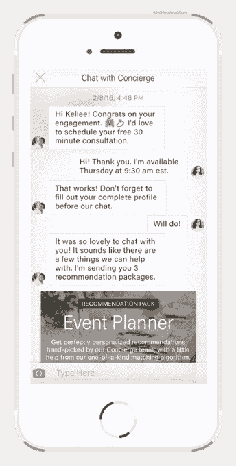

# Loverly 又筹集了 200 万美元，将婚礼策划师收入囊中 

> 原文：<https://web.archive.org/web/https://techcrunch.com/2016/03/22/loverly-raises-2-million-more-to-put-a-wedding-planner-in-your-pocket/>

在线婚礼创意初创公司[lovely](https://web.archive.org/web/20230129061635/https://lover.ly/)推出了一项新服务，希望将婚礼策划师的能力放在你的口袋里。今天正式推出，Loverly 正在[推出一种新的基于聊天的“礼宾”服务](https://web.archive.org/web/20230129061635/https://lover.ly/concierge/)，它将向新娘和新郎发送一份经过审查的婚礼供应商名单，这些供应商符合新人的预算、需求以及在相关婚礼日期有空。除此之外，该公司还宣布从新老投资者那里追加 200 万美元的资金来支持这个新市场的启动。

早在 2014 年，Loverly 已经筹集了[350 万美元的首轮融资。与此同时，新一轮融资由 Hunt Technology Ventures，LP 牵头，Montage Ventures，GrowthX，Transmedia Capital，645 Ventures，Great Oaks Capital 和女性创始人基金参与。](https://web.archive.org/web/20230129061635/https://techcrunch.com/2014/11/13/loverly-adds-smarter-search-and-picks-up-3-5-million-in-series-a-funding/)

迄今为止，Loverly 一直专注于提供一个网站和服务，通过图像、产品列表、独家新闻、专家建议、提示等提供灵感。然而，它去年进军电子商务的尝试并不成功。该公司此后停止了这些努力，并回归其根本——将夫妇与当地服务提供商联系起来，尽管现在的形式不同了。

此举正值许多公司正在试验基于聊天的虚拟助手之际。然而，一些人发现他们通常由人类驱动的机器人是不可持续的。这导致一些人转向更自动化的系统，例如[按需援助应用 GoButler 几天前做的](https://web.archive.org/web/20230129061635/https://techcrunch.com/2016/03/17/a-pivot-please/)，或者[新的 Y Combinator 支持的援助初创公司 Prompt](https://web.archive.org/web/20230129061635/https://techcrunch.com/2016/03/07/prompt-debuts-a-command-line-for-the-real-world/) 如何从早期自动化程度较低的努力中脱颖而出。

不过，有了 Loverly 的礼宾应用，就有了人工协助和自动化的结合。

首先，新娘和/或新郎点击该公司手机应用程序中的礼宾按钮，提供关于他们婚礼的信息，包括预算、宾客人数和日期。接下来是 15-30 分钟的电话，在大多数情况下，Loverly 总部受过训练的婚礼专家会告诉这对夫妇什么是真正重要的，他们希望如何花费他们的预算，以及他们遇到了什么样的痛点。

目前，这是一个非常高接触的过程，但我们被告知，该公司正在开发技术，使这一过程更加自动化。

最后，通过一种算法，将这对夫妇想要的东西与文件上的供应商标准进行匹配，Loverly 能够返回一个供应商列表。然而，在将这些建议发送给新人之前，该公司还将与供应商核实，以确保他们在婚礼当天确实可用。

[gallery ids="1295420，1295421，1295422，1295424"]

48 小时后，Loverly 手机应用程序中的礼宾“机器人”将向这对夫妇发送一个给定类别的推荐包，例如鲜花供应商。新娘和/或新郎可以选择 49 美元的费用打开这个包裹。

Loverly 创始人兼首席执行官 Kellee Khalil 解释说，该公司已经测试了免费咨询，但发现更多的用户在不收费的情况下打电话时打瞌睡。通过收费，这种服务的感知价值增加了。但她说，这也比使用传统的婚礼策划师更实惠。

哈利勒说:“一个完整的婚礼策划师平均起价为 3500 美元，”这就是为什么今天只有 16%的新娘聘请婚礼策划师。此外，夫妇雇用婚礼策划人的最大原因之一是供应商的推荐。“当你雇佣一名婚礼策划人时，这才是你真正需要支付的，”她补充道。

Loverly today 总共有超过 70，000 家供应商，但只有一小部分在推出时在聊天服务中活跃。然而，整个平台每月有 150 万访客关注该网站及其内容。

现在，目标是将这些用户转移到移动应用程序，这也让他们浏览想法，并将媒体，图像，文章等保存到移动剪贴簿。

哈利勒认为，新的基于消息的市场也将有利于供应商，以及雇用他们的夫妇，因为它能够向供应商发送合格的线索。也就是说，它将供应商与那些负担得起他们的价格的人匹配起来，并可以填补他们时间表中的一个漏洞。

供应商还需要每月支付 99 美元来加入这一新产品，该产品目前仅在纽约和洛杉矶推出，并计划根据客户需求推广到其他市场。与此同时，这些地区以外的夫妇可以使用 concierge 应用程序获得更多一般提示和建议。

礼宾服务现已在 Loverly iOS 应用中上线，[可点击此处](https://web.archive.org/web/20230129061635/https://lover.ly/concierge/)。