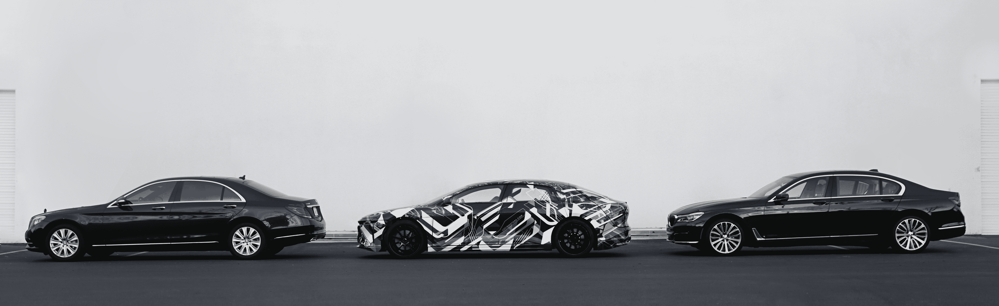

# Lucid Motors 推出了一款新的豪华电动汽车 Air，续航里程为 400 英里

> 原文：<https://web.archive.org/web/https://techcrunch.com/2016/12/14/lucid-motors-unveils-the-air-a-new-luxe-electric-car-with-a-400-mile-range/>

总部位于加州的 Lucid Motors 今天发布了其第一款汽车，这是一款针对“行政”市场的全电动轿车，其车载 100kWh 电池的额定里程为 400 英里，0-60 英里/小时时间为 2.5 秒，目标上市日期为 2018 年。车辆原型今天在加利福尼亚州弗里蒙特的一次特别揭幕活动中展示。

Lucid 的创始团队包括前特斯拉团队成员兼首席技术官彼得·罗林森(Peter Rawlinson)，以及前马自达、大众和宝马校友布莱恩·巴伦(Brian Barron)的德里克·詹金斯(Derek Jenkins)。Lucid Motors 计划于 2017 年在亚利桑那州的[开始制造这些电动汽车，根据该公司和亚利桑那州州长道格·杜西(Doug Ducey)的说法，新工厂将为该州带来约 2000 个新工作岗位。](https://web.archive.org/web/20230324192931/https://techcrunch.com/2016/11/29/lucid-motors-will-begin-manufacturing-in-arizona-in-2017/)

[gallery ids="1428431，1428430，1428429，1428428，1428427，1428426，1428425，1428424，1428423，1428422"]

罗林森此前指出，这些汽车的电动马达将拥有 1000 马力的总功率，并将有一个版本提供最大 400 英里的估计里程。根据罗林森之前的声明，该车辆还将具有一些自主功能。

以前的原型车已经展示了在正式亮相前穿的标志性黑白迷彩，但我们确实有一个空气看起来会是什么样子的想法。它更令人印象深刻的是没有令人困惑的包层，然而，如果可能比它的竞争对手特斯拉更冷静和明智的看起来，例如。

Lucid 在这款车中不断抛出的“执行”绰号是一个很好的指标，表明你在价格方面的预期，这一点尚未成为官方说法。超过 100，000 美元是 Lucid 对早期版本的期望，包括许多选项。

在 Lucid Air 的设计中，轿车的方式也比 Model S 更明显，这表明它可能会更多地与宝马 7 系等车辆竞争(事实上，它以前发布过将它与宝马 7 系和奔驰 S 级进行比较的图片，如上图所示)。

Lucid 还与三星 SDI 建立了合作伙伴关系，三星 SDI 是韩国科技巨头专注于电池的子公司。Lucid 已经通过三轮风险投资筹集了超过 1.3 亿美元的资金，其中包括来自中国环境基金的资金。

Lucid 的汽车看起来很有趣，但当这款车在 2018 年推出时，市场将会非常不同，许多主要豪华品牌的电动汽车几乎同时加入竞争。挑战将是站在起跑线上，但在电动汽车方面，新的参与者可能仍比传统汽车制造商有一些优势，即使老牌品牌正在加速他们的电动汽车计划。