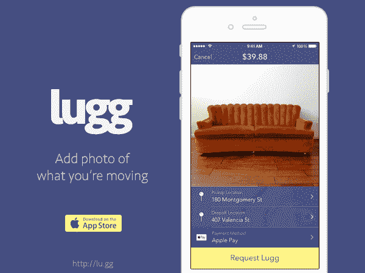

# Lugg 是一款按需短程移动应用，融资 380 万美元 

> 原文：<https://web.archive.org/web/https://techcrunch.com/2015/08/26/lugg-an-app-for-on-demand-short-distance-moves-raises-3-8-million/>

虽然优步、Lyft 和类似的拼车服务可以帮助你从一个地方到另一个地方，但它们对于拖运你的大件商品并不实用——比如在宜家疯狂购物的东西，或者你在 Craigslist 上找到的沙发。这就是名为 [Lugg](https://web.archive.org/web/20221226011931/http://lu.gg/) 的服务的用武之地。如果说 Lyft 就像你有车的朋友，那么 Lugg 就像你有卡车的朋友。

这家名为[的初创公司刚刚从 Y Combinator 2015 年夏季班](https://web.archive.org/web/20221226011931/https://techcrunch.com/2015/08/19/here-are-the-52-startups-that-launched-at-y-combinator-summer-2015-demo-day-2/#.s2agxy:clJz)毕业，现在已经从一些投资者那里筹集了 380 万美元的种子资金，这将使它能够壮大团队，并向新的城市扩张。

罗尼·康威(Ronny Conway)的 [A Capital](https://web.archive.org/web/20221226011931/https://www.crunchbase.com/organization/capital-partners-l-p) 领投了这一轮，参与投资的还有 [SV Angel](https://web.archive.org/web/20221226011931/https://www.crunchbase.com/organization/sv-angel) 、 [CrunchFund](https://web.archive.org/web/20221226011931/https://www.crunchbase.com/organization/crunchfund) (披露:TechCrunch 创始人迈克尔·阿灵顿创立的基金)、一些天使投资人，包括 Gmail 创始人兼 FriendFeed 创始人[保罗·布赫海特](https://web.archive.org/web/20221226011931/https://www.crunchbase.com/person/paul-buchheit)和[索玛资本](https://web.archive.org/web/20221226011931/https://www.crunchbase.com/organization/soma-capital)。

[Lugg 于 2015 年初首次在旧金山湾区推出](https://web.archive.org/web/20221226011931/https://techcrunch.com/2015/01/07/a-new-app-called-lugg-can-move-your-sofa-with-a-push-of-a-button/),这个想法来自乔丹·布朗，他之前在一家医疗保健初创公司工作，但发现自己面临着 Lugg 旨在直接解决的问题。我们中的许多人，不管有没有车，也能产生共鸣。我们经常不得不为不适合标准尺寸车辆的大宗采购做出特殊的、有时是昂贵的送货安排，或者我们不得不寻找有卡车的人，并说服他们帮助我们。

其他时候，我们只是错过了交易——比如你在车库拍卖或分类广告中发现的较大的二手物品。

Lugg 为您提供了另一种选择，即联系当地的搬家公司，他们会在 20 分钟左右的时间内到取货点与您会面，并配备自己的车辆来处理您的物品。要使用 Lugg，消费者只需用 Lugg 移动应用程序拍下商品的照片，输入他们的位置和目的地。与优步类似，支付是在应用程序本身中处理的。

目前，Lugg 的基本票价为 30 美元，加上装卸时每分钟 0.75 美元，以及每英里 2 美元。平均而言，旧金山湾区的搬迁费用约为 40 美元至 65 美元，距离稍长的搬迁，如旧金山至奥克兰，接近 80 美元。Lugg 的司机保留 80%的车费，其余归公司所有。

与其他拼车公司类似，任何有卡车的人都可以注册 Lugg，但他们需要能够移动重物。他们不是单独工作，Lugg 为每辆卡车指派两个人。这意味着承包商可以签约成为 Lugg 的“助手”，允许他们选择自己的工作时间，即使他们没有自己的车辆。(司机在换班开始时接他们的助手。)

Lugg 的搬运工被给予背景筛选，并且在被允许正式加入 Lugg 之前必须完成一系列的试运行。据布朗说，许多工人是大学生、运动员、前搬家公司员工、临时工，甚至是退伍军人。

虽然在某种程度上，Lugg 与较小的搬家公司竞争，但它并不是真正为将整个家庭的家具搬到城镇另一边而设计的。相反，这项服务只是为了在你需要一辆大卡车来短距离移动东西的时候提供帮助。然而，布朗指出，这并没有阻止一些人在搬家时使用 Lugg。

“(顾客)刚刚开始做……这真的很有趣，”他说。“他们可以从搬家公司获得 300 美元的报价，最少两个小时，或者只需要几个行李箱，他们就可以走了，”布朗解释说。“我认为很大程度上是因为搬家公司仍然如此古老——打电话给他们并获得报价，而不是仅仅按一下按钮，”他补充道。

迄今为止，Lugg 已经在旧金山地区处理了数千次搬家(接近六位数)。到今年年底，它计划达到更广泛的湾区，包括半岛，南湾和东湾。2016 年，该公司计划利用这笔资金扩张到新的城市，可能是纽约或洛杉矶，尽管这可能会发生变化。

消费者发现 Lugg 可以用于各种移动，但这家初创公司也得到了当地零售商的帮助。该公司已与 17 家现在向 Lugg 推荐业务的商店合作，包括好市多、宜家、家得宝、陶器坊、西榆树等。有些甚至展示店内标牌。

“很多商店[相信]他们能够卖出更多的家具或商品，因为[购物者]可以很快把它们运回家，”布朗解释道。“他们知道他们的顾客现在就想要，”他说。

在启动时，Lugg 是一个自力更生的三人团队，包括布朗、联合创始人史蒂夫·泽内里(前优步公司运营经理)和工程师埃里克·克鲁策(工程师)。但泽纳里在公司首次亮相后不久就离开了公司。

有了额外的资金，该公司现在将能够扩大团队，包括在工程和运营方面的招聘。它还将从一个仅支持 iOS 的应用程序扩展到支持 Android。

Lugg 作为雇用搬运工或像 U-Haul 这样的自己动手选项的替代方案是有意义的。但是如果这项服务起飞，它可能会面临像优步这样的更大的参与者的竞争，该公司一直在努力扩大消费者可以获得的按需车辆和送货服务的类型，今天包括从黑色轿车到出租车和 SUV 的一切，甚至可以选择带着[的孩子](https://web.archive.org/web/20221226011931/http://newsroom.uber.com/nyc/2014/05/uberfamilyfor-parents-on-the-go/)。

Lugg 的应用[是 iTunes 上的免费下载](https://web.archive.org/web/20221226011931/https://itunes.apple.com/app/apple-store/id919765207?mt=8)。

*(图片鸣谢:Lugg，Lugg [Instagram](https://web.archive.org/web/20221226011931/https://instagram.com/p/5sFgpqrFWf/?taken-by=lugg) )*