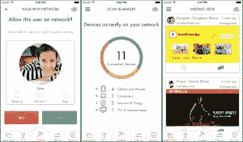

# 不可思议的是，Luma 让 Wi-Fi 设置变得有趣 

> 原文：<https://web.archive.org/web/https://techcrunch.com/2015/11/06/luma-quite-improbably-makes-wi-fi-setup-fun/>

# 不可思议的是，Luma 让 Wi-Fi 设置变得有趣

Wi-fi 设置通常非常简单:你在房子里找到一个空间，雇佣一个无线电专家团队来扫描盲点，并雇佣整个 it 团队来管理安全性和 QoS。然后你试着从后院连接，发现你不能从野餐桌上看 YouTube。

为了解决这个问题，Paul Judge 博士和 Mike Van Bruinisse 创造了 [Luma](https://web.archive.org/web/20221209102034/https://getluma.com/) 。这个小小的 Wi-Fi 热点使用一种“环绕声”方法连接，以确保您的家中没有死角。一台售价 99 美元，三台售价 249 美元。[现已提供预购](https://web.archive.org/web/20221209102034/https://getluma.com/)。就像之前的[谷歌](https://web.archive.org/web/20221209102034/https://on.google.com/hub/)一样，一款定制的更智能的 Wi-Fi 路由器听起来就像是入场券。

该系统还提供用户和家长控制，因此您可以在特定时间关闭特定设备。它通过私人网状网络与其他 Lumas 连接，从而在房子周围创建一个巨大的热点。

Luma 已经筹集了 350 万美元，由 Felicis Ventures 以及 Base Ventures、BIP 资本、Relay Ventures、Meraki 的联合创始人汉斯·罗伯逊(Hans Robertson)和 49 人队的首席执行官杰德·约克(Jed York)等人领导。

“Wi-Fi 覆盖的答案是大型企业使用的网状网络，”Judge 说。“Luma 还提供家长控制、可见性和网络安全。Luma 是第一款提供全套速度、安全和保障的产品。”

法官也把许多智慧放进一个小盒子里。

“我们将网状网络、内容过滤、移动设备管理和网络安全整合到一款外观小巧的设备中。每个设备都通过蓝牙与 app 进行通信，并帮助您找到家中放置它的最佳位置。然后，Lumas 全部进行无线通信，为您的房子构建理想的网状网络。它们会交流流量模式和网络干扰，然后动态地自动调整和重新配置，以始终优化性能。”

该产品将于 2016 年上市，目前享受五折优惠。除非去百思买 TCP/IP 和无线专家实验室(我认为不存在)，否则这可能是一个有很多 Wi-Fi 问题的大房子的最好选择。

【YouTube = https://www . YouTube . com/watch？v=AWnPaRuAqbU]