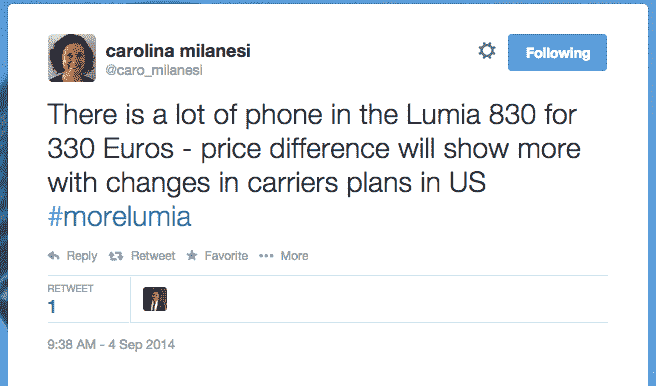
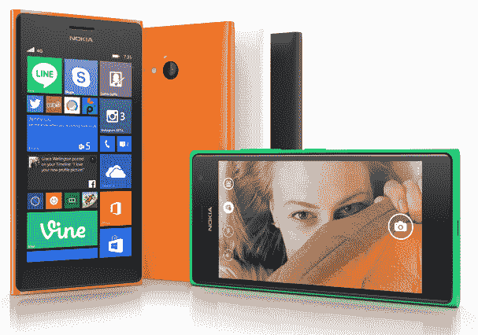

# 微软用另外三个 Lumias 填充了 Windows Phone 的腹部

> 原文：<https://web.archive.org/web/http://techcrunch.com/2014/09/04/lumia-830-730-735/>

微软，现在是诺基亚移动制造部门的骄傲所有者，在今天柏林举行的 IFA 新闻发布会上推出了三款新的中间层视窗手机——包括一款被称为“平价旗舰”的超薄、专注于照片的设备。又名[卢米娅 830](https://web.archive.org/web/20230315171626/http://conversations.nokia.com/2014/09/04/lumia-830/) 。

而且——T4 紧随许多安卓原始设备制造商的脚步——一款叫做 [Lumia 730](https://web.archive.org/web/20230315171626/http://conversations.nokia.com/2014/09/04/lumia-730-and-lumia-735/) 的“自拍手机”(还有一款叫做 Lumia 735 的双 SIM 卡变体)。

在规格方面，所有这些设备都是中端手机，所以很明显，微软认为有必要增加产品组合的中间部分，以提高销量，从而扩大视窗手机的市场份额。该平台继续[未能在美国](https://web.archive.org/web/20230315171626/https://techcrunch.com/2014/07/03/windows-phones-market-share-in-the-united-states-isnt-growing/)获得牵引力，但已经在国际市场上看到了一些生命迹象，包括[某些欧洲市场](https://web.archive.org/web/20230315171626/https://techcrunch.com/2013/11/04/windows-phone-one-in-10/)。

**Lumia 830**

[YouTube = http://www . YouTube . com/watch？v=Sb5McfPga4Q&w=640&h=360]

Lumia 830 看起来类似于诺基亚今年早些时候发布的金属边缘的 Lumia 930 ，但在外形上有所改进，但也有 1000 万像素的高端 PureView 镜头(而 930 有更小的卡尔·蔡司镜头)——尽管分辨率不如 2013 年 7 月发布的 41MP 镜头 [Lumia 1020](https://web.archive.org/web/20230315171626/https://techcrunch.com/2013/07/11/nokia-lumia-1020-official/) 。

就规格而言，聚碳酸酯背面有 5 英寸 720p 显示屏、1.2 千兆赫四核骁龙芯片组以及微软常见的令人瞠目结舌的颜色。它将随 [Lumia 牛仔布更新](https://web.archive.org/web/20230315171626/https://techcrunch.com/2014/08/04/windows-phone-8-1-update-1-goes-live-for-developers/)一起发货。

还有一款更新版的 Lumia Camera，具有更快的快照和其他图像增强功能，包括一个允许用户对同一张照片进行两次快照的功能:一次使用闪光灯，一次不使用闪光灯，然后在事后选择照片的曝光时间。

Lumia 830 的价格为€330 英镑，将于本月开始全球发货。

多年来，雷德蒙德一直在努力提高其 Windows Phone 平台的市场份额，鉴于苹果和安卓 OEM 三星的长期稳固地位，高端智能手机价格点的竞争尤为激烈。

然而，由于来自小米等安卓原始设备制造商的价格竞争，三星在最近几个月显示出下滑的迹象。微软现在看起来正在接近一个类似的策略，在价格上削弱高端竞争——尽管这一批设备填补了 Windows Phone 的中端市场，而不是高端市场——这一策略现在已经完全控制了诺基亚的设备制造部门。

**Lumia 730 和 735**

今天，雷德蒙德的 IFA 发布会上发布的第二款设备(有单双 SIM 卡版本)被称为“自拍手机”。我们已经看到包括 [HTC](https://web.archive.org/web/20230315171626/https://techcrunch.com/2014/05/15/htc-one-mini-2/) 在内的 Android OEMs 厂商最近试图通过提供显然更容易自拍的手机来开辟类似的道路。微软的 take 增加了一个 500 万像素的广角前置镜头，这样你就可以在自拍中容纳更多的人。

这款 4.7 英寸 720p 显示屏手机拥有 1.2GHz 四核骁龙 400 芯片组，外加 1GB 内存和 6.7MP 后置摄像头，因此它正好位于中端设备支架中。就价格而言，Lumia 730 售价为€199 英镑，而€735 售价为 219 英镑。

微软还利用其对 Skype 的所有权，为今天宣布的所有设备提供三个月的免费 Skype 通话——实际上是其所有的 Lumia 设备。那根本不会惹恼运营商…

【YouTube = http://www . YouTube . com/watch？v=rmkNiLRFZKI&w=640&h=360]