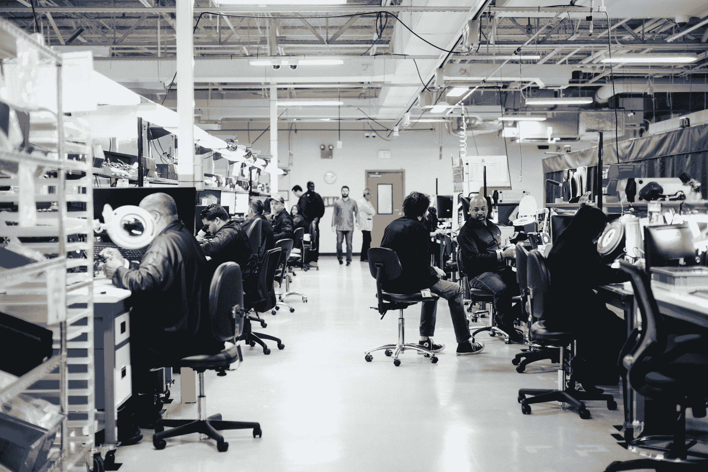
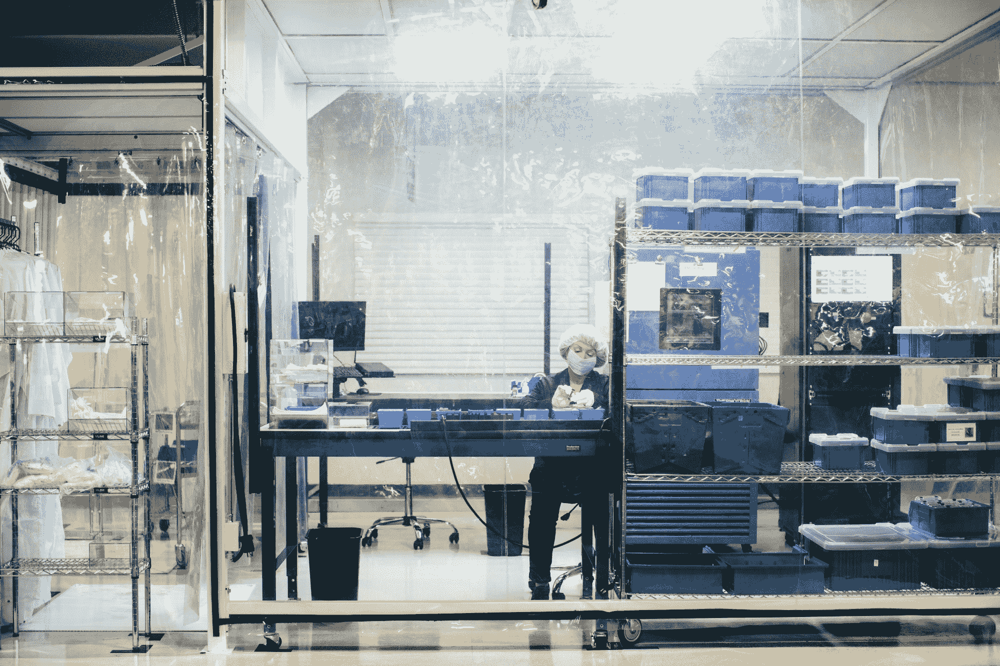

# Luminar 通过收购和智能工程将其激光雷达技术投入生产 

> 原文：<https://web.archive.org/web/https://techcrunch.com/2018/04/12/luminar-puts-its-lidar-tech-into-production-through-acquisitions-and-smart-engineering/>

去年，当 Luminar [凭借其从零开始建造的](https://web.archive.org/web/20221207125146/https://techcrunch.com/2017/04/13/luminar-debuts-a-sensor-to-make-self-driving-cars-safer-than-human/)[激光雷达系统](https://web.archive.org/web/20221207125146/https://beta.techcrunch.com/2017/02/12/wtf-is-lidar/)摆脱隐身状态时，它似乎在自己的游戏中击败了像威力登这样的老牌玩家——但花费巨大，而且没有能力大规模建造。然而，在这项技术在道路上证明了自己之后，Luminar 开始努力使其设备更好、更便宜，并且能够在几分钟而不是几小时内组装好。

“对我们来说，今年是关于规模的一年。去年花了一整天来建造每个单元——它们是由光学博士手工组装的，”Luminar 的神童创始人奥斯汀·拉塞尔说。“现在我们有了一个 136，000 平方英尺的制造中心，我们的单位生产时间减少到了 8 分钟。”

以免你认为该公司为了数量而牺牲了质量，但众所周知，该生产单元重量轻了约 30%，能效更高，能看得更远(250 米对 200 米)，并能检测到反射率较低的物体(想想在黑暗中穿着黑色衣服的人)。

实际上，整个操作的秘密在于传感器。Luminar 的激光雷达系统，像所有其他系统一样，发射一束光，并基本上确定其返回时间。这意味着你需要一个感光表面，它只能分辨少量的光子。

大多数光电传感器，如数码相机和其他激光雷达系统中的光电传感器，都使用硅基光电探测器。硅是众所周知的，便宜，并且制造工艺成熟。

然而，Luminar 决定从头开始使用它的系统，使用一种叫做铟镓砷或 InGaAs 的合金。基于 InGaAs 的光电探测器工作在不同的光频率下(1550 纳米而不是 900 纳米),捕捉光的效率要高得多。(这里有些物理。)

光线越强，你的传感器就越好——这是通常的规律。这里也是如此；Luminar 的 InGaAs 传感器和单个激光发射器产生的图像明显优于类似尺寸和功耗的设备，但移动部件更少。

问题是，铟镓砷就像传感器衬底的唐培里侬。它非常昂贵，而且为它设计是一个高度专业化的领域。Luminar 只是通过最大限度地减少 InGaAs 的使用量而逃脱了惩罚:只有一小部分 in GaAs 被用于需要的地方，他们围绕这一点进行了设计，而不是使用许多其他激光雷达产品中的光电探测器阵列。(这种限制与“较少移动部件”和单一激光方法密切相关。)

去年，Luminar 与一家名为 Black Forest Engineering 的公司合作设计这些芯片，发现它们的路径密不可分(除非办公室里有人想自愿建造 InGaAs ASICs)，Luminar 购买了它们。黑森林公司的 30 名员工，加上从《秘密行动》出来后雇佣的 200 名员工，使公司总人数达到 350 人。

通过让设计人员参与进来，构建他们自己的定制版本，不仅包括光电探测器，还包括解析和传递信号所需的各种芯片，他们将接收器的成本从数万美元降至……*三*美元。

“我们已经能够摆脱这些昂贵的处理芯片的时间和东西，”拉塞尔说。“我们构建自己的 ASIC。我们只取一点 InGaAs 放在芯片上。我们定制芯片。”

“这是人们一直认为你永远无法将其用于生产车队的东西，”他继续说道。“好吧，事实证明它实际上并不一定很贵！”

当然——它只需要一群天才、五年时间和七位数的预算(如果 3600 万美元的种子资金是他们所需要的全部，我会感到惊讶)。但是我们不要吹毛求疵。

洁净室质量检查时间。

不过，这一切都是着眼于未来的漫长道路。去年，该公司证明了它的系统不仅有效，而且运行良好，尽管一开始只有几十个。他们可能会侥幸逃脱，因为正如罗素所说，“迄今为止，每个人所建立的基本上都是一个自主测试舰队。但现在，每个人都在考虑构建一个实际的、固化的硬件平台，可以扩展到现实世界的部署。”

一些公司进行了一次大胆的尝试，比如丰田和其他几家未透露名称的公司，尽管这可能意味着暂时的挫折。

“这是一个非常高的进入壁垒，但也是一个非常高的退出壁垒，”罗素指出。“我们的一些合作伙伴不得不丢弃数万英里的数据，重做大部分软件堆栈，以迁移到我们的传感器上。但是他们知道他们最终必须这么做。就像撕掉创可贴一样。”

我们很快就会看到这个行业是如何发展的——随着稳定的进步，以及在优步自动驾驶汽车发生致命车祸后的强烈焦虑和审查，很难预测不久的将来。但是 Luminar 似乎看得更远。