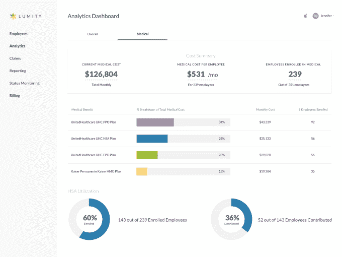

# Lumity 筹集 1900 万美元简化员工医疗保健选择 

> 原文：<https://web.archive.org/web/https://techcrunch.com/2017/08/23/lumity-raises-19m-to-simplify-employee-health-care-choices/>

随着公司变得越来越大，他们的需求也将发生变化——可能最重要的是，随着员工基数的扩大以及这些计划的成本开始飙升，他们的医疗保健选项也将发生变化。但最终结果是，在没有大量指导的情况下，员工可能会面临一系列令人困惑的计划。

这就是 Lumity 的用武之地。这家初创公司希望为雇主提供工具，优化医疗保健成本，简化为员工选择医疗保健计划的方法。最终产品是一个大约有四个方框的屏幕，员工可以选择一个医疗保健计划，随着公司接触到成百上千的员工，签约过程变得越来越复杂，这是有意义的。Lumity 今天表示，它在由 Draper Fisher Jurvetson 牵头的一轮融资中筹集了 1900 万美元，以帮助吸引客户，其中已经包括 Lyft 和 GoFundMe。

“我们承担主要的员工支持，”Lumity 联合创始人塔里克·希拉利说。“我们处理所有员工问题，处理所有注册技术，处理所有数据分析。我们制定了一套对员工更有利的计划，并通过使用处方数据等方式，在不影响福利质量的情况下，从根本上降低了计划成本。”

一个例子是处方数据，Lumity 客户可以自愿提交这些数据，以帮助规划他们的最佳医疗保健计划。起初，Hilaly 和他的团队并不 100%确定员工是否愿意加入并分享这些数据。但该平台上约 90%的员工实际上选择了这项服务，这让 Lumity 在继续完善其算法时有更多数据可供咀嚼。

“数据显然有一个附带的飞轮，”希拉利说。“你得到的越多，模型就越好，结果也就越好。我们正在解决利益问题，同时应用技术和服务组件。它涉及到与许多不同系统的接口。我认为，随着我们所做的事情的复杂性和广度的扩大，围绕它的护城河也在扩大。”

该公司上次融资是在 2015 年 9 月，自那以后，它继续收集更多关于其客户群的数据。这是那些依靠预测分析来帮助管理风险和确定最佳医疗保健计划的公司的一项要求，尤其是在面临来自拥有丰富经验和专业知识的地区经纪人的大量潜在竞争的情况下。Lumity 必须确保良性循环——获得更多数据，创造更好的体验，然后利用这种体验转化新客户——继续下去，才能保持活力。

Lumity 的观点是，该公司不一定会把你局限在一个平台上。这就是为什么 Hilaly 说公司会选择它而不是像 Zenefits 这样的产品的部分原因，鉴于它的目标是福利空间，它可能是它最强有力的竞争对手之一。然而，Zenefits 针对公司的多个不同的就业领域——这对小公司有意义，但不一定是因为它们成长为大公司。

希拉利说:“他们把这三样东西放在一起，可能对于员工不足 100 人的公司来说是有意义的。”“在我们的市场中，价格从 100 英镑左右开始上涨，人们不太关心一体机。他们有不同的需求和系统。例如，他们可能需要 ADP 来支付工资。随着他们变得越来越大，一些人可能想使用 Workday。我们不会专注于打造一款一体机，也不会将您局限于我们的平台。我们只关注福利，那是你花钱最多的地方。”