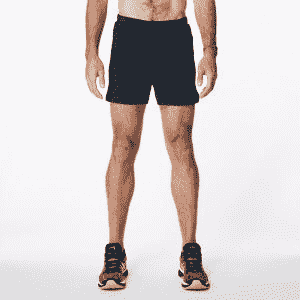

# Lumo 旨在通过推出“智能”裤子来改善跑步者的姿势来占领跑步市场技术危机

> 原文：<https://web.archive.org/web/https://techcrunch.com/2015/10/07/lumo-aims-for-the-running-market-with-launch-of-a-smart-garment-to-improve-runners-posture/>

# Lumo 瞄准跑步市场，推出“智能”裤子来改善跑步者的姿势

Lumo，生产 [Lumo Lift](https://web.archive.org/web/20221007061943/http://www.lumobodytech.com/lumo-lift/) 姿势矫正设备的厂商，也发布了一些东西来帮助跑步者创造更好的体型。

这款名为 [Lumo Run](https://web.archive.org/web/20221007061943/http://www.lumobodytech.com/lumo-run/) 的可穿戴系统由 Lumo“智能服装”——男士短裤和女士卡普里斯——以及一款可以嵌入这些服装口袋的设备组成，该设备可以在应用程序上提供实时反馈，向跑步者展示他们在脚后跟每一击下的表现。

良好的体型不仅能增加跑步者的速度和距离，还能防止可能限制跑步者撞击路面能力的损伤。

Lumo Run 将传感器和导电线嵌入 Lumo 短裤或七分裤的腰带中，以检测慢跑者的生物特征、姿势和里程，并协助实时教练。使用 Lumo 的专门算法，该设备在慢跑时使用所有信息进行跟踪并给出反馈，以便跑步者可以看到他们的表现并及时做出纠正。

有很多应用程序可以向跑步者显示他们跑了多远和多快，但对于想要改善状态和防止受伤的跑步者来说，没有多少应用程序可用。[阿索斯](https://web.archive.org/web/20221007061943/https://www.liveathos.com/)是硅谷的一家可穿戴健身初创公司，有类似的七分裤和短裤，可以在你锻炼时检测肌肉力量和运动，但不是专门用于跑步。

我们是否总是需要购买裤子才能获得好处？耐克提供了一种类似的设备，名为[耐克+](https://web.archive.org/web/20221007061943/https://secure-nikeplus.nike.com/plus/login) ，适合特制的耐克品牌鞋。它最初是带着一个手环而不是一个应用程序，但现在可以在任何地方的智能手机上找到。虽然该设备最初需要放在鞋底的口袋中，但消费者最终找到了一些配件，允许他们在自己的鞋子上使用该设备，而不是需要购买耐克的专有鞋子来使其工作。

Lumo 的首席执行官 Monisha Perkash 强调了购买服装的必要性。“把它放在我们的腰带上有助于传感器正确放置，也更稳定，”她说。"所以你得到的读数要准确得多."

从今天开始，你可以以 99 美元的价格预购 Lumo Run 男士短裤，以 119 美元的价格预购女士 capri 长裤。男士短裤的零售价为 149 美元，女士七分裤的零售价为 169 美元。Lumo Run 长裤将于 2016 年 3 月 31 日开始发货。

我会见了 Perkash，以了解该公司如何将其姿势技术扩展到跑步中。看看上面的视频，更好地了解它是如何工作的，以及运动中的裤子是什么样子。