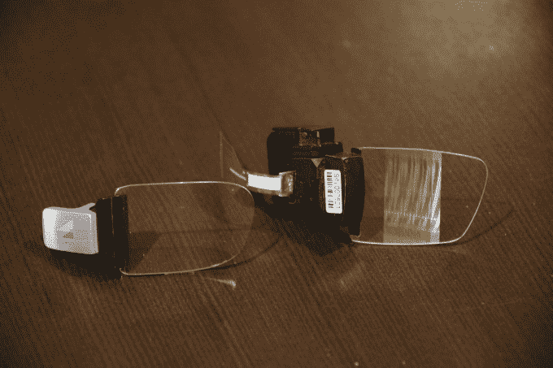
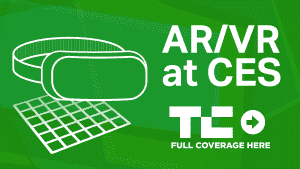

# Lumus 展示了其最新的越来越小的增强现实显示器 

> 原文：<https://web.archive.org/web/https://techcrunch.com/2018/01/09/lumus-shows-off-the-latest-of-its-increasingly-tiny-augmented-reality-displays/>

随着苹果、微软、谷歌和脸书都期待将增强现实眼镜推向市场，将他们对世界的愿景直接推向观众的眼球，他们遇到了一个共同的挑战。虽然这些科技巨头已经熟悉了复杂技术的小型化，但 ar 显示器是一个仍然需要大量 R&D 来推动突破的技术领域。

“在所有这些解决方案中，光学确实是一个瓶颈，”Lumus 首席执行官 Ari Grobman 告诉 TechCrunch。

Lumus 在今年的 CES 上展示了它的最新产品，并强调了一种新的外形，它希望在今年的 Q2 做好准备，带来一种比以往任何时候都更小的复杂显示技术。

该公司制造了所谓的反射波导。这种有趣而光滑的显示技术依赖于透明玻璃透镜中的微观蚀刻，这些透镜可以捕捉投射到其边缘的光线。虽然这些系统在多大程度上限制了它们可以填充观众的视野，但它们在可以达到的小尺寸方面是无与伦比的，并且可能会成为你的第一副智能眼镜的动力。

该公司最近成为头条新闻，因为它与苹果使用的制造商广达达成协议，开始制造 AR 显示器。这家以色列公司已经从广达、阿里巴巴和 HTC 等公司筹集了 5700 万美元。

TechCrunch 首先看到了他们的最新设计。Lumus 最新的反射波导显示器将 40 度自上而下的视野波导封装在一个比我们在最近的智能眼镜产品中看到的更紧凑的外形中。与 Lumus 的早期产品相比，这款微型显示器更加清晰，现在拥有 1080p 的分辨率。

有趣的是，Grobman 还指出，几乎每个认真的合作伙伴都在寻找一种“双目”解决方案，这意味着在每只眼睛上使用一种显示器，产生 3D 效果。这与谷歌眼镜等解决方案形成了鲜明对比，谷歌眼镜显然只使用了一个显示屏。

格罗伯曼说，该公司最新的显示器“比其他任何产品都好。”凭借强大的制造合作伙伴，Lumus 也比大多数人更有条件将他们的显示技术应用到即将推出的 AR 产品中。

我有机会尝试了一些利用该公司技术的解决方案，发现虽然视野仍然比大多数用户可能喜欢的消费产品小一点，但显示屏非常强大，推动清晰的图形，重要的是非常明亮。在一个阳光充足的房间里，波导管显示了一个火箭的图像，它足够亮，几乎可以遮挡住走在我前面的真实世界的人。

与 Magic Leap 等竞争对手相比，这些竞争对手正在大声谈论他们的技术如何实现景深，Lumus 正在建造的东西仍然位于单个焦平面上，尽管 Grobman 表示，合作伙伴可以修改镜头，以展示类似的视觉效果。对于 Lumus 来说，产品路线图主要指向更宽视野和越来越小外形的显示器。

“我们不知疲倦地试图淘汰我们自己的技术，”格罗伯曼说。