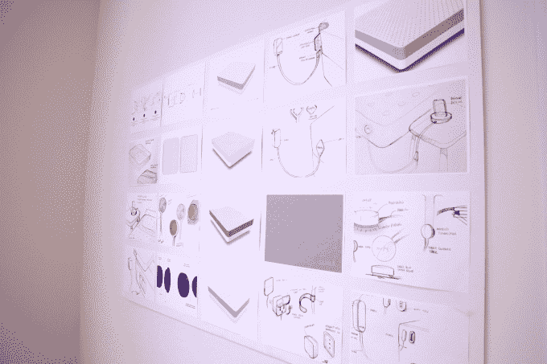
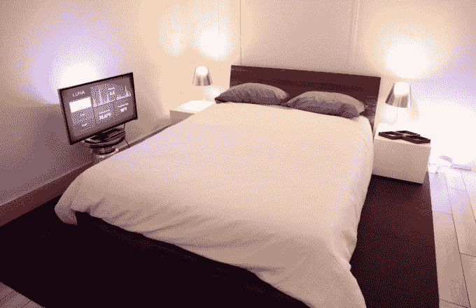

# 露娜智能床垫套能帮助你睡得更好

> 原文：<https://web.archive.org/web/https://techcrunch.com/2015/01/27/luna-smart-mattress-cover/>

# 露娜智能床垫套可以帮助你睡得更好

Luna 的联合创始人 Matteo Franceschetti 提出了一个非常吸引人的关于上床睡觉的愿景:当你躺下时，灯光、温度(床和房间)以及音乐都可以根据你选择的环境进行调节。然后当你睡着的时候，它们会再次调整，也许会完全关闭。

Luna 通过智能床垫套实现了这一点，该床垫套现在可以通过 Indiegogo 上的众筹活动[进行预购。](https://web.archive.org/web/20230223083009/https://www.indiegogo.com/projects/luna-turn-your-bed-into-a-smartbed)

正如你在上面的视频中看到的，Luna 是一款适合放在床垫上的外套。然后，它会自动跟踪你的睡眠，将数据发送到 Luna 应用程序和家中其他联网设备。

在 Luna 陈列室里，Franceschetti 实际上是在装睡，我们看到房间在他周围睡着了。该公司正在宣传其与 Nest 智能温度计的集成，但 Franceschetti 表示，它也与其他智能家居设备签署了合作伙伴关系。(尽管如此，我怀疑其中的一些卖点，比如在你醒来的时候煮咖啡，可能会更远一些。)

“我们的想法是真正自动化你的大多数睡眠习惯，”他说，随后补充道，“在美国分发和销售的互联网设备越多，这种产品就越有用。”

当被问及 Luna 给睡眠习惯带来的最显著的改变时，Franceschetti 回答道:

> 对于男性来说，最令人兴奋的部分是我们与智能家居设备的互动——比如灯光、你的网飞、Spotify。相反，对于女人来说，这是温度问题。我们见过大多数夫妻因为温度而争吵，而男人喜欢冷着睡，而女人喜欢热着睡，通过不同的温度和区域控制，这是我们可以解决的问题。

在随后的一封电子邮件中，Luna 团队还告诉了我它是如何保护你的睡眠数据的。该公司表示，它收集的数据在本地聚合在设备上，然后加密并发送到 Luna 进行存储和分析。

Luna 智能外壳的计划零售价格为 249 美元，但目前通过预购以 179 美元的价格[出售。](https://web.archive.org/web/20230223083009/https://www.indiegogo.com/projects/luna-turn-your-bed-into-a-smartbed)

