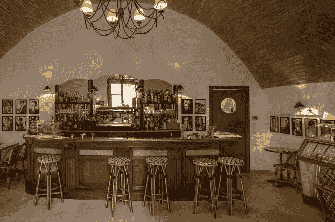

# 面向高端住宅和客人的 Airbnb 网站 Luxury Retreats 融资 1100 万美元 

> 原文：<https://web.archive.org/web/https://techcrunch.com/2015/06/08/luxury-retreats-an-airbnb-for-high-end-homes-and-guests-raises-11m/>

随着 Airbnb 继续[向其在线住宿租赁市场添加更多功能](https://web.archive.org/web/20230131002329/http://www.wsj.com/articles/airbnb-signals-expansion-into-professional-vacation-rentals-1432051843)以满足来自监管机构及其不断增长的主人和客人受众的[需求](https://web.archive.org/web/20230131002329/https://techcrunch.com/2015/04/14/airbnb-new-regulations/)，一家位于同一空间但专注于高端物业的初创公司筹集到了资金。 [Luxury Retreats](https://web.archive.org/web/20230131002329/http://www2.luxuryretreats.com/) ，这是一家位于蒙特利尔的市场，为人们列出和寻找超豪华的短期租赁房屋，已经在 B 轮融资中筹集了 1100 万美元，由另一家位于加拿大的公司 [iNovia Capital](https://web.archive.org/web/20230131002329/http://inovia.vc/) 领投。

该公司没有公开披露这一轮的估值，但创始人兼首席执行官乔·普林(Joe Poulin)告诉了我一些其他细节:豪华度假村——一套 3-5 间卧室的房子的典型价格在 1500 美元至 2500 美元/晚之间——已经盈利“多年”(对于规模大得多的竞争对手 Airbnb，我们并不确切知道这一细节)，它并没有寻求资金，但决定无论如何都要拿这笔钱来帮助在几个不同的领域扩张。

一个是地理足迹——该平台上的 90 个地点现在有 2800 套房子，豪华度假村现在正在迈阿密、纽约、巴黎和洛杉矶扩张，普林说这是“疯狂增长”

另一家公司正在拓展礼宾和家政服务——分别为客人和主人提供服务。

鉴于 Luxury Retreats 将采用四季式的方法来共享经济型房屋租赁，礼宾服务是其向通过其平台预订房屋的人提供的服务的一个非常重要的部分。到目前为止，该公司一直在使用当地代理商和一个从蒙特利尔远程工作的团队——总共 180 人——来提供客人在住宿期间可能需要的任何东西。现在的想法是，在关键市场中配备更直接的员工，他们可以提供更个性化和本地化的服务。

通过礼宾服务提出了什么样的请求？虽然人们可能会通过[测试 YC 支持的](https://web.archive.org/web/20230131002329/https://techcrunch.com/2015/02/27/catch-a-tiger-by-the-toe/)[魔术](https://web.archive.org/web/20230131002329/https://techcrunch.com/2015/03/26/sources-magic-is-raising-12m-from-sequoia-at-a-40m-valuation/)的极限来[吃出自己的方式](https://web.archive.org/web/20230131002329/http://recode.net/2015/02/25/i-tried-out-magic-the-new-text-message-concierge-and-it-was-far-from-magical/)，但豪华度假村实际上已经围绕着“一切皆有可能”的理念建立了自己的业务

普林说，要求特定的葡萄酒、租船、详细的菜单和派对计划是非常标准的，但他们也有(并满足了)更多的要求，例如当客人想念家里的水禽时，运送一种特定品种的鸭子到家中的花园；在另一个客人的家里建造一个完整的犹太教堂。

这些房产本身来自富人和不知名的人，也有富人和名人，理查德·布兰森的内克岛和弗朗西斯·福特·科波拉在意大利普利亚令人回味的宫殿都在网站上。(在主持人和嘉宾方面，还有其他一些不公开的高调名字。这真的是百分之一的 Airbnb。)

除了指出已经发现并完全锁定目标市场的科技服务的长期成功之外，奢侈品静修中心的融资和增长还突显了其他一些东西:“共享经济”的概念已经变得多么正常。

Airbnb 的诞生源于这样一种理念，即当普通人不在的时候，通过出租房间或房屋来给他们提供一种补充收入的方式；或者为旅行者提供一种更独特、可能比酒店更便宜的住宿方式。豪华度假村是一个迹象，表明这一概念如何渗透到旅游业的其他领域——特别是服务于更稀有和更高收入客户的领域。这就像优步效应对其他交通方式的影响一样，比如游艇和私人飞机，还有运送你的孩子去参加放学后活动的 T3，还有 T4。

“共享经济已经大受欢迎，我们看到了向我们的客人提供可预测性和一致性的巨大机会，”Poulin 说。

富人的高端房屋租赁也是其他人越来越想瞄准的一个领域。竞争对手 [OneFineStay](https://web.archive.org/web/20230131002329/http://www.onefinestay.com/) 最近筹集了 4000 万美元，其中包括来自凯悦酒店的[战略投资。与此同时，HomeAway 现在也有了自己的子品牌，同样命名为](https://web.archive.org/web/20230131002329/http://www.wsj.com/articles/hyatt-invests-in-home-rentals-firm-1432232861)[奢侈品租赁](https://web.archive.org/web/20230131002329/http://luxury.homeaway.com/)。普林表示，他的豪华度假村与这些度假村不同，因为它关注审查网站——或者他称之为“监管”——并且通常会将共享沙箱的墙建得更高。

“你不能只是装载一个属性就走，”他说。“我们的优势在于我们有了更多的控制权。它不是完全对等的，因为我们认证所有属性。有必要推动高端业务。奢侈品不是出售的，而是交付的。”

有趣的是，Luxury Retreat 对高端住宅和偶尔古怪的人类需求的培养并没有像你想象的那样影响利润率。

“我们收取 20%的佣金，在某些情况下还会多一点，”他解释道，他说这比 Airbnb 和其他公司在房产上市时收取的佣金总和高不了多少。Airbnb 向房主收取 5%左右的费用，然后向客人收取 6%到 12%的费用，这还不包括清洁费。“对我们来说，这完全是交钥匙工程，而对 Airbnb 来说，这需要大量的工作，”他补充道。

Poulin 表示，该公司没有计划尝试将其模式扩展到更便宜的多层房屋或付费客人。

在这一轮之前，Luxury Retreats 已经从英诺维亚筹集了 500 万美元。