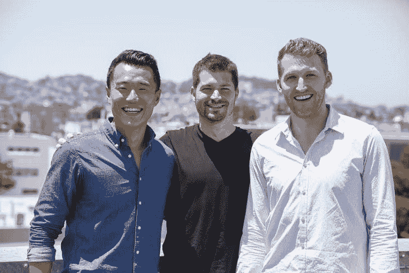

# lyft Acqui-从消息应用 Leo 雇佣团队来改进位置和其他功能 

> 原文：<https://web.archive.org/web/https://techcrunch.com/2015/06/26/lyft-acquihires-the-team-from-messaging-app-leo-to-improve-location-and-other-features/>

Lyft 已经收购了 [Leo](https://web.archive.org/web/20221208001407/http://leo.co/) 背后的团队，这是一款正在消失的用于一对一或小组对话的消息应用。我们被告知，这笔交易已于上周末敲定，联合创始人卡洛斯·惠特、奥斯汀·布洛伊和基斯·郭已于周一开始在 Lyft 的新工作。

Lyft 拒绝透露交易的条款，但惠特的初创公司从投资者那里筹集了 150 万美元，他告诉 TechCrunch，“我们的投资者对收购感到满意。”

这是该打车平台继 Hitch、Rover 和 Cherry 之后的第四次收购。这也是 Lyft 希望改善 Lyft 应用程序中围绕客户体验的许多功能，特别是帮助司机找到乘客。

竞争对手优步已经可以通过内置的 GPS 跟踪技术获得用户的准确位置，但这仍然是 Lyft 的一个笨拙的过程。我仍然需要在 Lyft 上输入我的地址或把 pin 码放在我的位置上——即使这样，我有时也会遇到司机迷路的情况。

惠特对移动定位技术颇有经验。他和 Lyft 的首席技术官克里斯·兰伯特曾一度合作开发谷歌的移动地图。这两个人开发了你在谷歌地图上看到的那个蓝色小点。

Leo 团队从左至右依次为郭、Carlos Whitt、Austin Broyles

惠特和兰伯特仍然是朋友，不久前开始讨论 Lyft 应用程序的痛点——我听说惠特对兰伯特如何改进事情有很多想法。但惠特当时只对分享他的观点感兴趣，因为他正忙于建立自己的初创公司，先是与利奥，然后是生成 gif 的 [Camoji 应用](https://web.archive.org/web/20221208001407/https://www.crunchbase.com/product/camoji)。

然后惠特开始焦躁不安。他的应用程序运行良好，但并不出色。他知道应用市场不景气，开始在其他创业公司中寻找机会。兰伯特最终把他带到 Lyft 总部，商谈收购事宜。

惠特计划在 Lyft 应用程序中触及乘客体验的各个方面，从有人注册的那一刻到他们到达目的地的时候。但他的定位经验很可能会在帮助 Lyft 改善对乘客所在位置的计算方面发挥重要作用。

惠特和 Lyft 不想详细说明他的团队将首先解决哪些功能，但可以想象，改善骑手和车手的位置跟踪将是他关注的一部分。

惠特的团队也可能致力于支付。惠特和布洛伊在中断他们的消息应用程序启动之前在 Square。两人在 Square Cash 团队工作，并在那里帮助实现了 Square 与星巴克的支付系统。Lyft 在客户支付功能方面相当强大——它已经整合了信用卡。

但是这里的任何改进都不是为了乘客。Lyft 在客户支付功能方面相当稳固——它已经整合了信用卡支付、PayPal 和 Apple Pay。然而，他们可以努力改善交易处理和对司机的支付，包括帮助司机实时监控他们的收入的功能。

Lyft Line 还可以看到惠特、布洛伊和郭的一些调整。Lyft 对 Hitch 的收购帮助创建了 Line 服务，该服务现在占旧金山打车平台交易的 50%以上，占纽约市交易的 30%以上。改善路线点以获得更快的乘车速度，并与附近的合作乘车者更好地匹配，不仅可以改善客户体验，还可以让司机更快地搭载更多乘客，并通过增加乘车次数来潜在地赚更多钱。改善该产品的体验可能是工程团队的首要任务。

Lyft 与超过 10 万名司机签订了合同，仅在美国每月就提供超过 200 万次乘车服务，尽管存在一些监管障碍，但它也处于上升趋势。根据 Lyft 的数据，这家初创公司在 2014 年的乘车次数和收入都增长了 5 倍。但在未来几个月里，Whitt 和他的团队还有很多工作要做，以使这款应用程序为客户和司机带来更流畅的体验。

Leo 和 Camoji 将在几周内退役，该团队现在将全职改进 Lyft 的移动应用程序。