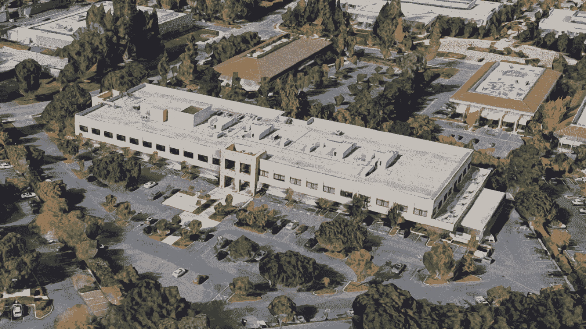
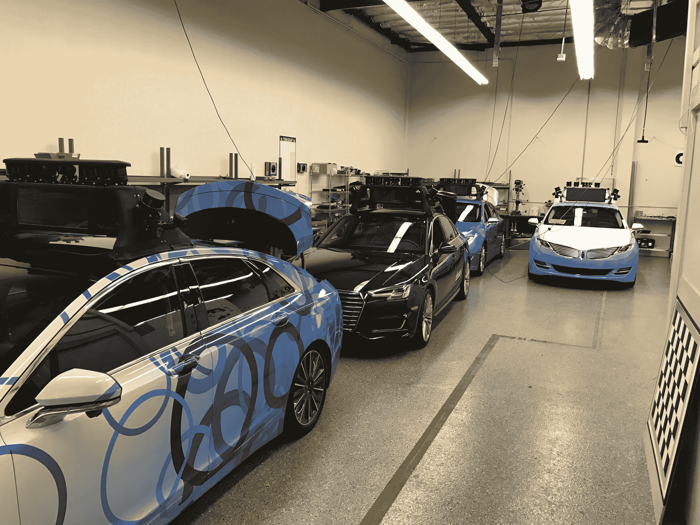

# Lyft 和 Drive.ai 在湾区自动驾驶乘车试点项目上的合作伙伴 

> 原文：<https://web.archive.org/web/https://techcrunch.com/2017/09/07/lyft-and-drive-ai-partner-on-bay-area-self-driving-ride-hailing-pilot/>

Lyft 正与自动驾驶初创公司 Drive.ai 合作，通过一个新的试点项目在旧金山及其周边地区部署自动驾驶汽车。

Drive.ai 将会运行一些测试车队

[Lyft’s open platform](https://web.archive.org/web/20221208095845/https://take.lyft.com/open-platform/)

Lyft 创建该公司是为了帮助汽车制造商和自动驾驶技术公司在现实世界中制造和部署自动驾驶汽车，并最终成为按需乘车的车辆。

Drive.ai 是一家初创公司，在斯坦福大学的人工智能实验室有着深厚的根基，其自治方法专注于跨堆栈的深度学习。Drive.ai 的目标是以一种既可扩展又具成本效益的方式为车辆构建人工智能软件，该公司最近透露，其走向市场的战略是[建立改造套件，可以将现有车队转化为自主资源](https://web.archive.org/web/20221208095845/https://beta.techcrunch.com/2017/06/27/drive-ai-raises-50m-for-retrofit-kits-to-bring-self-driving-to-existing-fleets/)。

Drive.ai 总裁兼联合创始人卡罗尔·雷利(Carol Reiley)和 Lyft 自动驾驶产品总监塔加特·马蒂森(Steve Matthiesen)表示，试点项目将从相对较小的规模开始，并随着时间的推移取得进展。

“我们正在湾区与 Lyft 合作，开发几种不同的车辆，”Reiley 解释道。“我们将从小规模开始，然后向外扩展。我们希望关注的三件事是:第一，安全；第二，为车手创造一个独特的体验，让他们了解 AVs，然后教育大众关于 AVs 的技术。第三，我们会从 Lyft 的 350 多个城市中找出我们未来想去的城市。”

Lyft 在帕洛阿尔托的自动驾驶项目办公室。

该计划将使用现有的 Drive.ai 车辆进行试点，其中包括几个不同的车辆平台，配备了这家初创公司的售后自动驾驶套件。他们没有透露试点道路上汽车的具体数量，但最初的车辆将是四车轿车，如上图所示。

Lyft 的目标与 Drive 的合作伙伴相似——这个开放平台旨在为合作伙伴提供一种建立自主技术的方式，同时也有助于从消费者的角度了解成功的自动驾驶汽车车队。

“我们的真正目标是用世界上最好的自主技术连接我们的乘客；Drive.ai 就是一个很好的例子，”塔加特解释道。“我们希望与他们合作，加速他们的技术，我们希望为我们的乘客创造安全和一致的体验，虽然我们从试点的角度开始，但随着时间的推移，我们的目标是在我们的整个平台上缓慢而稳定地发展这些游乐设施。”

塔加特指出，Lyft 的系统旨在动态评估接送请求，检查该地区上次被绘制地图的时间等数据，以及道路和天气情况，以便它可以将这些信息传递给 Drive.ai 等自动驾驶服务提供商。如果 Drive.ai 确定它可以在这些条件下有效运行，它将部署一个 AV 来接送乘客——但如果没有，Lyft 的现有网络可以处理该请求。所有这些都发生在幕后，与今天的打车相比，骑手的体验没有任何变化。

这个想法是，随着时间的推移，随着合作伙伴之间技术方面的进步使之成为可能，随着开放网络的发展，它可以在更多的地方促进更多的自主提货，最终目标是自动驾驶规模覆盖整个网络。

看看 Drive.ai 的车库。

“我们将从小规模开始，最有可能的是创建一个白名单，首先吸引一些乘客，”塔加特解释道，并谈到了关于湾区试点推广的具体细节。“随着时间的推移，我们会把范围扩大一点，并提供选择加入功能。即使你选择加入该计划，你也可以随时选择不想让自动驾驶汽车来接你，尽管我认为很少有人会拒绝。”

Lyft 和 Drive.ai 也将此视为用户体验的学习机会。对于 Drive 来说，这是这种合作关系的独特之处，因为它已经进行了广泛的道路测试。当谈到自动驾驶技术时，UX 可能是一个关键的产品差异化因素，Drive 正在利用这个机会提出关于人们如何与 AVs 互动的问题，并希望获得一些答案。

“就驾驶而言，我们已经在湾区行驶了一年多，这个试点项目的重点不仅仅是收集驾驶里程，”Reiley 说。“这是为了找出方法，确保从调用应用程序到汽车来接乘客时的体验是无缝的，安全在那里如何工作，然后是车内的体验。”

湾区拥有许多专注于改善用户体验的自动驾驶飞行员，包括通用汽车为员工提供的巡航自动驾驶服务和优步的一名飞行员。Lyft 加入 Drive 的竞争意味着，如果你不仅对自治的技术方面感兴趣，而且对它如何为日常生活服务也感兴趣，这仍然是值得一看的中心。