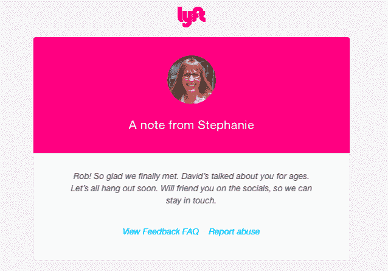

# Lyft 实验让乘客互相评价，并在旅程结束后建立联系 

> 原文：<https://web.archive.org/web/https://techcrunch.com/2015/05/18/lyft-experiment-lets-passengers-rate-each-other-and-connect-after-the-ride-is-over/>

# Lyft 的实验让乘客互相评价，并在乘车结束后联系

这读起来像是一部糟糕但不可避免的浪漫喜剧的情节:两个陌生人共用一条 Lyft 线路。火花飞舞；爱情绽放。就在二号乘客鼓起勇气邀请一号乘客约会的时候，一号乘客到达了他们的目的地——当然是匆匆忙忙——然后消失在夜色中。失恋了。

或者是？

Lyft 正在尝试允许线路乘客在乘车结束后重新连接。我们了解到，该公司目前正在旧金山测试这项功能。

虽然如果做错了，它有可能变得可怕和令人毛骨悚然，但他们正在以这样的方式做，即*应该*将令人毛骨悚然的因素保持在最低限度。

**这是真正的二合一测试功能:**

*   **同车乘客评分**:乘坐后，Lyft Line 乘客可以互相评分。不涉及明星，就“:)”或者“:(”。
*   **备注**:除了评分，你还可以给其他乘客留言。一句“很高兴见到你！”，也许——或者“我们去喝杯咖啡吧！这是我的号码。”如果(且仅如果)你们都给对方积极的评价，你的笔记将被分享。如果一名乘客不评价另一名乘客，或者一名乘客对另一名乘客的评价是负面的，那么这些音符就会消失在空气中。

这种选择加入的设置*应该*防止 Lyft 变成任何人的无尽沮丧之源，你知道，只是想搭车上班。如果一个人对建立友谊或诸如此类的事情不感兴趣，他们就什么也不做。不要评价其他人，他们的笔记将永远不会显示。

你也可以对其他乘客进行负面评价——如果投诉合理，你会得到一个 Lyft 支持热线的链接。对其他乘客进行评级的选项目前只出现在旧金山 Lyft Line 用户的乘车后电子邮件收据中。

那么他们为什么会这样做呢？如果没有别的，这符合他们早期的信息。从高飞的 stache 到现在几乎被废弃的 fist bump，他们一直在玩这个想法，你和一群朋友一起搭车；现在，有了 Lyft Line notes，你就能交到新朋友了。友谊万岁！

出于好奇，Lyft 告诉我，除了一般的数据收集和发送信息之外，乘客对乘客的评分目前对这项服务没有影响。因此，如果你收到一堆“:(“仅仅因为你不喜欢在下班回家的路上说话，你不会被 Lyft Line 解雇。

*【谢谢提醒，[库尔维尔](https://web.archive.org/web/20221210032553/https://twitter.com/kul/status/598984968467976192)*