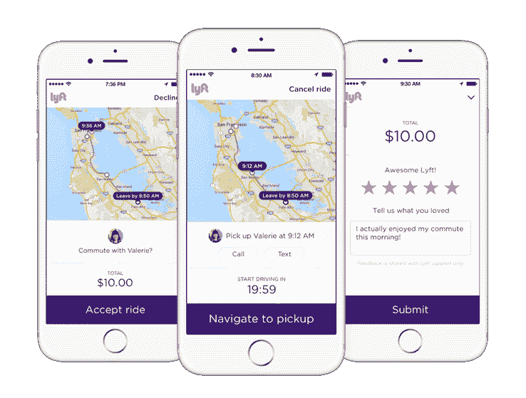

# Lyft 通过 Lyft car pool TechCrunch 回归 Zimride 根源

> 原文：<https://web.archive.org/web/https://techcrunch.com/2016/03/29/lyft-gets-back-to-zimride-roots-with-lyft-carpool/>

早在 2007 年，联合创始人约翰·齐默(John Zimmer)和洛根·格林(Logan Green)就设想了一种新型的公共交通拼车系统，将全国的乘客和司机连接起来。他们称之为 [Zimride](https://web.archive.org/web/20221209191948/https://beta.techcrunch.com/tag/zimride/) 。

但结果是，更多的人想在城市里转转，而不是去远方，几年后，母公司被一个更粉更模糊的公司取代了。

[Lyft](https://web.archive.org/web/20221209191948/http://lyft.com/) 现在想让你和 [Lyft 拼车](https://web.archive.org/web/20221209191948/https://www.lyft.com/carpool)一起回到它的 Zimride 根源。

Lyft 不是已经有叫 Lyft Line 的拼车服务了吗？确实如此。算是吧。

Line 会花几块钱带你和一群陌生人穿过城镇，就像拼车一样，但如果你想从码头到山景城，乘坐费用会高得多。

竞争对手优步服务公司并不关心你是否想去奥克塔维亚的 Smitten 冰激凌店或帕洛阿尔托的 Rick's 店，而是使用它的 UberPOOL。让你下 101 公路的成本可能过高，但它会带你去那里(TechCrunch 总部的 38.80 美元，如果你好奇的话)。

但是价格似乎是乘客选择拼车服务的一个重要因素。Lyft 告诉 TechCrunch，由于这个原因，Lyft Line 没有超出城市界限。

那么拼车现在愿意带我们走多远呢？您可能已经注意到，所有这些位置参考都在湾区内。这是因为这是 Lyft 的新服务将暂时提供的地方。

Lyft 与加州大都会运输委员会(MTC)及其 [511 拼车计划](https://web.archive.org/web/20221209191948/http://511.org/default.asp)合作，Lyft [最近宣布与该计划](https://web.archive.org/web/20221209191948/http://www.prnewswire.com/news-releases/mtc-and-lyft-partnership-brings-new-carpooling-resource-to-the-bay-area-300235824.html)合作，将乘客与日常通勤中同路的司机配对。

根据距离的不同，单程的乘车费用约为 4 至 10 美元，与从城市到山景城的旅程大致相同，如果你先乘坐市政列车，然后再跳上 Caltrain。但是拼车可能会节省大约一个小时的时间，这取决于交通状况。

拼车公司[在 12 月宣布](https://web.archive.org/web/20221209191948/https://www.lyft.com/carpool)拼车，并在今天上线之前收集了潜在拼车者的数据，以确定最繁忙的通勤。

那些在硅谷任何地方开车的人可能不会惊讶地发现，从旧金山到半岛的 101 运输是头号通勤要求。Lyft 表示，关于通勤者最需要乘车的时间和地点的知识和其他一些数据将有助于在应用程序中创造匹配效率。

这项服务也有可能减少二氧化碳排放量。排放是一个远远超出海湾的问题，一条减轻部分碳足迹的经济路线可能会吸引至少一些绿色环保的 Lyft 乘客。

但是拼车并不是一个新概念——它早在 20 世纪 70 年代就存在了——硅谷还有很多其他拼车应用。不久前，我列出了至少 10 个优步和 Lyft 的替代方案。看来我们不需要另一个了。

但是 Lyft 有一个其他公司没有的优势，Lyft 的运输政策总监 Emily Castor 说——品牌认知度。

“我们现在有一个非常成熟的市场。湾区数百万人已经使用了我们的服务。Castor 告诉 TechCrunch:“通过平台和品牌认知度，以及熟悉我们应用程序的用户安装基础，已经有数百万次骑行。“我们相信这将使我们更加成功。”

拼车并不适合所有人——有些人真的很喜欢给自己找个私人司机的想法。但格林和齐默的目标从一开始就很明确——提供高效、廉价的乘车服务。

除了台球，优步可能很快会拿出类似的东西(两人似乎在对方宣布某事的时候拿出[非常相似的报价](https://web.archive.org/web/20221209191948/https://www.lyft.com/line))。但是，就目前而言，拼车在拼车竞赛中为 Lyft 提供了一种更实惠的交通方式。